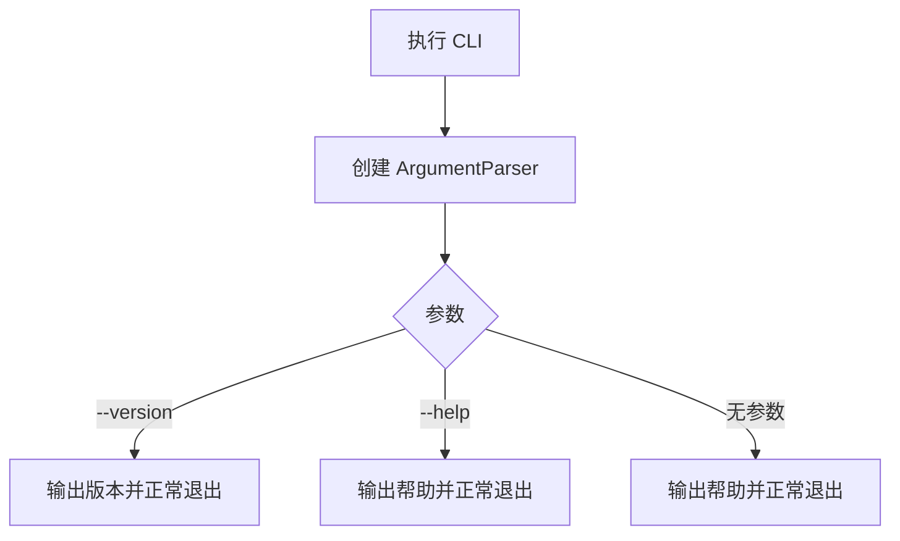

# MiniCode Rebuild 实现与学习记录

## 项目目标

从零实现一个可安装、可运行、可测试和可演示的本地终端 AI Coding Agent。项目按阶段建立模型适配、工具系统、安全边界、Agent Loop、上下文管理、会话恢复与扩展机制；每个阶段都保留真实的设计、测试和 Git 记录。

## 当前状态

| 项目 | 内容 |
|---|---|
| 当前阶段 | 阶段 0：仓库初始化与工程基线 |
| 最近完成 | 工程基线实现及本地验收 |
| 当前分支 | `rebuild/minicode-learning` |
| 阶段实现提交 | `62ca406 chore(phase-00): bootstrap project and learning log` |
| 测试状态 | 阶段测试与全量测试均为 `4 passed` |
| 下一步 | 推送阶段 0，然后规划阶段 1 |

## 总体架构

项目采用 `src/` 布局。阶段 0 只建立可安装包和 CLI 外壳；后续阶段在包内逐步加入核心类型、模型适配、工具基础设施和 Agent Loop。入口层只负责参数解析与展示，不提前依赖模型或工具模块。


## 阶段路线图

| 阶段 | 名称 | 状态 | 核心产物 | 提交 |
|---|---|---|---|---|
| 0 | 仓库初始化与工程基线 | 已完成 | Python 包、CLI、pytest、README、学习日志 | `62ca406` |
| 1 | 核心类型与模型适配层 | 待开始 | 核心类型、`ModelAdapter`、`MockModel`、真实适配器 | - |
| 2 | 工具基础设施 | 待开始 | 工具定义、上下文、结果和注册表 | - |
| 3 | 只读工作区工具 | 待开始 | 读取、列举、搜索和路径保护 | - |
| 4 | 写入、编辑和命令执行工具 | 待开始 | 安全写入、编辑、命令与权限决策 | - |
| 5 | 最小 Agent Loop | 待开始 | 有界模型/工具执行循环 | - |
| 6 | 可用的 CLI 与运行配置 | 待开始 | 交互模式、Headless 模式和运行配置 | - |
| 7 | 上下文预算与压缩 | 待开始 | 预算、裁剪、摘要和降级策略 | - |
| 8 | 会话、Checkpoint 与 Rewind | 待开始 | 会话持久化、检查点和恢复 | - |
| 9 | Skills、Hooks 与扩展机制 | 待开始 | 按需技能和生命周期扩展点 | - |
| 10 | 可观测性、质量与发布准备 | 待开始 | 日志、质量门禁、安装与发布验证 | - |
| 11 | 可选高级能力 | 待开始 | 核心稳定后单独选择并实现 | - |

## 阶段 0：仓库初始化与工程基线

### 1. 阶段目标

- 建立 Python 3.11+ 的标准 `src/` 包结构。
- 使用 `pyproject.toml` 声明构建方式、项目元数据、CLI 和 pytest 配置。
- 提供能显示帮助和版本的最小 CLI。
- 建立 README、忽略规则、环境变量示例和阶段学习日志。
- 编写并运行不依赖网络或真实密钥的初始测试。

### 2. 本阶段非目标

- 不接入真实模型或 API。
- 不实现模型适配器、工具注册表或 Agent Loop。
- 不实现文件操作、命令执行、权限、会话、记忆、Skills、Hooks、MCP 或 TUI。
- 不引入运行时第三方依赖。

### 3. 参考资料与源码分析

| 参考项 | 路径或提交 | 学到的内容 | 本项目的取舍 |
|---|---|---|---|
| MiniCode Python 工程配置 | `D:\code\MiniCode-Python\pyproject.toml` | Python 版本、构建后端、控制台脚本和 pytest 可以集中声明 | 同样集中配置，但使用 `src/` 布局隔离源码，并只声明一个当前可工作的 CLI |
| MiniCode Python 入口 | `D:\code\MiniCode-Python\minicode\main.py` | 入口应负责参数解析和依赖组装 | 阶段 0 只解析 `--version` 和帮助，不加载任何尚未实现的运行时能力 |
| MiniCode Python 入口清理 | 提交 `47db045` | 已删除模块若仍留在脚本入口中，会让安装成功但命令运行失败 | 每个入口必须有测试；当前只注册一个最小入口 |
| MiniCode Python README | `D:\code\MiniCode-Python\README.zh-CN.md` | README 应给出可复制的安装、启动和验证命令 | 只描述当前阶段真实可用的命令，不提前宣称后续功能 |
| MiniClaudeCode README | `https://github.com/Monet1016/MiniClaudeCode`，提交 `4adcec6` | 入口层负责 CLI 和依赖组装，执行引擎不应反向依赖入口；项目应从可运行小闭环逐步扩展 | 阶段 0 保留独立 `cli.py` 边界，不复制其单文件实现，也不引入其中的高级能力 |

### 4. 设计方案

#### 4.1 模块职责

- `minicode_rebuild.__init__`：保存包版本这一项稳定元数据。
- `minicode_rebuild.cli`：构造参数解析器并提供控制台入口。
- `minicode_rebuild.__main__`：支持 `python -m minicode_rebuild`。
- `tests/`：验证版本、帮助、模块入口和控制台行为。

#### 4.2 核心数据结构

阶段 0 不定义 Agent 领域类型。唯一的稳定数据是包版本字符串，后续可由 CLI 和包元数据共同使用。

#### 4.3 执行流程



### 5. 实现内容

| 文件 | 新增或修改 | 作用 |
|---|---|---|
| `pyproject.toml` | 新增 | 声明构建后端、Python 版本、开发依赖、包发现、CLI 和 pytest 配置 |
| `src/minicode_rebuild/__init__.py` | 新增 | 暴露单一版本来源 |
| `src/minicode_rebuild/cli.py` | 新增 | 构造无副作用参数解析器并实现阶段 0 CLI |
| `src/minicode_rebuild/__main__.py` | 新增 | 支持 `python -m minicode_rebuild` |
| `tests/test_cli.py` | 新增 | 覆盖版本、帮助、模块入口和非法参数 |
| `README.md` | 新增 | 记录当前真实能力、安装、使用和测试方法 |
| `.gitignore` | 新增 | 排除密钥、本地环境、缓存和构建产物 |
| `.gitattributes` | 新增 | 统一文本文件换行规则，降低跨平台差异 |
| `.env.example` | 新增 | 为阶段 1 预留无敏感值的配置名称 |
| `docs/REBUILD_LOG.md` | 新增 | 保存路线图、参考分析、设计、验证和学习记录 |
| `AI_MINICODE_REBUILD_EXECUTION_PROMPT.md` | 纳入版本控制 | 保存项目的持续执行协议 |

### 6. 关键代码解析

#### 6.1 `build_parser`

`build_parser()` 只创建并返回 `ArgumentParser`，不读取配置、不访问网络，也不启动任何 Agent 能力。这使参数结构可以独立测试，并保证阶段 0 的 CLI 不依赖后续模块。`--version` 直接读取包级 `__version__`，避免 CLI 与包元数据在源码中出现两套运行时版本常量。

#### 6.2 `main`

`main(argv)` 接收可选参数序列：测试传入列表时不需要修改全局 `sys.argv`，控制台脚本不传参数时则自然使用真实命令行。正常的无参数路径打印帮助并返回 `0`；`argparse` 对帮助、版本和非法参数分别给出标准退出码。

#### 6.3 调用链

```text
minicode-rebuild / python -m minicode_rebuild
→ minicode_rebuild.cli.main
→ build_parser
→ parse_args
→ 版本、帮助或参数错误输出
```

### 7. 测试与验证

#### 7.1 测试范围

- 包版本可读取。
- CLI 无参数时输出帮助并成功退出。
- CLI 的 `--version` 输出与包版本一致。
- `python -m minicode_rebuild` 可作为模块入口运行。
- 安装后的 `minicode-rebuild` 控制台脚本可执行。

#### 7.2 执行命令

```bash
python -m venv .venv
.\.venv\Scripts\python.exe -m pip install -e ".[dev]"
.\.venv\Scripts\python.exe -m pytest tests\test_cli.py -q
.\.venv\Scripts\python.exe -m pytest -q
.\.venv\Scripts\python.exe -m minicode_rebuild --version
.\.venv\Scripts\minicode-rebuild.exe --help
.\.venv\Scripts\python.exe -m compileall -q src tests
```

#### 7.3 实际结果

- 验证解释器：Python `3.14.6`，满足项目声明的 Python `3.11+`。
- 可编辑安装：成功构建并安装 `minicode-rebuild==0.1.0`，同时安装 pytest 开发依赖。
- 阶段测试：`4 passed in 1.17s`。
- 全量回归：`4 passed in 0.98s`。
- 模块版本入口：输出 `minicode-rebuild 0.1.0`，退出码为 `0`。
- 控制台脚本：成功显示 `usage: minicode-rebuild [-h] [--version]`。
- 编译检查：`compileall` 无错误输出，退出码为 `0`。

### 8. 遇到的问题与解决过程

| 问题 | 根因 | 解决方案 | 如何避免 |
|---|---|---|---|
| 自动化账户触发 Git `dubious ownership` | 仓库由用户账户创建，执行环境使用不同 Windows SID | Git 命令仅在本次调用中传入 `safe.directory`，不修改用户全局配置 | 不通过全局白名单扩大信任范围 |
| 首次可编辑安装无法下载构建依赖 | 沙箱网络策略阻止访问配置的 PyPI 镜像 | 获得联网许可后原命令重试成功 | 将网络策略问题与项目构建问题分开记录，不通过降低依赖版本伪装修复 |

### 9. 与参考项目的差异

本项目从空仓库建立 `src/` 包布局和单一入口。参考项目当前已经包含完整运行时与大量高级能力，本阶段不会复制这些模块；MiniClaudeCode 的模块边界只作为后续依赖方向参考。

### 10. 本阶段知识点

- 构建配置、包结构、控制台入口和测试共同构成可验证的工程基线。
- “能够安装”和“入口能够运行”是两项不同的验收，需要分别测试。
- 路线图中的后续模块不应提前成为阶段 0 入口的依赖。

### 11. 自测问题

1. 为什么 `src/` 布局能更早暴露未安装包或导入路径配置错误？
2. 为什么控制台脚本需要独立于函数单元测试进行验证？
3. 为什么阶段 0 不应提前加入模型 SDK？

### 12. 阶段验收

- [x] 可执行开发模式安装。
- [x] CLI 能输出帮助。
- [x] CLI 能输出版本。
- [x] 阶段 0 测试通过。
- [x] 全量回归测试通过。
- [x] 文档记录与实际结果一致。

### 13. Git 记录

- 分支：`rebuild/minicode-learning`
- 提交：`62ca406`
- 提交信息：`chore(phase-00): bootstrap project and learning log`
- 远程状态：待推送

### 14. 下一阶段

阶段 1 将定义核心消息、模型响应与工具调用类型，建立 `ModelAdapter` 协议、可测试的 `MockModel`，并加入 OpenAI-compatible 真实适配器。
