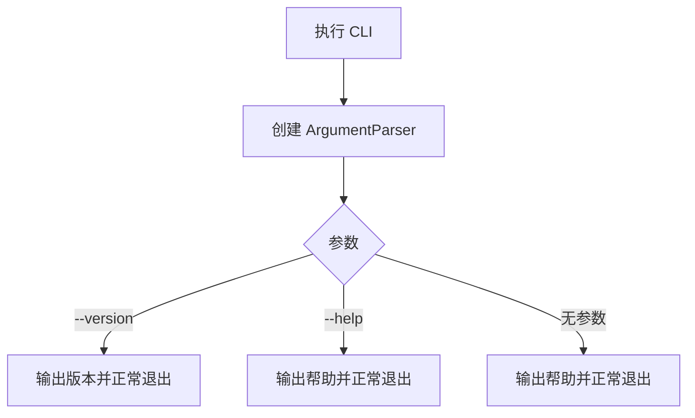
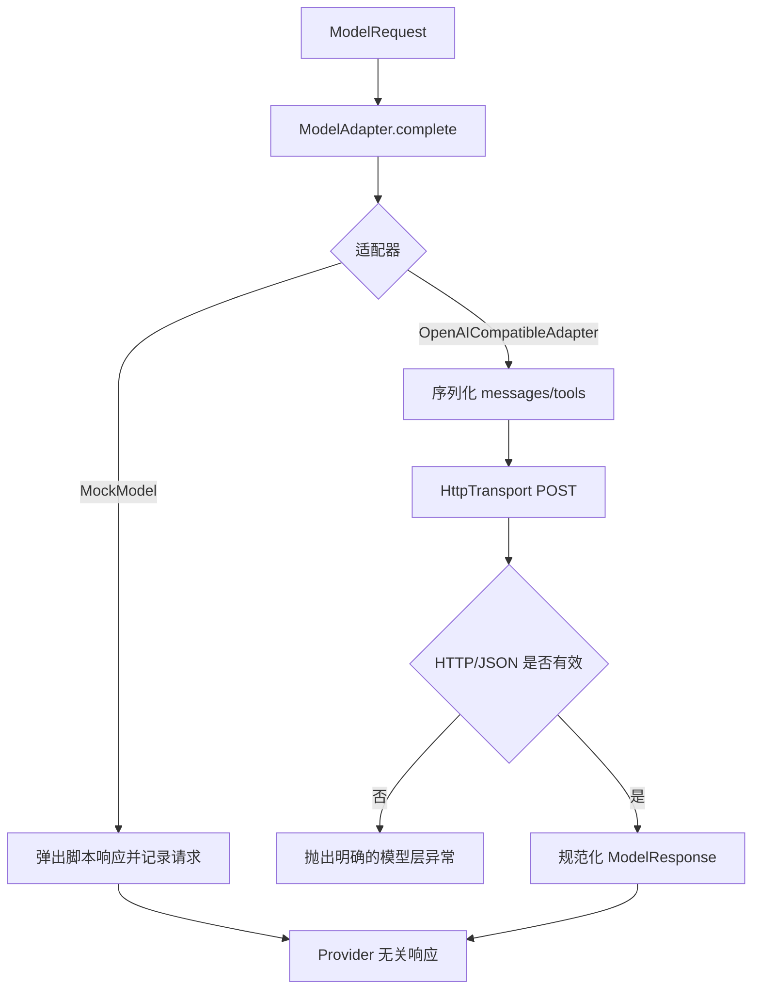
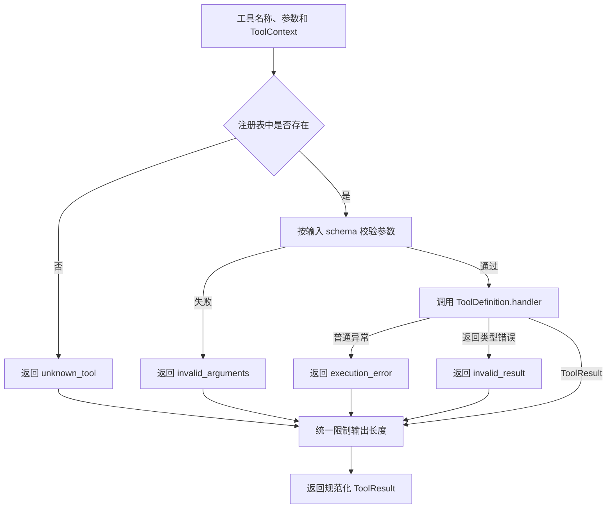
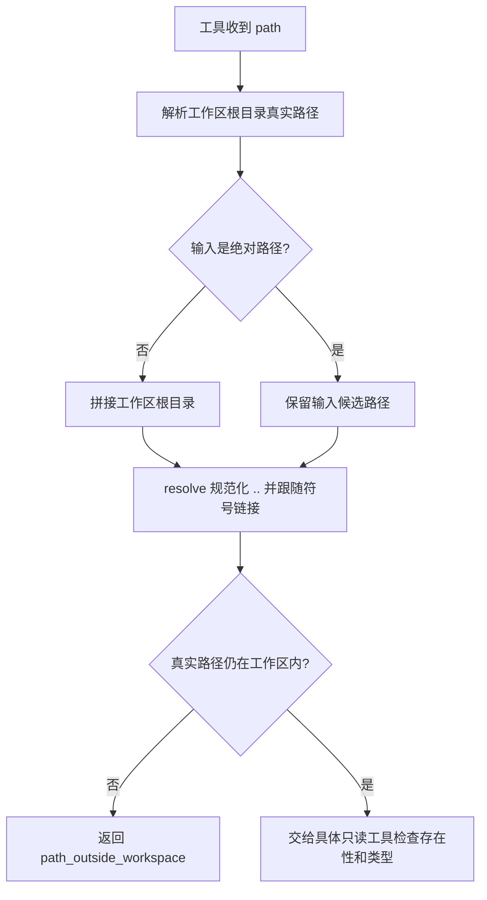
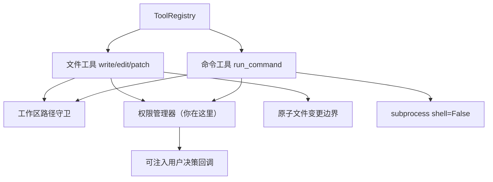
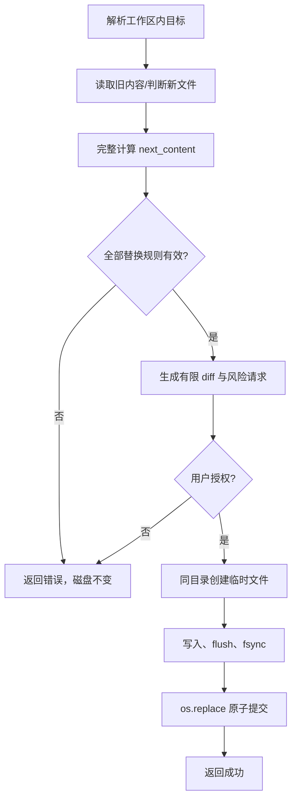
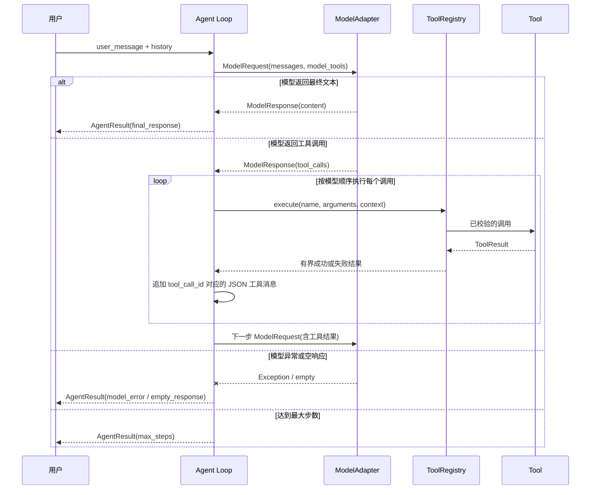
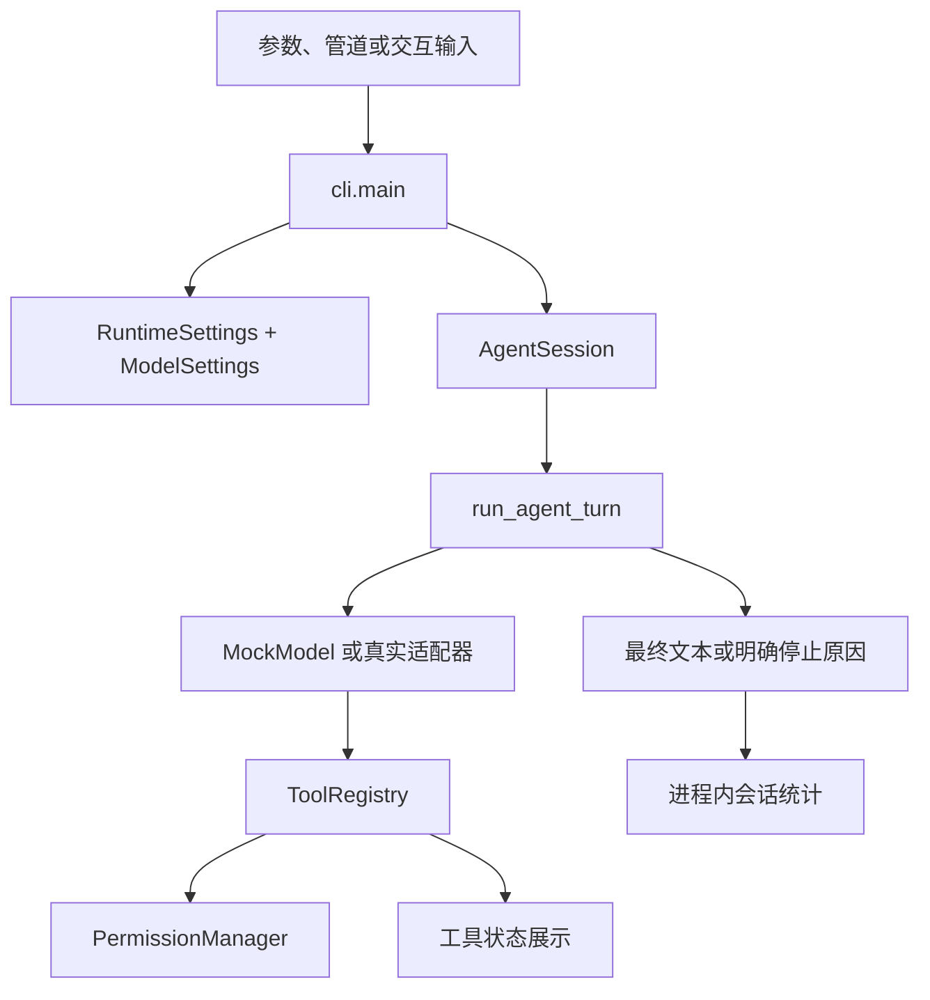
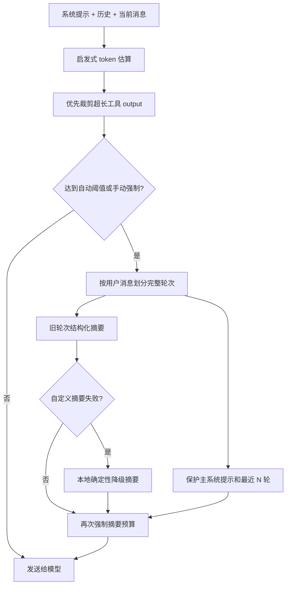

# MiniCode Rebuild 实现与学习记录

## 项目目标

从零实现一个可安装、可运行、可测试和可演示的本地终端 AI Coding Agent。项目按阶段建立模型适配、工具系统、安全边界、Agent Loop、上下文管理、会话恢复与扩展机制；每个阶段都保留真实的设计、测试和 Git 记录。

## 当前状态

| 项目 | 内容 |
|---|---|
| 当前阶段 | 阶段 13：多模型路由与降级（本地完成，等待远程验证） |
| 最近完成 | 阶段 12：成本控制（已合并）；阶段 13 已完成本地开发 |
| 当前分支 | `codex/phase-13-model-routing` |
| 最新阶段实现提交 | `38cd0eb feat(phase-13): add model routing and fallback` |
| 测试状态 | 阶段相关回归 `101 passed`；全量回归 `339 passed, 3 skipped`；分支覆盖率 `86.01%` |
| 下一步 | 提交文档收口、推送开发分支、创建 Draft PR 并完成跨平台 CI |

## 总体架构

项目采用 `src/` 布局。阶段 0 只建立可安装包和 CLI 外壳；后续阶段在包内逐步加入核心类型、模型适配、工具基础设施和 Agent Loop。入口层只负责参数解析与展示，不提前依赖模型或工具模块。


## 阶段路线图

| 阶段 | 名称 | 状态 | 核心产物 | 提交 |
|---|---|---|---|---|
| 0 | 仓库初始化与工程基线 | 已完成 | Python 包、CLI、pytest、README、学习日志 | `62ca406` |
| 1 | 核心类型与模型适配层 | 已完成 | 核心类型、`ModelAdapter`、`MockModel`、真实适配器 | `274523e` |
| 2 | 工具基础设施 | 已完成 | 工具定义、上下文、结果和注册表 | `a56c195` |
| 3 | 只读工作区工具 | 已完成 | 读取、列举、搜索和路径保护 | `8764e55` |
| 4 | 写入、编辑和命令执行工具 | 已完成 | 安全写入、编辑、命令与权限决策 | `0ad29a4` |
| 5 | 最小 Agent Loop | 已完成 | 有界模型/工具执行循环 | `c91c47c` |
| 6 | 可用的 CLI 与运行配置 | 已完成 | 交互模式、Headless 模式和运行配置 | `7f3e86e` |
| 7 | 上下文预算与压缩 | 已完成 | 预算、裁剪、摘要和降级策略 | `2bf4bfa` |
| 8 | 会话、Checkpoint 与 Rewind | 已完成 | 会话持久化、检查点和恢复 | `b4afec3` |
| 9 | Skills、Hooks 与扩展机制 | 已完成 | 按需技能和生命周期扩展点 | `6201245` |
| 10 | 可观测性、质量与发布准备 | 已完成 | 日志、质量门禁、安装与发布验证 | `edf1569` |
| 11 | 长期记忆与检索 | 已完成 | 工作区本地记忆、按需检索和权限控制 | `d06ad40` |
| 12 | 成本控制 | 已完成 | 会话 token 预算、输出上限和预算门禁 | `fa243dc` |
| 13 | 多模型路由与降级 | 本地完成 | 有序候选、瞬时故障降级和脱敏路由事件 | `38cd0eb` |

## 阶段 0：仓库初始化与工程基线

### 1. 阶段目标

- 建立 Python 3.11+ 的标准 `src/` 包结构。
- 使用 `pyproject.toml` 声明构建方式、项目元数据、CLI 和 pytest 配置。
- 提供能显示帮助和版本的最小 CLI。
- 建立 README、忽略规则、环境变量示例和阶段学习日志。
- 编写并运行不依赖网络或真实密钥的初始测试。

### 2. 本阶段非目标

- 不接入真实模型或 API。
- 不实现模型适配器、工具注册表或 Agent Loop。
- 不实现文件操作、命令执行、权限、会话、记忆、Skills、Hooks、MCP 或 TUI。
- 不引入运行时第三方依赖。

### 3. 参考资料与源码分析

| 参考项 | 路径或提交 | 学到的内容 | 本项目的取舍 |
|---|---|---|---|
| MiniCode Python 工程配置 | `D:\code\MiniCode-Python\pyproject.toml` | Python 版本、构建后端、控制台脚本和 pytest 可以集中声明 | 同样集中配置，但使用 `src/` 布局隔离源码，并只声明一个当前可工作的 CLI |
| MiniCode Python 入口 | `D:\code\MiniCode-Python\minicode\main.py` | 入口应负责参数解析和依赖组装 | 阶段 0 只解析 `--version` 和帮助，不加载任何尚未实现的运行时能力 |
| MiniCode Python 入口清理 | 提交 `47db045` | 已删除模块若仍留在脚本入口中，会让安装成功但命令运行失败 | 每个入口必须有测试；当前只注册一个最小入口 |
| MiniCode Python README | `D:\code\MiniCode-Python\README.zh-CN.md` | README 应给出可复制的安装、启动和验证命令 | 只描述当前阶段真实可用的命令，不提前宣称后续功能 |
| MiniClaudeCode README | `https://github.com/Monet1016/MiniClaudeCode`，提交 `4adcec6` | 入口层负责 CLI 和依赖组装，执行引擎不应反向依赖入口；项目应从可运行小闭环逐步扩展 | 阶段 0 保留独立 `cli.py` 边界，不复制其单文件实现，也不引入其中的高级能力 |

### 4. 设计方案

#### 4.1 模块职责

- `minicode_rebuild.__init__`：保存包版本这一项稳定元数据。
- `minicode_rebuild.cli`：构造参数解析器并提供控制台入口。
- `minicode_rebuild.__main__`：支持 `python -m minicode_rebuild`。
- `tests/`：验证版本、帮助、模块入口和控制台行为。

#### 4.2 核心数据结构

阶段 0 不定义 Agent 领域类型。唯一的稳定数据是包版本字符串，后续可由 CLI 和包元数据共同使用。

#### 4.3 执行流程



### 5. 实现内容

| 文件 | 新增或修改 | 作用 |
|---|---|---|
| `pyproject.toml` | 新增 | 声明构建后端、Python 版本、开发依赖、包发现、CLI 和 pytest 配置 |
| `src/minicode_rebuild/__init__.py` | 新增 | 暴露单一版本来源 |
| `src/minicode_rebuild/cli.py` | 新增 | 构造无副作用参数解析器并实现阶段 0 CLI |
| `src/minicode_rebuild/__main__.py` | 新增 | 支持 `python -m minicode_rebuild` |
| `tests/test_cli.py` | 新增 | 覆盖版本、帮助、模块入口和非法参数 |
| `README.md` | 新增 | 记录当前真实能力、安装、使用和测试方法 |
| `.gitignore` | 新增 | 排除密钥、本地环境、缓存和构建产物 |
| `.gitattributes` | 新增 | 统一文本文件换行规则，降低跨平台差异 |
| `.env.example` | 新增 | 为阶段 1 预留无敏感值的配置名称 |
| `docs/REBUILD_LOG.md` | 新增 | 保存路线图、参考分析、设计、验证和学习记录 |
| `AI_MINICODE_REBUILD_EXECUTION_PROMPT.md` | 纳入版本控制 | 保存项目的持续执行协议 |

### 6. 关键代码解析

#### 6.1 `build_parser`

`build_parser()` 只创建并返回 `ArgumentParser`，不读取配置、不访问网络，也不启动任何 Agent 能力。这使参数结构可以独立测试，并保证阶段 0 的 CLI 不依赖后续模块。`--version` 直接读取包级 `__version__`，避免 CLI 与包元数据在源码中出现两套运行时版本常量。

#### 6.2 `main`

`main(argv)` 接收可选参数序列：测试传入列表时不需要修改全局 `sys.argv`，控制台脚本不传参数时则自然使用真实命令行。正常的无参数路径打印帮助并返回 `0`；`argparse` 对帮助、版本和非法参数分别给出标准退出码。

#### 6.3 调用链

```text
minicode-rebuild / python -m minicode_rebuild
→ minicode_rebuild.cli.main
→ build_parser
→ parse_args
→ 版本、帮助或参数错误输出
```

### 7. 测试与验证

#### 7.1 测试范围

- 包版本可读取。
- CLI 无参数时输出帮助并成功退出。
- CLI 的 `--version` 输出与包版本一致。
- `python -m minicode_rebuild` 可作为模块入口运行。
- 安装后的 `minicode-rebuild` 控制台脚本可执行。

#### 7.2 执行命令

```bash
python -m venv .venv
.\.venv\Scripts\python.exe -m pip install -e ".[dev]"
.\.venv\Scripts\python.exe -m pytest tests\test_cli.py -q
.\.venv\Scripts\python.exe -m pytest -q
.\.venv\Scripts\python.exe -m minicode_rebuild --version
.\.venv\Scripts\minicode-rebuild.exe --help
.\.venv\Scripts\python.exe -m compileall -q src tests
```

#### 7.3 实际结果

- 验证解释器：Python `3.14.6`，满足项目声明的 Python `3.11+`。
- 可编辑安装：成功构建并安装 `minicode-rebuild==0.1.0`，同时安装 pytest 开发依赖。
- 阶段测试：`4 passed in 1.17s`。
- 全量回归：`4 passed in 0.98s`。
- 模块版本入口：输出 `minicode-rebuild 0.1.0`，退出码为 `0`。
- 控制台脚本：成功显示 `usage: minicode-rebuild [-h] [--version]`。
- 编译检查：`compileall` 无错误输出，退出码为 `0`。

### 8. 遇到的问题与解决过程

| 问题 | 根因 | 解决方案 | 如何避免 |
|---|---|---|---|
| 自动化账户触发 Git `dubious ownership` | 仓库由用户账户创建，执行环境使用不同 Windows SID | Git 命令仅在本次调用中传入 `safe.directory`，不修改用户全局配置 | 不通过全局白名单扩大信任范围 |
| 首次可编辑安装无法下载构建依赖 | 沙箱网络策略阻止访问配置的 PyPI 镜像 | 获得联网许可后原命令重试成功 | 将网络策略问题与项目构建问题分开记录，不通过降低依赖版本伪装修复 |

### 9. 与参考项目的差异

本项目从空仓库建立 `src/` 包布局和单一入口。参考项目当前已经包含完整运行时与大量高级能力，本阶段不会复制这些模块；MiniClaudeCode 的模块边界只作为后续依赖方向参考。

### 10. 本阶段知识点

- 构建配置、包结构、控制台入口和测试共同构成可验证的工程基线。
- “能够安装”和“入口能够运行”是两项不同的验收，需要分别测试。
- 路线图中的后续模块不应提前成为阶段 0 入口的依赖。

### 11. 自测问题

1. 为什么 `src/` 布局能更早暴露未安装包或导入路径配置错误？
2. 为什么控制台脚本需要独立于函数单元测试进行验证？
3. 为什么阶段 0 不应提前加入模型 SDK？

### 12. 阶段验收

- [x] 可执行开发模式安装。
- [x] CLI 能输出帮助。
- [x] CLI 能输出版本。
- [x] 阶段 0 测试通过。
- [x] 全量回归测试通过。
- [x] 文档记录与实际结果一致。

### 13. Git 记录

- 分支：`rebuild/minicode-learning`
- 提交：`62ca406`
- 提交信息：`chore(phase-00): bootstrap project and learning log`
- 远程状态：已推送至 `origin/rebuild/minicode-learning`

### 14. 下一阶段

阶段 1 将定义核心消息、模型响应与工具调用类型，建立 `ModelAdapter` 协议、可测试的 `MockModel`，并加入 OpenAI-compatible 真实适配器。

## 阶段 1：核心类型与模型适配层

### 1. 阶段目标

- 定义消息、模型请求、模型响应、工具调用、模型工具声明和 token 用量等核心类型。
- 定义与具体 Provider 解耦的 `ModelAdapter` 协议。
- 实现可按脚本返回响应或异常、并记录请求的 `MockModel`。
- 实现一个非流式 OpenAI-compatible Chat Completions 适配器。
- 通过环境变量加载默认模型、API 基址、API Key 和超时。
- 使用可注入假传输层完成真实适配器测试，不依赖网络和真实密钥。

### 2. 本阶段非目标

- 不实现工具注册、参数 schema 执行校验或任何本地工具。
- 不实现 Agent Loop、重试、流式输出、成本统计或模型路由。
- 不把真实模型调用接入 CLI。
- 不读取 `.env` 文件，不引入第三方模型 SDK。
- 不支持图像、音频、自定义工具或 Provider 私有高级参数。

### 3. 参考资料与源码分析

| 参考项 | 路径或提交 | 学到的内容 | 本项目的取舍 |
|---|---|---|---|
| MiniCode 核心类型 | `D:\code\MiniCode-Python\minicode\types.py` | Provider 应通过统一协议返回规范化响应，Agent 不应依赖原始响应体 | 使用不可变 dataclass 代替松散 `TypedDict`，并把一次调用封装为 `ModelRequest` |
| MiniCode Mock 模型 | `D:\code\MiniCode-Python\minicode\mock_model.py`、提交 `4e5253b` | Mock 让测试不依赖真实 Provider；参考实现会根据命令生成固定工具调用 | 本阶段采用响应队列而非内置命令语义，使任何测试都能显式编排文本、工具调用和异常 |
| MiniCode OpenAI 适配器 | `D:\code\MiniCode-Python\minicode\openai_adapter.py` | Provider 层负责消息/工具序列化、HTTP 错误和响应规范化 | 只保留非流式最小路径，并注入传输协议，不带重试、Store、成本或工具注册依赖 |
| MiniCode Provider 修复 | 提交 `d326bc6`、`ef6c775` | Provider 私有能力不能仅凭模型名盲目开启；思考块等扩展会增加兼容复杂度 | 阶段 1 只发送 Chat Completions 的公共最小字段，不发送 thinking 等私有扩展 |
| OpenAI Chat Completions API | `https://developers.openai.com/api/reference/resources/chat/subresources/completions/methods/create` | 工具使用函数名、描述和 JSON Schema 声明；响应给出 `tool_calls`，参数是需校验的 JSON 字符串 | 建立 `ModelTool` 与 `ToolCall` 规范化边界；无效 JSON 作为协议错误，不静默替换为空对象 |
| DeepSeek API 快速开始 | `https://api-docs.deepseek.com/` | OpenAI-compatible 基址为 `https://api.deepseek.com`，支持 `deepseek-v4-pro` 和 `/chat/completions` | 将它们设为默认值，同时允许环境变量覆盖；也支持以 `/chat/completions` 结尾的完整地址 |

### 4. 设计方案

#### 4.1 模块职责

- `core.py`：定义 Provider 无关、可验证的核心数据类型和 `ModelAdapter` 协议。
- `config.py`：只从显式环境映射或 `os.environ` 加载模型设置，且不在对象 repr 中暴露密钥。
- `models/mock.py`：提供确定性脚本响应并记录调用。
- `models/openai_compatible.py`：序列化标准请求、调用注入的 HTTP 传输并规范化响应。

#### 4.2 核心数据结构

- `Message`：角色、文本、可选工具调用或工具结果关联 ID。
- `ModelTool`：模型可见的函数名、描述和 JSON Schema；它不是阶段 2 的可执行工具定义。
- `ToolCall`：模型生成的调用 ID、名称和已解析参数。
- `ModelRequest`：一次模型调用的消息与工具声明快照。
- `ModelResponse`：文本、工具调用、停止原因与 token 用量。
- `ModelSettings`：模型、基址、密钥与超时。

#### 4.3 执行流程



### 5. 实现内容

| 文件 | 新增或修改 | 作用 |
|---|---|---|
| `src/minicode_rebuild/core.py` | 新增 | 定义消息、工具声明/调用、模型请求/响应、token 用量和适配器协议 |
| `src/minicode_rebuild/config.py` | 新增 | 加载并校验 OpenAI-compatible 环境配置，隐藏密钥 repr |
| `src/minicode_rebuild/models/errors.py` | 新增 | 区分传输错误与响应协议错误 |
| `src/minicode_rebuild/models/mock.py` | 新增 | 按顺序返回脚本响应/异常并记录请求 |
| `src/minicode_rebuild/models/openai_compatible.py` | 新增 | 非流式 Chat Completions 序列化、HTTP 传输和响应规范化 |
| `src/minicode_rebuild/models/__init__.py` | 新增 | 暴露 `MockModel` 公共入口 |
| `tests/test_core.py` | 新增 | 验证核心类型约束和非法边界 |
| `tests/test_config.py` | 新增 | 验证默认值、覆盖、错误配置和密钥脱敏 |
| `tests/test_mock_model.py` | 新增 | 验证脚本响应、异常、记录、协议兼容和耗尽行为 |
| `tests/test_openai_compatible.py` | 新增 | 验证文本/工具调用、多轮序列化、HTTP/网络/JSON 错误 |
| `.env.example` | 修改 | 写明默认 DeepSeek 基址、超时和两种密钥变量 |
| `README.md` | 修改 | 记录阶段 1 真实能力、配置和最小库用法 |
| `docs/REBUILD_LOG.md` | 修改 | 补充阶段 1 分析、设计、测试和结果 |

### 6. 关键代码解析

#### 6.1 核心类型与不变量

`Message` 把对话角色限制为 system、user、assistant 和 tool。工具结果必须带 `tool_call_id`，而只有 assistant 消息能携带 `tool_calls`。`ModelRequest` 至少需要一条消息，`ModelTool` 和 `ToolCall` 对函数名执行公共格式检查。这些约束在请求到达 Provider 前暴露结构错误。

核心类型使用 `frozen=True` 和 tuple 保存集合快照，避免 Mock 记录的历史请求被调用方事后改变。参数 Mapping 会在构造时复制，但阶段 1 不执行 JSON Schema 校验；那是阶段 2 的职责。

#### 6.2 `ModelAdapter` 与 `MockModel`

`ModelAdapter.complete(request)` 只有一个输入对象和一个标准响应。`MockModel` 实现同一结构协议：每次调用先记录请求，再弹出一个 `ModelResponse` 或异常。脚本耗尽会抛出 `ModelResponseError`，测试因此不会意外重复最后一次结果或静默返回空响应。

#### 6.3 OpenAI-compatible 适配器

适配器把 `Message` 转为 Chat Completions 消息，把 `ModelTool` 转为 function tool JSON Schema。它只发送 `model`、`messages` 和可选 `tools`，不根据模型名猜测私有参数。

HTTP 由 `HttpTransport` 注入。生产实现使用 `urllib`，测试使用 `FakeTransport` 捕获 URL、header 和 payload。HTTP 非 2xx、网络故障、非 JSON、空 choices、非法 token 用量和非法工具参数分别产生明确模型层异常。工具参数字符串只有在解码为 JSON object 后才进入 `ToolCall`。

#### 6.4 调用链

```text
ModelSettings.from_env
→ OpenAICompatibleAdapter.complete(ModelRequest)
→ serialize messages/tools
→ HttpTransport.post_json
→ validate HTTP and JSON
→ normalize ModelResponse
```

### 7. 测试与验证

#### 7.1 测试范围

- 核心类型正常路径与角色/关联 ID 边界。
- 配置默认值、覆盖、密钥缺失、非法 URL、非法超时和密钥脱敏。
- Mock 的文本、工具调用、异常、请求记录和脚本耗尽行为。
- OpenAI-compatible 文本响应、工具 schema、工具调用、多轮消息、token 用量和 URL 拼接。
- HTTP 错误、非 JSON、空 choices、无效工具参数等错误路径。
- 阶段 0 CLI 回归。

#### 7.2 执行命令

```bash
.\.venv\Scripts\python.exe -m pytest tests\test_core.py tests\test_config.py tests\test_mock_model.py tests\test_openai_compatible.py -q
.\.venv\Scripts\python.exe -m pytest -q
.\.venv\Scripts\python.exe -m compileall -q src tests
.\.venv\Scripts\minicode-rebuild.exe --version
```

#### 7.3 实际结果

- 测试先行检查：实现前出现 4 个 `ModuleNotFoundError` 收集错误，原因是计划中的模块尚未创建，符合预期。
- 阶段测试：`28 passed in 0.14s`。
- 全量回归：`32 passed in 1.07s`。
- 编译检查：`compileall` 无错误输出，退出码为 `0`。
- CLI 回归：输出 `minicode-rebuild 0.1.0`。
- 安装隔离验证：从项目目录外成功导入 `OpenAICompatibleAdapter`，证明新增子包可通过现有可编辑安装访问。
- 所有模型适配测试使用假传输或 monkeypatch 的网络错误，没有发送真实 API 请求。

### 8. 遇到的问题与解决过程

| 问题 | 根因 | 解决方案 | 如何避免 |
|---|---|---|---|
| OpenAI Developer Docs MCP 无法安装 | 当前环境拒绝执行 `codex.exe`，返回 `Access is denied` | 按文档技能的官方域名回退规则，读取 OpenAI 官方 API Reference | 只以官方 API 参考为协议依据，不用搜索摘要猜测字段 |
| 测试先行时 4 个模块导入失败 | 测试引用的阶段 1 模块尚未实现 | 保留失败输出作为红灯基线，随后只实现测试要求的最小模块 | 先确认测试确实失败，再进入实现，避免测试对既有行为给出假阳性 |
| 首次 Git 推送发生 `SSL_ERROR_SYSCALL` | 沙箱内到 GitHub 的 TLS 连接失败 | 使用获准的外部网络环境原命令重试，推送成功 | 保留本地提交，不改写历史；把网络问题与提交内容问题分开处理 |

### 9. 与参考项目的差异

参考 MiniCode 的当前适配器同时承担流式处理、重试、成本、Store 和 Provider 扩展。本阶段把边界缩到“标准请求 → 单次 HTTP → 标准响应”，并通过注入传输层隔离网络，使模型层先具备可预测、可测试的失败语义。

### 10. 本阶段知识点

- 统一模型协议的价值是让 Agent Loop 面向稳定领域对象，而不是 Provider JSON。
- Mock 应允许测试声明响应脚本，而不是把某个演示命令写死在模型实现中。
- 模型生成的工具参数不可信，即便能够 JSON 解码，也仍需阶段 2 的 schema 校验。

### 11. 自测问题

1. 为什么 `ModelTool` 与可执行的 `ToolDefinition` 应是两个边界对象？
2. 为什么无效的工具参数 JSON 不应该静默替换成 `{}`？
3. 为什么真实适配器测试应注入传输层，而不是 monkeypatch 整个业务方法？

### 12. 阶段验收

- [x] 核心类型和 `ModelAdapter` 协议已定义。
- [x] `MockModel` 可确定性返回文本、工具调用和异常。
- [x] OpenAI-compatible 适配器可规范化文本与工具调用。
- [x] 环境配置不提交或泄漏真实密钥。
- [x] 阶段测试通过。
- [x] 全量回归测试通过。
- [x] 文档与真实实现一致。

### 13. Git 记录

- 分支：`rebuild/minicode-learning`
- 提交：`274523e`
- 提交信息：`feat(phase-01): add model adapter and mock model`
- 远程状态：已推送至 `origin/rebuild/minicode-learning`

### 14. 下一阶段

阶段 2 将实现可执行工具定义、上下文、结果和注册表，并加入参数校验、未知工具处理、异常隔离与结果长度限制。

## 阶段 2：工具基础设施

### 1. 阶段目标

- 定义模型工具声明与 Python 执行函数之间的 `ToolDefinition` 边界。
- 定义承载工作目录和一次执行共享状态的 `ToolContext`。
- 使用 `ToolResult` 统一表达成功、失败、错误代码和输出截断信息。
- 实现支持注册、查找、模型声明导出和执行的 `ToolRegistry`。
- 在执行处理器之前校验参数，在执行之后统一隔离普通异常并限制结果长度。

### 2. 本阶段非目标

- 不实现 `read_file`、搜索、写入、编辑或命令执行等具体工具。
- 不实现工作区路径解析、越界保护、危险操作审批或权限持久化；这些分别属于阶段 3 和阶段 4。
- 不实现后台任务、并发工具调用、重试、Hooks、MCP 或 Agent Loop。
- 不引入完整 JSON Schema 第三方实现；只支持当前工具参数需要且可明确测试的子集。

### 3. 参考资料与源码分析

| 参考项 | 路径或提交 | 学到的内容 | 本项目的取舍 |
|---|---|---|---|
| MiniCode 工具注册表 | `D:\code\MiniCode-Python\minicode\tooling.py`、提交 `4e5253b` | 工具定义需要把模型 schema、参数解析和执行函数绑定在一起，注册表负责统一查找和调用 | 保留稳定的定义与注册表边界，但让本项目的 `ToolDefinition` 直接复用阶段 1 的 `ModelTool` schema |
| MiniCode 注册表索引修复 | 提交 `050c45a` | 工具数量增长后，名称查找不应每次线性扫描；重复名称也必须在注册时暴露 | 使用名称到定义的字典进行 O(1) 查找，并拒绝重复注册 |
| MiniCode 校验与输出治理 | 提交 `3d1c2a8`、`dd6e934` | 模型参数和工具输出都不可信；校验错误、运行异常和超长结果需要在统一边界收敛 | 实现小型 JSON Schema 子集、稳定错误代码和统一头尾截断，不提前加入日志与工具专属截断策略 |
| MiniClaudeCode 工具基础设施 | `https://github.com/Monet1016/MiniClaudeCode`，提交 `4adcec6` 的 `tooling.py` 与 `tests/test_tooling.py` | 最小注册表仍应覆盖未知工具、校验异常、运行异常、非法返回值和超长错误文本 | 吸收最小闭环测试思路，但不复制其后台任务、权限对象或运行时字段；这些能力留给后续阶段 |

### 4. 设计方案

#### 4.1 模块职责

- `minicode_rebuild.tooling`：集中定义工具上下文、结果、可执行定义、参数校验错误和注册表。
- `minicode_rebuild.core.ModelTool`：继续作为模型可见的只读声明；由 `ToolDefinition.to_model_tool()` 生成，避免执行函数泄漏到模型边界。
- `ToolRegistry`：持有唯一名称索引，先校验参数，再调用处理器，最后检查并限制结果。

#### 4.2 核心数据结构

- `ToolContext`：包含 `cwd: Path` 和可变 `state`。注册表原样传递同一个上下文，不处理阶段 3 才定义的路径安全语义。
- `ToolResult`：包含 `ok`、`output`、稳定的可选 `error_code`，以及 `truncated`、`original_length` 截断元数据。
- `ToolDefinition`：包含名称、描述、对象型输入 schema、处理器和可选的单工具输出上限。
- `ToolRegistry`：用字典保存定义；默认输出上限为 20,000 字符，单工具可以选择更小的上限。

参数校验支持对象、数组、字符串、整数、数字、布尔值和 null，并处理 `required`、`properties`、`additionalProperties`、`items`、`enum` 与常用长度/数值边界。未支持的 schema 关键字不会被伪装成已经生效；定义注册时会检查 schema 自身结构。

#### 4.3 执行流程



`Exception` 会转换为失败结果，使单个工具错误不击穿未来的 Agent Loop；`KeyboardInterrupt` 和 `SystemExit` 不属于普通执行失败，保持可传播，以便用户中断和进程退出仍然有效。

### 5. 实现内容

| 文件 | 新增或修改 | 作用 |
|---|---|---|
| `src/minicode_rebuild/tooling.py` | 新增 | 定义工具上下文、结果、可执行定义、schema 校验器和注册表 |
| `tests/test_tooling.py` | 新增 | 覆盖注册、模型声明导出、参数边界、异常隔离、返回协议和输出截断 |
| `README.md` | 修改 | 说明阶段 2 的真实能力、边界和最小注册表示例 |
| `docs/REBUILD_LOG.md` | 修改 | 记录阶段 2 的参考分析、设计、实现、验证与学习结论 |

### 6. 关键代码解析

#### 6.1 `ToolDefinition` 与 `ModelTool`

`ToolDefinition` 是执行侧对象，包含处理器；`ModelTool` 是模型侧对象，只包含名称、描述和参数 schema。构造 `ToolDefinition` 时先检查根 schema 必须是对象，再借助 `ModelTool` 复用函数名称约束。`to_model_tool()` 返回 schema 的深拷贝，使 Provider 层永远看不到 Python 处理器。

```python
def to_model_tool(self) -> ModelTool:
    return ModelTool(
        name=self.name,
        description=self.description,
        parameters=deepcopy(dict(self.input_schema)),
    )
```

#### 6.2 参数校验

注册时，`_validate_schema_definition` 检查 schema 本身是否属于已支持子集，拒绝未知关键字、未定义的必填属性和矛盾边界。执行时，`_validate_value` 递归检查实际值，并用 `$.items[0].mode` 一类路径指出失败位置。整数校验显式排除 Python 中属于 `int` 子类的 `bool`，避免模型传入 `true` 后被当成数字 `1`。

校验失败会返回 `error_code="invalid_arguments"`，处理器不会运行。这样未来的 Agent Loop 可以根据稳定错误代码做决策，而用户仍能从文本输出理解失败原因。

#### 6.3 异常隔离与返回协议

`ToolRegistry.execute()` 只捕获 `Exception`，将处理器普通异常转换为 `execution_error`。处理器若没有返回 `ToolResult`，则转换为 `invalid_result`。未知名称直接返回 `unknown_tool`。`KeyboardInterrupt` 和 `SystemExit` 继承自 `BaseException`，因此不会被误吞。

```text
name + arguments + context
→ O(1) 查找定义
→ schema 校验
→ handler
→ ToolResult 类型检查
→ 统一输出限制
```

#### 6.4 结果长度限制

注册表默认限制输出为 20,000 字符，每个定义可设置不少于 32 字符的更小上限。超过限制时同时保留开头和结尾，中间插入明确标记，并设置 `truncated=True` 与 `original_length`。成功结果、领域失败、校验错误和运行异常都经过同一终结步骤，因此长错误文本也无法绕过限制。

### 7. 测试与验证

#### 7.1 测试范围

- 上下文工作目录规范化和共享状态传递。
- 注册、查找、重复名称拒绝和 `ModelTool` 声明导出。
- 根 schema、输出上限和处理器返回协议边界。
- 必填属性、类型、额外属性、数值范围、嵌套数组与枚举校验。
- 未知工具、普通执行异常、`KeyboardInterrupt` 和 `SystemExit`。
- 成功结果、领域失败和超长校验错误的统一头尾截断。
- 阶段 0 CLI 与阶段 1 模型适配层的完整回归。

#### 7.2 执行命令

```bash
.\.venv\Scripts\python.exe -m pytest tests\test_tooling.py -q
.\.venv\Scripts\python.exe -m pytest -q
.\.venv\Scripts\python.exe -m compileall -q src tests
git -c safe.directory=D:/code/MiNiCode-xxx diff --check
```

#### 7.3 实际结果

- 测试先行检查：实现前在收集阶段出现 `ModuleNotFoundError: No module named 'minicode_rebuild.tooling'`，证明新测试确实覆盖尚未存在的能力。
- 首轮实现：`19 passed, 1 failed`；唯一失败是必填属性错误文本使用 `requires property`，没有满足测试约定的 `required property` 表达。
- 阶段测试：`20 passed in 0.12s`。
- 全量回归：`52 passed in 1.29s`。
- 编译检查：`compileall` 无错误输出，退出码为 `0`。
- 差异检查：`git diff --check` 无错误输出，退出码为 `0`。

### 8. 遇到的问题与解决过程

| 问题 | 根因 | 解决方案 | 如何避免 |
|---|---|---|---|
| 首轮阶段测试有 1 项错误提示断言失败 | 实现使用“requires property”，测试约定检查“required property”；错误类型、错误代码和处理器短路均正确 | 统一为 `is missing required property`，保留 JSON 路径和属性名后重新运行全部测试 | 把错误代码作为机器边界，把少量稳定文本作为用户边界；修改提示后必须重跑失败用例与回归 |
| 临时参考仓库首次清理因权限审核超时 | 递归删除触发了执行环境的自动权限审核，审核未在时限内完成 | 先确认解析后的精确目录，再用同一路径获得授权后清理成功 | 临时资源使用独立、明确路径；删除前验证目标，审核超时不等同于命令或目录不安全 |

### 9. 与参考项目的差异

参考 MiniCode 的当前工具层已经包含后台任务、权限对象、运行时会话、日志持久化和针对具体工具的截断规则。参考 MiniClaudeCode 也把后台任务元数据纳入 `ToolResult`。本阶段只建立未来 Agent Loop 必需的稳定执行边界：共享上下文、schema、处理器、规范结果和注册表。权限在阶段 4 结合真实写入与命令风险设计，后台任务则只有出现明确需求时才加入，避免为尚不存在的调用场景固化字段。

与两个参考实现主要依赖每个工具自带 validator 的方式不同，本项目让 `ToolDefinition` 的模型可见 schema 同时成为执行前校验依据。这样声明和实际约束不会天然形成两套来源；代价是当前只支持经过测试的 JSON Schema 子集，并对不支持的关键字快速失败。

### 10. 本阶段知识点

- 模型可见声明和 Python 可执行定义职责不同，但应共享同一份参数 schema。
- 工具边界需要同时防御不可信参数、不受控异常、错误返回类型和超长输出。
- 错误文本服务于人，稳定错误代码服务于程序；两者一起让未来 Agent Loop 可以安全继续。
- 捕获 `Exception` 而不是 `BaseException`，才能在隔离工具故障的同时保留用户中断和进程退出语义。

### 11. 自测问题

1. 为什么 `ToolDefinition` 不直接作为 `ModelRequest.tools` 的元素发送给 Provider？
2. 为什么参数校验必须在处理器运行之前，而且处理器收到的是参数副本？
3. 为什么输出限制必须同样作用于校验错误和运行异常？

### 12. 阶段验收

- [x] `ToolDefinition`、`ToolContext`、`ToolResult` 和 `ToolRegistry` 已实现。
- [x] 工具可以转换为阶段 1 的 `ModelTool` 声明。
- [x] 未知工具和无效参数返回稳定失败结果。
- [x] 普通处理器异常不会击穿注册表边界。
- [x] 所有结果路径都受字符长度上限保护。
- [x] 阶段测试和全量回归测试通过。
- [x] README 与学习文档反映真实实现边界。

### 13. Git 记录

- 分支：`rebuild/minicode-learning`
- 提交：`a56c195`
- 提交信息：`feat(phase-02): implement tool registry`
- 远程状态：已推送至 `origin/rebuild/minicode-learning`

### 14. 下一阶段

阶段 3 将在本注册表之上实现 `read_file`、`list_files`、`glob_search` 和 `grep_files`，并集中设计工作区路径解析、绝对路径与 `..` 越界保护、搜索结果上限和大文件读取边界。

## 阶段 3：只读工作区工具

### 1. 阶段目标

- 实现 `read_file`、`list_files`、`glob_search` 和 `grep_files` 四个只读工具。
- 建立唯一的工作区路径解析入口，所有工具先经过同一条路径安全边界。
- 允许工作区内的相对路径和绝对路径，同时拒绝通过绝对路径、`..` 或符号链接逃逸工作区。
- 为单文件读取、目录列举、文件匹配、内容搜索和单行展示分别设置明确上限。
- 通过阶段 2 的 `ToolRegistry` 执行具体工具，验证 schema 校验、异常隔离和最终输出截断可以组合工作。

### 2. 本阶段非目标

- 不实现写入、编辑、补丁、删除或命令执行。
- 不实现权限询问、一次性授权或危险操作分类；只读工具无条件受工作区根目录约束。
- 不读取 `.gitignore` 或建立可配置忽略规则，不调用外部 `rg`、`grep` 或 shell 命令。
- 不支持二进制、图片、PDF 或自动编码探测；文本统一按 UTF-8 处理。
- 不做全文索引、缓存、并行搜索、模糊搜索或 AST 级代码导航。

### 3. 参考资料与源码分析

| 参考项 | 路径或提交 | 学到的内容 | 本项目的取舍 |
|---|---|---|---|
| MiniCode 工作区路径守卫 | `D:\code\MiniCode-Python\minicode\workspace.py`、提交 `4e5253b` | 相对路径和绝对路径应先解析为规范路径，再用工作区根目录做包含关系检查；这个边界应独立于具体工具 | 保留集中解析与 `Path.relative_to` 检查，并额外用解析后的真实路径防止工作区内符号链接指向外部；本阶段不接入权限管理器 |
| MiniCode 基础读取与列举工具 | `minicode/tools/read_file.py`、`list_files.py`，提交 `4e5253b`、`8d83e84`、`661c5c5` | 读取需要 offset/limit 和二进制/编码错误处理；目录结果需要稳定排序和数量限制；后续提交说明把 `OSError` 转为空字符串会掩盖真实失败 | 不加入缓存；按块跳过字符并只读取请求窗口，避免为了截断先把大文件全部载入内存；缺失、类型错误、编码错误和 I/O 错误返回不同错误代码 |
| MiniCode 内容搜索扩展 | `minicode/tools/grep_files.py`、提交 `3d1c2a8` | 搜索需要忽略常见大型目录、限制扫描文件数/结果数、跳过非文本文件，并输出 `path:line:content` | 只保留阶段 3 必需的正则、单个 include glob、大小与结果限制；逐文件逐行搜索，不对整个 `rglob` 结果排序，也不一次读完整文件 |
| MiniCode 路径守卫补齐 | 提交 `f5873de` 与 `tests/test_tools.py` | 后加入的工具若直接拼接 `cwd / path`，会绕开既有安全边界；该问题后来需要专门安全修复和越界回归测试 | 四个工具从第一版就只调用公共解析器；阶段测试同时覆盖 `..`、工作区外绝对路径和可用时的符号链接逃逸 |

### 4. 设计方案

#### 4.1 模块职责

- `minicode_rebuild.workspace`：定义 `WorkspacePathError` 和 `resolve_workspace_path()`，只负责把不可信输入解析为工作区内的规范路径。
- `minicode_rebuild.tools.read_only`：定义四个工具、只读扫描辅助函数、统一忽略目录和各级预算常量。
- `minicode_rebuild.tools`：暴露四个 `ToolDefinition` 及稳定的 `READ_ONLY_TOOLS` 集合，供未来 CLI 或 Agent Loop 注册。
- `tests/test_workspace.py`：只验证路径解析边界，不依赖工具注册表。
- `tests/test_read_only_tools.py`：全部通过 `ToolRegistry.execute()` 验证工具正常、边界、错误、安全和集成路径。

#### 4.2 工具契约与预算

| 工具 | 输入 | 正常输出 | 主动限制 |
|---|---|---|---|
| `read_file` | `path`，可选 `offset`、`limit` | 文件窗口、字符位置和是否仍有后续内容 | 默认读取 8,000 字符，单次最多 16,000；按块跳过 offset，不整文件载入 |
| `list_files` | 可选 `path`、`limit` | 直接子项的类型和工作区相对路径 | 默认 200 项，最多 1,000 项；稳定排序，达到上限给出截断摘要 |
| `glob_search` | `pattern`，可选 `path`、`limit` | 匹配文件/目录的工作区相对路径 | 拒绝绝对或含 `..` 的 glob；忽略常见大型目录；限制扫描项和返回项 |
| `grep_files` | `pattern`，可选 `path`、`include`、`case_sensitive`、`limit` | `path:line:content` | 最多扫描 5,000 个文件；跳过超过 1 MiB 或非 UTF-8 文件；单行预览最多 500 字符；限制匹配数 |

四个工具还会使用阶段 2 的单工具 `output_limit=20_000` 作为最终防线。工具自身的结果限制负责提供准确的“已截断”语义，注册表限制负责防止任何遗漏或异常文本突破统一边界。

#### 4.3 路径安全流程



工作区内绝对路径是同一资源的另一种表达，因此允许；绝对路径只有指向工作区外时才拒绝。`..` 也不按字符串一概拒绝：解析后仍在工作区内可以使用，解析后越过根目录则拒绝。这样安全规则取决于最终资源边界，而不是路径文本外观。

#### 4.4 错误边界

- 路径逃逸统一返回 `path_outside_workspace`，不把工作区外文件名或内容放入结果。
- 不存在、不是文件、不是目录、非法 glob、非法正则、非 UTF-8 和普通 I/O 错误使用稳定且可测试的错误代码。
- 搜索遇到单个不可读、过大或非文本文件时跳过并在摘要中计数，不让一个无关文件击穿整个搜索。
- 工作区根目录本身无效属于调用方配置错误，由工具转换为明确失败结果；`KeyboardInterrupt` 和 `SystemExit` 仍由阶段 2 注册表保持可传播。

### 5. 实现内容

| 文件 | 新增或修改 | 作用 |
|---|---|---|
| `src/minicode_rebuild/workspace.py` | 新增 | 集中解析工作区真实路径并拒绝越界 |
| `src/minicode_rebuild/tools/__init__.py` | 新增 | 暴露四个工具和 `READ_ONLY_TOOLS` 稳定集合 |
| `src/minicode_rebuild/tools/read_only.py` | 新增 | 实现读取、列举、glob、grep 及其扫描/输出预算 |
| `tests/test_workspace.py` | 新增 | 覆盖相对/绝对路径、`..`、工作区根和符号链接边界 |
| `tests/test_read_only_tools.py` | 新增 | 通过注册表覆盖四工具正常、错误、安全、限额和集成路径 |
| `README.md` | 修改 | 记录阶段 3 真实能力、调用示例和安全/输出边界 |
| `docs/REBUILD_LOG.md` | 修改 | 记录参考分析、设计、测试、实现和学习结论 |

### 6. 关键代码解析

#### 6.1 `resolve_workspace_path`

解析器先使用 `strict=True` 得到真实且必须存在的工作区根目录，再把输入路径按绝对/相对两种形式组成候选路径。候选路径使用 `resolve(strict=False)` 消除 `.`、`..` 并跟随已经存在的符号链接，最后通过 `relative_to(root)` 判断真实目标是否仍在工作区内。

`WorkspacePathError` 同时携带稳定错误代码。越界错误文本不会回显不可信的外部路径，避免搜索或读取失败时泄漏工作区外文件名。路径解析只判断边界，不把“不存在”“不是文件”等具体工具语义混在一起。

#### 6.2 `read_file` 与 `list_files`

`read_file` 以 UTF-8 文本流打开文件。跳过 offset 时使用 8,192 字符的小块循环，随后最多读取 `limit + 1` 个字符；多出的一个字符只用来判断是否还有后续内容。因此读取 16,000 字符窗口不会因为源文件很大而先加载整个文件。输出包含 `OFFSET`、`END`、`TRUNCATED` 和可选的 `NEXT_OFFSET`。

`list_files` 使用 `heapq.nsmallest(limit + 1, ...)`，只保留足以排序和判断截断的有限结果，而不是先把大型目录的全部条目放入列表。输出始终使用工作区相对 POSIX 路径，便于模型在不同平台生成后续调用。

#### 6.3 `glob_search` 与 `grep_files`

glob 模式必须是相对模式且不能包含 `..`。每个匹配项再次检查解析后的真实路径是否在工作区内，因此工作区内指向外部的符号链接不会进入结果。常见版本控制、虚拟环境、缓存和构建目录默认跳过。

`grep_files` 使用 `os.walk(..., followlinks=False)` 遍历，并在打开文件前检查路径边界和 1 MiB 大小上限。每个文件按 UTF-8 文本流逐行匹配；单行只展示 500 个字符，匹配结果到达上限后立即停止。非法正则是 `invalid_regex`，单个大文件、非 UTF-8 文件和不可读文件则跳过并在摘要中分别计数。

#### 6.4 调用链

```text
模型工具参数
→ ToolRegistry schema 校验
→ read_only 工具处理器
→ resolve_workspace_path 路径守卫
→ 文件系统只读操作
→ 工具主动结果/大小限制
→ ToolRegistry 20,000 字符最终限制
→ ToolResult
```

### 7. 测试与验证

#### 7.1 测试范围

- 路径解析：工作区内相对路径、工作区内绝对路径、规范化、`..` 越界、绝对路径越界、无效工作区和符号链接越界。
- `read_file`：窗口读取、继续 offset、大文件边界、缺失、目录、非 UTF-8 和四工具越界集成。
- `list_files`：稳定排序、相对路径、数量限制、错误目录类型和绝对路径。
- `glob_search`：递归匹配、忽略目录、非法/绝对/父级 glob、结果限制、外部符号链接和路径错误。
- `grep_files`：正则、include glob、大小写、结果限制、非法正则、过大/非文本文件、长行和注册表总输出限制。
- 阶段 0 CLI、阶段 1 模型适配和阶段 2 工具注册表全量回归。

#### 7.2 执行命令

```bash
python -m pytest tests/test_workspace.py tests/test_read_only_tools.py -q
python -m pytest -q
python -m compileall -q src tests
python -m pip wheel . --no-deps --wheel-dir <临时目录>
git diff --check
```

#### 7.3 实际结果

- 测试先行红灯：收集阶段出现 2 个 `ModuleNotFoundError`，分别缺少 `minicode_rebuild.workspace` 和 `minicode_rebuild.tools`。
- 首轮最小实现阶段测试：`31 passed, 2 skipped in 0.29s`。
- 补充绝对路径、搜索根和 schema 上限测试后首轮：`41 passed, 2 failed, 2 skipped`；失败来自测试把 glob 的 `*` 当成正则，`grep_files` 正确返回 `invalid_regex`。改用两种语法都合法的 `.*` 后通过。
- 最终阶段测试：`43 passed, 2 skipped in 0.39s`。
- 最终全量回归：`95 passed, 2 skipped in 1.43s`。
- 两项跳过均为 Windows 当前账户无法创建符号链接；同一安全边界的 `..` 和工作区外绝对路径测试已实际执行通过。
- 编译检查：`compileall` 无错误输出，退出码为 `0`；pycache 输出重定向到临时目录。
- 打包检查：首次关闭构建隔离时因现有 `.venv` 未安装 `setuptools`/`wheel` 失败；允许 pip 在隔离环境下载 `pyproject.toml` 声明的构建依赖后，成功生成 `minicode_rebuild-0.1.0-py3-none-any.whl`（20,926 字节），并确认其中包含三个阶段 3 模块。

### 8. 遇到的问题与解决过程

| 问题 | 根因 | 解决方案 | 如何避免 |
|---|---|---|---|
| 原工作区已有 4 个跟踪文件删除和缓存目录 | 开发前状态不是干净基线，直接恢复或编辑 README 会覆盖用户现有修改 | 从当前 `HEAD` 创建临时干净克隆，在隔离目录实现并准备快进推送；原工作区不恢复、不暂存、不覆盖 | 开发前始终审核 `git status`；能隔离时不要求用户牺牲现有修改 |
| 历史提交邮箱不是要求的精确地址 | 历史作者邮箱使用全角句号 `qq。com`，当前配置才是 ASCII `qq.com` | 隔离仓库显式设置本地 `user.email=32326077178@qq.com`，提交前再次核对 | 同时检查配置来源和真实提交作者，不能只看 `git config` |
| 补充测试时 `grep_files` 两项失败 | 同一个参数化测试把 glob 通配符 `*` 传给正则工具，正则语法本身无效 | 改用 glob 和正则都合法的 `.*`，重新运行阶段与全量测试 | 参数化多协议接口时先确认测试数据在每种协议下语义有效 |
| 两个符号链接测试跳过 | 当前 Windows 账户没有创建符号链接所需权限 | 保留跨平台测试并明确记录跳过；实际执行 `..`、绝对路径和解析器逻辑的替代安全测试 | 不把环境不支持写成“通过”；在支持符号链接的平台让同一测试自动执行 |
| 首次 wheel 验证无法导入构建后端 | 现有虚拟环境没有安装 `setuptools`/`wheel`，且命令关闭了构建隔离 | 使用标准隔离构建，临时下载声明的构建依赖后成功生成并检查 wheel | 区分运行依赖、开发依赖和 PEP 517 构建依赖；打包验证默认使用隔离环境 |

### 9. 与参考项目的差异

参考 MiniCode 的 `read_file` 会缓存完整文件内容，当前 `grep_files` 也会先对完整 `rglob` 结果排序并逐文件读入全部文本。本项目阶段 3 不加入缓存，并把内存边界放在第一版：读取采用窗口流，grep 文件先受 1 MiB 上限约束再逐行处理，glob 只保留有限候选。

参考实现允许工具在路径解析后依赖可选权限管理器；本阶段尚无权限系统，所以只读工具始终以 `ToolContext.cwd` 为硬边界。参考项目后续用 `f5873de` 才把部分实用工具补入路径守卫，本项目从一开始让四个工具共享唯一解析器。

### 10. 本阶段知识点

- 路径安全应检查规范化后的真实目标，不应只搜索字符串中是否出现 `..`。
- 工具自身的语义截断和注册表的最终截断职责不同：前者告诉调用方如何继续，后者防止遗漏突破全局边界。
- 搜索除了限制返回匹配数，还必须限制扫描文件数、单文件大小和单行展示长度。
- 错误代码让未来 Agent Loop 能区分“参数可修正”“路径越界”“文件不存在”和“普通 I/O 失败”。

### 11. 自测问题

1. 为什么工作区内绝对路径可以允许，而工作区外绝对路径必须拒绝？
2. 为什么 `read_file` 要读取 `limit + 1` 个字符，而不是读取完整文件后切片？
3. 为什么 grep 的结果数限制不能替代单文件大小和单行长度限制？

### 12. 阶段验收

- [x] `read_file` 可以分窗口读取工作区内 UTF-8 文件。
- [x] `list_files` 可以稳定、有限地列举直接子项。
- [x] `glob_search` 和 `grep_files` 的扫描与结果均受控。
- [x] 绝对路径和 `..` 无法逃逸工作区。
- [x] 符号链接逃逸逻辑已实现并提供可执行环境相关测试。
- [x] 大文件、长行和最终工具输出均有限制。
- [x] 阶段测试、全量回归、编译和 wheel 打包验证通过。
- [x] README 与学习文档反映真实能力和限制。

### 13. Git 记录

- 分支：`rebuild/minicode-learning`
- 提交：`8764e55`
- 提交信息：`feat(phase-03): add read-only workspace tools`
- 远程状态：已推送至 `origin/rebuild/minicode-learning`

### 14. 下一阶段

阶段 4 将实现 `write_file`、`edit_file`、`patch_file` 和 `run_command`，在任何写入或命令执行前建立权限风险分类、危险命令检测以及允许/拒绝/一次性授权机制。

## 阶段 4：写入、编辑和命令执行工具

### 1. 阶段目标

- 实现 `write_file`、`edit_file`、`patch_file` 和 `run_command`。
- 为文件创建、文件覆盖、普通命令和危险命令建立明确风险等级。
- 提供默认拒绝、允许一次、会话内允许和明确拒绝的可测试权限决策。
- 文件变更必须先完整计算下一版本、生成有限 diff 预览并获得授权，再以同目录临时文件和原子替换提交。
- 命令名与参数必须结构化分离，使用 `subprocess.run([...], shell=False)`，拒绝管道、重定向和其他 shell 片段。
- 复用阶段 3 工作区真实路径守卫，写入路径和命令 cwd 都不能逃逸工作区。

### 2. 本阶段非目标

- 不把写入或命令工具接入 CLI 或 Agent Loop；统一编排属于阶段 5 和阶段 6。
- 不实现后台命令、交互式命令、PTY、流式输出、命令并发或进程恢复。
- 不持久化权限到用户目录，不加入“永久允许/永久拒绝”；会话持久化尚未建立。
- 不支持 shell 命令字符串、管道、重定向、命令连接符、环境变量展开或平台 shell builtin。
- `patch_file` 使用可验证的多组精确文本替换，不解析 unified diff，也不实现模糊匹配。
- 不创建 checkpoint 或 rewind；它们属于阶段 8。

### 3. 参考资料与源码分析

| 参考项 | 路径或提交 | 学到的内容 | 本项目的取舍 |
|---|---|---|---|
| MiniCode 权限管理 | `D:\code\MiniCode-Python\minicode\permissions.py`、提交 `4e5253b`、`ac023ff`、`dd6e934` | 权限请求需要精确 scope、拒绝优先、风险原因和可注入 prompt；Windows 路径大小写与分隔符需要专门测试 | 只保留阶段 4 必需的请求、风险和会话决策，不读写全局权限文件，不允许工作区外路径 |
| MiniCode 文件审查边界 | `minicode/file_review.py`、`write_file.py`、提交 `4e5253b`、`1169330` | 所有写工具应共享“读取旧内容 → diff → 授权 → 写入”的唯一边界 | 增加同目录临时文件、flush/fsync、权限继承和 `os.replace`；参考实现最终直接 `write_text`，本项目不沿用这一非原子路径 |
| MiniCode 精确编辑与批量补丁 | `minicode/tools/edit_file.py`、`patch_file.py`，提交 `4e5253b`、`3d1c2a8` | 单次编辑遇到多个匹配必须拒绝并要求更多上下文；多替换应先全部验证后一次提交 | 实现精确唯一替换与显式 `replace_all`；不加入 fuzzy/difflib 相似匹配，减少模型意外改错位置 |
| MiniCode 命令执行 | `minicode/tools/run_command.py`、提交 `8d83e84`、`3d1c2a8`、`b2f6720` | 命令需要 cwd、超时、输出合并/截断、跨平台解码和稳定失败结果 | 只实现前台 `subprocess.run`；UTF-8 解码失败用替换字符；命令输出继续受阶段 2 的 20,000 字符总上限保护 |
| MiniCode shell 安全修复 | 提交 `445093a` 与 `tests/test_tools.py` | 仅靠命令 allowlist 不足以识别 `curl | sh`、`rm -rf | cat`、PowerShell `iex` 等嵌套危险载荷 | 阶段 4 完全不接受 shell 片段；命令字段只允许单个可执行文件名，参数作为数组直传，避免进入 shell 语法解释层 |

### 4. 设计方案

#### 4.1 模块职责与依赖



- `minicode_rebuild.permissions`：定义风险等级、权限请求/决策、危险命令分类和默认拒绝的 `PermissionManager`。
- `minicode_rebuild.file_changes`：读取 UTF-8 旧内容、生成有限 unified diff、请求授权并原子替换目标文件。
- `minicode_rebuild.tools.write`：实现完整写入、单次精确编辑和事务式多替换补丁。
- `minicode_rebuild.tools.command`：校验结构化命令、解析 cwd、风险分类、权限请求、超时执行和结果规范化。
- `ToolContext.permissions`：可选注入权限管理器；只读工具不使用它，所有变更工具在缺失时默认拒绝。

#### 4.2 权限模型

| 风险等级 | 典型操作 | 默认行为 |
|---|---|---|
| `LOW` | 阶段 3 工作区内只读工具 | 无需提示 |
| `MEDIUM` | 创建新文件、已知只读命令 | 需要明确授权 |
| `HIGH` | 覆盖现有文件、未知命令、网络/构建命令 | 需要明确授权并展示原因 |
| `CRITICAL` | Git 强制/清理、递归删除、解释器或 shell、磁盘与权限命令 | 强提示；仍只能通过精确 scope 授权 |

权限回调只接受三种结果：

- `allow_once`：仅放行当前这次请求，不写入任何集合。
- `allow_session`：仅对当前精确 scope（文件真实路径或完整命令签名）在本进程内复用。
- `deny`：拒绝当前操作；没有回调、无效结果或回调异常也按拒绝处理。

#### 4.3 文件变更流程



原子替换前的任何失败都不会截断或部分覆盖原文件。临时文件与目标位于同一目录，避免跨文件系统移动失去原子性；已有文件的权限位会复制到临时文件。

#### 4.4 四个工具契约

| 工具 | 关键输入 | 决策规则 | 失败时保证 |
|---|---|---|---|
| `write_file` | `path`、`content` | 新文件 `MEDIUM`，覆盖 `HIGH` | 未授权或写入失败时旧文件不变 |
| `edit_file` | `path`、`old`、`new`、可选 `replace_all` | 默认只允许唯一精确匹配 | 缺失/多匹配时不提示、不写入 |
| `patch_file` | `path`、`replacements[]` | 全部规则按顺序在内存中成功后只提示一次 | 任一规则失败则整个补丁不落盘 |
| `run_command` | `command`、`args[]`、可选 `cwd`、`timeout` | 所有命令都授权；风险影响提示强度 | 拒绝时不启动进程；超时返回有限部分输出 |

文件内容单次最多 1,000,000 字符，diff 预览最多 12,000 字符；命令超时默认 30 秒、最多 300 秒，输出最终由注册表限制为 20,000 字符。

### 5. 实现内容

- 新增 `permissions.py`，提供风险等级、权限请求、权限决策、默认拒绝管理器及文件/命令风险分类。
- `ToolContext` 增加可选 `permissions`，保持只读工具无需权限，同时让所有变更工具共享同一授权入口。
- 新增 `file_changes.py`，集中处理旧内容读取、有限 unified diff、授权和同目录原子替换。
- 新增 `tools/write.py`，实现 `write_file`、`edit_file`、`patch_file` 及稳定 JSON Schema。
- 新增 `tools/command.py`，实现结构化 argv、工作区 cwd、风险请求、超时和稳定进程结果。
- 从 `minicode_rebuild.tools` 导出 `WRITE_TOOLS`、`MUTATING_TOOLS` 和四个独立工具定义。
- 新增 54 个阶段测试，覆盖默认拒绝、会话 scope、原子失败、事务补丁、命令危险度、Windows 可执行文件后缀、shell 片段拒绝、cwd 越界、超时和输出限制。

### 6. 关键代码解析

#### 6.1 失败关闭的权限边界

`PermissionManager.authorize()` 只认可 `allow_once`、`allow_session` 和 `deny`。未提供回调返回 `permission_required`；无效结果、显式拒绝或回调异常都返回拒绝，不会因审批组件故障而放行操作。会话授权仅保存请求的完整 scope，不按命令名或目录做宽泛匹配。

#### 6.2 文件变更只提交完整下一版本

三个文件工具先在内存中计算完整 `next_content`。授权前不会创建父目录；授权后使用目标同目录临时文件，完成写入、flush、fsync 和权限位复制后才调用 `os.replace`。替换失败会清理临时文件并保留原文件。

#### 6.3 命令不进入 shell 解释层

`run_command` 的 `command` 必须是单个可执行文件名，路径、空格和 shell 连接字符会在授权前被拒绝。参数保持数组形式传给 `subprocess.run`，并显式设置 `shell=False`。cwd 使用阶段 3 的真实路径守卫，超时、找不到程序、非零退出和输出截断都有稳定结果。

### 7. 测试与验证

测试先行红灯：新增测试首次运行时，`permissions`、`file_changes`、`tools.write` 和 `tools.command` 尚不存在，3 个测试模块按预期在收集阶段失败。

实现后的真实验证：

```text
python -m pytest tests/test_permissions.py tests/test_write_tools.py tests/test_command_tool.py -q
54 passed in 0.39s

python -m pytest -q
150 passed, 2 skipped in 1.88s

python -m compileall -q src
compileall: passed

git diff --check
passed
```

两个跳过项仍是阶段 3 已记录的 Windows 环境符号链接权限测试，不是阶段 4 回归失败。

恢复审核时另外补充了 4 个回归用例：阶段 3 的 `grep_files` 现在会在 `include` 过滤前统计候选文件，避免过滤条件绕过 5,000 个候选上限（`d5bbab9`）；阶段 4 会先移除 `.exe`、`.cmd`、`.bat`、`.com` 等 Windows 可执行文件后缀，再分类 `git`、解释器和递归删除命令，避免危险命令被降级为普通未知命令。

### 8. 风险与限制

- `run_command` 仍可通过合法可执行文件产生副作用，因此所有命令都必须授权，风险分类只影响提示强度而不替代授权。
- 会话授权仅存在于当前 `PermissionManager` 实例，不跨进程持久化。
- `patch_file` 只支持精确文本替换，不支持 unified diff 或模糊匹配。
- 文件工具只处理 UTF-8 文本，单次内容上限为 1,000,000 字符。
- 命令执行是同步前台模式，不提供 PTY、后台任务、流式读取或交互输入。

### 9. 与参考项目的差异

参考 MiniCode 提供更丰富的权限持久化、交互审批和后台命令能力。本阶段只保留 Agent Loop 建立前可独立验证的最小安全边界：精确 scope、失败关闭、原子文件提交和无 shell 的前台命令。

参考实现的文件审查最终仍可能直接写目标文件；本项目把审查与原子提交合并为唯一公共函数，避免各写工具分别实现不一致的落盘流程。

### 10. 本阶段知识点

- 风险分类不能等同于授权；即使是只读命令也需要明确决策。
- 文件原子性要求临时文件与目标位于同一目录，并在替换失败时清理临时状态。
- 批量编辑必须先验证全部规则，再执行一次落盘，否则后续规则失败会留下部分修改。
- 禁止 shell 字符串比维护不断扩大的危险片段黑名单更容易形成清晰边界。

### 11. 自测问题

1. 为什么 `allow_session` 必须绑定完整 scope，而不能只绑定工具名？
2. 为什么 diff 预览和授权必须发生在创建父目录之前？
3. 为什么 `shell=False` 仍不能取消命令权限审批？

### 12. 阶段验收

- [x] 四个变更工具具有稳定 schema 和导出顺序。
- [x] 缺少权限管理器时所有变更操作默认拒绝。
- [x] 文件创建、覆盖、精确编辑和批量补丁受路径守卫与原子提交保护。
- [x] 命令名、argv、cwd、超时和输出均有明确边界。
- [x] 危险 Git、递归删除和解释器命令被标记为关键风险。
- [x] 阶段测试、全量回归、编译和 diff 检查通过。
- [x] README 与重建日志反映真实实现和限制。

### 13. Git 记录

- 分支：`rebuild/minicode-learning`
- 实现提交：`0ad29a4`
- 提交信息：`feat(phase-04): add gated mutation tools`
- 远程策略：本阶段提交通过开发分支推送，不直接修改 `master`。

### 14. 下一阶段

阶段 5 将实现最小 Agent Loop：把模型请求、工具声明、工具调用执行和结果回传组织成有最大步数与明确停止条件的循环，并为未知工具、失败结果和模型异常建立可测试行为。

## 阶段 5：最小 Agent Loop

### 1. 阶段目标

- 接收一条用户消息，并与可选系统提示和规范化历史共同构建模型请求。
- 把 `ToolRegistry` 中的模型可见声明传给模型，解析 `ModelResponse.tool_calls` 并顺序执行。
- 把每个 `ToolResult` 序列化为与 `tool_call_id` 对应的工具消息，再继续调用模型。
- 在模型返回非空最终文本、空响应、模型异常或达到最大步数时明确停止。
- 返回完整规范化消息、步数、工具调用次数、累计 token 使用量和停止原因。

### 2. 本阶段非目标

- 不把 Agent Loop 接入命令行；交互模式、Headless 模式和配置装配属于阶段 6。
- 不实现流式输出、模型重试、退避、自动改模型、并行工具或后台任务。
- 不实现上下文 token 预算、裁剪或压缩；它们属于阶段 7。
- 不持久化消息，不建立会话、Checkpoint 或 Rewind；它们属于阶段 8。
- 不加入 Skills、Hooks、MCP、多 Agent、计划器或复杂状态机。

### 3. 参考资料与源码分析

| 参考项 | 路径或提交 | 学到的内容 | 本项目的取舍 |
|---|---|---|---|
| MiniCode 初始循环 | `D:\code\MiniCode-Python\minicode\agent_loop.py`、提交 `4e5253b` | 模型文本和工具调用必须进入同一消息时间线；工具失败应回传给模型而不是立刻终止；最大步数是防无限循环的硬边界 | 只实现同步的 Provider 无关循环，复用本项目 `ModelRequest`、`ModelResponse`、`ToolRegistry` 和 `ToolContext`，不复制字典协议 |
| MiniCode 运行时加固 | 提交 `445093a` | 普通适配器异常需要隔离，但 `KeyboardInterrupt` 等控制流异常不能被吞掉；新增边界需要独立回归测试 | 捕获普通 `Exception` 并返回 `model_error`，保留 `BaseException` 子类传播；不提前加入 store、流式回调和 MCP |
| MiniCode 后期循环 | 当前 `agent_loop.py` | 后期实现已经包含并发、上下文管理、控制器、记忆和自愈，说明基础循环稳定后容易承载大量扩展，也更容易失去清晰边界 | 阶段 5 保持单一 `for` 循环和四个停止原因；复杂调度明确延后，避免污染核心闭环 |

### 4. 设计方案

#### 4.1 模块职责

- `minicode_rebuild.agent.AgentStopReason`：声明 `final_response`、`empty_response`、`max_steps` 和 `model_error`。
- `minicode_rebuild.agent.AgentResult`：保存最终展示文本、规范化历史、步数、工具次数、累计 token 和错误摘要。
- `run_agent_turn()`：唯一编排入口，负责请求、响应、工具执行和停止，不承担具体模型或工具逻辑。
- `ModelAdapter`：只负责把 `ModelRequest` 转成 `ModelResponse`。
- `ToolRegistry`：继续负责未知工具、参数校验、执行异常和输出限制；Agent Loop 不重复这些策略。

#### 4.2 完整数据流



#### 4.3 停止契约

| 停止原因 | 条件 | `completed` | 历史处理 |
|---|---|---|---|
| `final_response` | 没有工具调用且文本非空 | `True` | 保留最终 assistant 消息 |
| `empty_response` | 没有工具调用且文本为空白 | `False` | 保留模型的空 assistant 消息供诊断 |
| `model_error` | 模型抛出普通异常或返回错误类型 | `False` | 保留发起失败请求前的全部历史 |
| `max_steps` | 每一步都有工具调用，达到正整数上限 | `False` | 保留最后一批工具结果，不再请求模型 |

默认 `max_steps=12`。一“步”定义为一次模型请求；一次响应可以包含多个工具调用，所以结果同时独立记录 `steps` 和 `tool_calls`。

#### 4.4 工具结果回填

每个工具消息使用稳定 JSON，包含 `ok`、`output`、`error_code`、`truncated` 和 `original_length`。因此未知工具、非法参数、普通工具异常和业务失败都沿用阶段 2 的机器可读错误码，模型能够在下一步修正，而不需要 Agent Loop 知道具体工具实现。

### 5. 实现内容

| 文件 | 新增或修改 | 作用 |
|---|---|---|
| `src/minicode_rebuild/agent.py` | 新增 | 实现结果类型、停止原因、消息组装、结果序列化和有界循环 |
| `tests/test_agent_loop.py` | 新增 | 覆盖完整闭环、错误回填、停止条件、输入校验和控制流异常 |
| `README.md` | 修改 | 记录阶段 5 使用方式、能力和明确非目标 |
| `docs/REBUILD_LOG.md` | 修改 | 记录设计、参考、测试、限制和 Git 事实 |

### 6. 关键代码解析

#### 6.1 循环只负责编排

`run_agent_turn()` 每步重新用完整消息快照构建 `ModelRequest`，工具声明来自注册表。它不解析 Provider 私有响应，不自行校验工具 schema，也不直接访问文件或启动进程；已有层继续各自负责边界。

#### 6.2 工具失败属于上下文而非循环异常

`ToolRegistry.execute()` 总是返回规范化 `ToolResult`。Agent Loop 无论成功或失败都生成 `MessageRole.TOOL`，以原调用 ID 关联并交给下一次模型请求。这样模型可以换参数、换工具或在最终答案中解释失败。

#### 6.3 最大步数阻止无限循环

循环使用有限 `range(1, max_steps + 1)`，并拒绝布尔值、零和负数。即使模型永远只发工具调用，执行次数也有确定上限；达到上限后不再额外请求模型，并返回 `max_steps`。

#### 6.4 异常分层

模型适配器的普通异常会转换为稳定 `model_error`，错误类型和消息放进 `AgentResult.error`。`KeyboardInterrupt` 与 `SystemExit` 不属于普通 `Exception`，会继续向调用方传播，确保未来 CLI 可以正确响应 Ctrl-C 和进程退出。

### 7. 测试与验证

测试先行红灯：首次执行 `tests/test_agent_loop.py` 时，因为 `minicode_rebuild.agent` 尚不存在，在测试收集阶段得到 `ModuleNotFoundError`。

实现与安全复审后的真实验证：

```text
python -m pytest tests/test_agent_loop.py -q
17 passed in 0.12s

python -m pytest -q
167 passed, 2 skipped in 1.69s

python -m compileall -q src
compileall: passed

git diff --check
passed
```

两个跳过项仍是阶段 3 的 Windows 符号链接权限环境测试，不是 Agent Loop 回归失败。

### 8. 风险与限制

- 只提供同步调用；慢模型和慢工具会阻塞当前线程。
- 模型普通异常不会自动重试，调用方可依据 `model_error` 决定是否重试。
- 一个模型响应中的多个工具调用严格顺序执行；尚未声明只读并发安全语义。
- 历史在每一步完整传给模型，尚无 token 预算或压缩，长对话需要阶段 7 处理。
- 工具是否允许执行仍由阶段 4 的 `PermissionManager` 决定；Agent Loop 不绕过也不自动批准。
- 当前 CLI 仍只支持帮助和版本，阶段 6 才会装配真实模型、工具和权限交互。

### 9. 与参考项目的差异

参考 MiniCode 当前循环已经承担流式输出、并发调度、上下文管理、记忆、任务图、运行时事件和多种控制器。本项目没有复制这些扩展，只提取最早期循环中不可缺少的数据流，并用阶段 1—4 已经建立的强类型契约重新实现。

本项目还返回不可变 `AgentResult` 而不是只返回消息列表，使调用方无需扫描历史即可判断停止原因、完成状态、步数、工具次数和 token 使用量。

### 10. 本阶段知识点

- Agent Loop 的核心不是“不断调用模型”，而是把 assistant 工具调用与对应 tool 结果完整放回消息协议。
- 工具业务失败应成为模型可见证据，只有编排层自身停止条件才结束循环。
- 最大模型步数和工具调用次数不是同一个指标；一个模型响应可能并列提出多个调用。
- 明确停止原因比用空字符串或异常猜测状态更适合 CLI、日志和后续恢复功能。

### 11. 自测问题

1. 为什么未知工具不应该直接终止 Agent Loop？
2. 为什么达到最大步数后不再额外调用一次模型索要总结？
3. 为什么 `KeyboardInterrupt` 不应被转换成 `model_error`？

### 12. 阶段验收

- [x] 用户消息、系统提示和历史可以组成稳定模型请求。
- [x] 注册工具声明会传给模型，工具调用按顺序执行。
- [x] 成功、未知、参数错误和工具失败结果都关联原 `tool_call_id` 回填。
- [x] 最终文本、空响应、模型异常和最大步数均有明确停止原因。
- [x] 最大步数为强制正整数，持续工具调用无法形成无限循环。
- [x] 模型普通异常被隔离，控制流异常保持传播。
- [x] 阶段测试、全量回归、编译和 diff 检查通过。
- [x] README 与学习日志反映真实实现和限制。

### 13. Git 记录

- 分支：`rebuild/minicode-learning`
- 实现提交：`c91c47c`
- 提交信息：`feat(phase-05): implement bounded agent loop`
- 远程状态：实现与文档已推送至 `origin/rebuild/minicode-learning`，并进入草稿 PR #2。

### 14. 下一阶段

阶段 6 将把模型配置、默认工具注册表、权限提示和 `run_agent_turn()` 接入 CLI，提供可测试的单次 Headless 调用和基础交互模式，同时保持缺少密钥、模型错误与用户退出时的友好错误边界。

## 阶段 6：可用的 CLI 与运行配置

### 1. 阶段目标

- 将真实 OpenAI-compatible 适配器、MockModel 演示、默认工具和权限管理装配到命令行入口。
- 提供单次 Headless 调用和可连续输入的基础交互模式。
- 在终端展示工具执行结果、明确停止原因和累计会话统计。
- 对缺少配置、模型错误、EOF 与 Ctrl-C 提供无堆栈的安全退出。

### 2. 本阶段非目标

- 不实现全屏 TUI、流式 token 渲染或异步工具并发。
- 不实现上下文压缩、会话落盘、Checkpoint 或 Rewind。
- 不自动读取 `.env`，不把 API Key 写入文件或终端输出。
- Headless 模式不默认批准写文件或运行命令。

### 3. 参考资料与源码分析

| 参考项 | 路径或提交 | 学到的内容 | 本项目的取舍 |
|---|---|---|---|
| MiniCode 早期 CLI | `D:\code\MiniCode-Python\minicode\main.py` at `4e5253b` | 入口层负责装配模型、工具、权限与循环，并区分 TTY 和管道输入 | 保留入口装配思想，使用当前项目的强类型接口重新实现，不复制复杂 TUI、会话和管理命令 |
| MiniCode Headless | `D:\code\MiniCode-Python\minicode\headless.py` | 单次模式需要清晰处理空输入、配置失败和非交互权限 | 合并为同一命令的 positional prompt/管道输入，危险操作继续默认拒绝 |
| 安全退出提交 | `b013b8d` | `KeyboardInterrupt` 应由 CLI 边界友好处理，资源清理放在确定的退出路径 | 当前工具无持久连接，仅捕获控制流并返回稳定退出码，不提前引入资源生命周期框架 |

### 4. 设计方案（实现前）

- `config.py` 增加不含密钥的 CLI 运行设置，统一校验最大步数和系统提示环境变量。
- `agent.py` 增加可选工具结果观察器，让 CLI 在不侵入工具实现的情况下实时展示执行进度。
- 新建终端运行层，负责默认工具注册、权限询问、历史延续、统计累加和两种运行模式。
- `cli.py` 只解析参数、选择 Mock/真实模型、转换友好错误与退出码。
- `--demo` 必须通过真实 `MockModel -> Agent Loop -> ToolRegistry -> 工具结果回填` 路径完成一次可复现演示。

### 5. 验收测试计划

- Headless MockModel 演示应实际执行工具、输出最终文本与统计。
- 交互模式应保留上一轮消息，支持 `/stats`、`/help`、`/exit` 与 EOF。
- 权限提示应支持一次允许、会话允许和拒绝；Headless 默认拒绝变更，仅显式参数允许。
- 缺少 API Key、非法最大步数和模型失败应返回非零退出码及清晰提示，不打印 traceback。
- Ctrl-C 应转换为安全退出码 `130`。

### 6. 实现内容与关键调用链

| 文件 | 新增或修改 | 作用 |
|---|---|---|
| `src/minicode_rebuild/cli.py` | 修改 | 参数解析、模式选择、依赖装配、友好错误和退出码 |
| `src/minicode_rebuild/cli_runtime.py` | 新增 | 默认工具注册、权限提示、会话历史、工具展示和统计 |
| `src/minicode_rebuild/config.py` | 修改 | 加载并校验 `MINICODE_MAX_STEPS` 与系统提示 |
| `src/minicode_rebuild/agent.py` | 修改 | 增加可选工具观察器，不改变核心工具回填协议 |
| `tests/test_cli.py` | 修改 | 覆盖用户入口、演示、真实配置、权限与退出行为 |
| `tests/test_cli_runtime.py` | 新增 | 覆盖统计累加和权限输入解析 |



`AgentSession` 在每轮调用时把上一轮的非系统消息作为历史传回 Agent Loop，系统提示仍由运行设置统一注入。返回后它累加轮数、模型步数、工具调用数和输入/输出 token；不会在磁盘写入会话数据。

工具观察器只接收已经完成的 `ToolCall` 与 `ToolResult`，因此 CLI 可以展示 `ok` 或稳定错误码，同时工具结果仍由 Agent Loop 按原协议完整回填给模型。

### 7. 两种运行模式与安全边界

- positional prompt 或 `--headless` 执行单次任务；后者也可从标准输入读取。
- `--interactive` 连续读取输入，支持 `/help`、`/stats`、`/exit`，并在轮次间保留内存历史。
- `--demo` 使用确定脚本的 MockModel，真实经过一次 `list_files` 工具调用，不需要 API Key。
- 交互模式的变更请求明确展示风险、摘要和详情，支持一次允许、会话允许或拒绝。
- Headless 默认没有权限提示器，因此写入和命令调用安全失败；`--allow-mutations` 是本进程逐项一次允许的显式危险开关，并输出警告。
- 缺少密钥、非法环境配置或非法工作区返回退出码 `2`；模型未完成返回 `1`；Ctrl-C 返回 `130`；正常完成和用户退出返回 `0`。

### 8. 测试与验证

测试先行红灯：新增测试第一次收集时得到 `ModuleNotFoundError: minicode_rebuild.cli_runtime`，并因 `RuntimeSettings` 尚不存在得到 `ImportError`。

实现后的真实验证：

```text
python -m pytest tests/test_cli.py tests/test_cli_runtime.py tests/test_config.py tests/test_agent_loop.py -q
46 passed in 1.40s

python -m pytest -q -rs
184 passed, 2 skipped in 2.12s

python -m compileall -q src
passed

git diff --check
passed
```

两个跳过项是 Windows 环境没有创建符号链接所需权限，和此前阶段一致，不是 CLI 回归失败。

MockModel 端到端演示的真实输出：

```text
[tool] list_files -> ok
Mock demo complete: inspected the workspace.
[stats] turns=1 steps=2 tools=1 tokens=0 (input=0 output=0)
```

### 9. 遇到的问题、风险与限制

| 问题 | 根因 | 解决方案 | 后续边界 |
|---|---|---|---|
| CLI 需要展示工具过程，但循环原先只返回最终历史 | 返回后扫描无法形成运行中反馈 | 增加可选只读观察器，在工具完成后同步通知 | 阶段 10 可在此基础上扩展结构化事件 |
| 非交互环境无法询问权限 | 标准输入可能是任务管道或不存在 | Headless 默认拒绝；仅显式开关允许本次操作 | 不把危险开关保存到配置文件 |
| 交互历史持续增长 | 阶段 6 只负责可用入口 | 当前保留完整进程内历史 | 阶段 7 引入预算与压缩 |

当前仍是同步、非流式 CLI；模型或工具执行期间不会显示 token 流。会话和统计在进程结束后丢失，持久化属于阶段 8。真实模型验收依赖用户提供有效 API Key，本阶段通过现有假传输测试验证适配协议，并通过依赖注入验证真实配置装配路径，没有发起计费网络请求。

### 10. 与参考项目的差异

参考 MiniCode 入口已包含全屏 TUI、管理命令、历史文件、会话恢复、Skills 和 MCP。本项目只保留阶段 6 所需的入口装配与安全退出，并将 Headless 和交互模式放在同一可测试命令下。这样入口层尚未依赖后续阶段的数据结构，测试也无需真实终端或网络。

### 11. 本阶段知识点与自测问题

- CLI 是核心能力的装配层，不应重新实现模型、工具或权限业务逻辑。
- Headless 自动化没有人能即时确认，默认拒绝变更比默认批准更安全。
- 进度观察器应是可选依赖，避免库调用者被迫产生终端输出。
- 退出码让脚本区分正常完成、配置错误、运行错误与人工中断。

1. 为什么 `--allow-mutations` 只在当前 Headless 进程逐项授权？
2. 为什么系统提示不直接加入并永久保存到 `AgentSession.history`？
3. 为什么模型返回 `model_error` 时 CLI 返回 `1` 而不是打印 traceback？

### 12. 阶段验收

- [x] MockModel 通过真实 Agent Loop 和工具注册表完成可复现演示。
- [x] 配置有效时 CLI 可装配 OpenAI-compatible 真实适配器。
- [x] 缺少配置和非法配置显示清晰提示，不泄漏密钥或异常堆栈。
- [x] 提供单次 Headless 和基础交互模式。
- [x] 工具调用成功或失败状态会展示给用户。
- [x] 变更操作遵守交互确认和 Headless 默认拒绝边界。
- [x] EOF、`/exit` 和 Ctrl-C 可以安全退出。
- [x] 会话统计覆盖轮数、模型步数、工具次数和 token 用量。
- [x] 阶段测试、全量回归、编译与 diff 检查通过。

### 13. Git 记录

- 分支：`rebuild/minicode-learning`
- 实现提交：`7f3e86e`
- 提交信息：`feat(phase-06): add usable CLI runtime`
- 远程状态：实现与文档已推送至 `origin/rebuild/minicode-learning`；由于 PR #2 已先合并，阶段 6 单独进入 Draft PR #3。

### 14. 下一阶段

阶段 7 将为增长中的交互历史建立 token 或字符预算，优先控制工具结果膨胀，并加入保留关键近期消息的结构化摘要、手动/自动压缩和失败降级策略。

## 阶段 7：上下文预算与压缩

### 1. 阶段目标

- 使用确定、可解释的启发式方法估算消息 token 预算。
- 对历史和当前轮的超长工具结果做协议安全的定向裁剪。
- 压缩旧轮次时保留最近完整轮次以及 assistant/tool 调用配对。
- 把被移除历史转换为包含用户意图、结论与工具活动的结构化摘要。
- 为交互 CLI 提供 `/compact` 手动压缩，并在阈值到达时自动压缩。
- 自定义摘要器失败时回退到本地确定性摘要，不丢失最近消息。

### 2. 本阶段非目标

- 不实现长期记忆、向量检索或跨进程会话恢复。
- 不声称启发式估算等于 Provider 的精确 tokenizer 结果。
- 不调用额外付费模型生成摘要；默认摘要完全在本地生成。
- 不实现模型上下文窗口自动探测或多模型动态预算。

### 3. 参考资料与源码分析

| 参考项 | 路径或提交 | 学到的内容 | 本项目的取舍 |
|---|---|---|---|
| MiniCode 上下文管理 | `D:\code\MiniCode-Python\minicode\context_manager.py` | 中英文估算需不同权重；压缩应按阈值触发并保留近期消息 | 实现更小的不可变策略和结果类型，不复制模型窗口表、缓存与持久化历史 |
| MiniCode 压缩器 | `D:\code\MiniCode-Python\minicode\context_compactor.py` | 摘要必须保留用户意图、关键决定、路径/工具结果，失败需要降级 | 使用本地结构化摘要为默认和降级路径，不在阶段 7 增加摘要模型调用 |
| 当前阶段 5/6 数据流 | `agent.py`、`cli_runtime.py` | 压缩必须作用于每次模型请求，而不仅是下一轮开始前 | 增加通用消息准备钩子；CLI 会话负责手动命令和压缩统计展示 |

### 4. 实现前设计

- 新建 `context.py`，提供 `ContextPolicy`、`ContextManager`、`CompactionResult` 和可测试的估算函数。
- 预算以 token 启发式统一表示；CJK 字符按更高权重估算，并计入角色、工具调用参数等协议开销。
- 工具消息优先解析 Agent Loop 的 JSON 结果，只裁剪 `output` 字段并保留 `ok`、`error_code`、`tool_call_id` 和截断元数据。
- 历史按用户消息划分完整轮次，摘要旧轮次，保留最近轮次，避免孤立的 tool message。
- 摘要作为带明确前缀的 system 历史消息注入；主系统提示仍由每轮单独添加。
- Agent Loop 接受可选消息准备器，使同一轮新产生的工具结果在下一次模型请求前也受预算保护。
- `AgentSession` 自动压缩每个请求和轮次结果；`/compact` 强制压缩已有历史并报告前后预算。

### 5. 验收测试计划

- 英文、CJK、工具调用和工具结果的估算均为确定正整数。
- 工具结果裁剪后 JSON 仍有效、关联 ID 不变，并保留头尾证据。
- 压缩保留最近完整轮次并生成分区结构化摘要。
- 自动压缩只在阈值达到后触发；手动压缩可以在阈值前执行。
- 摘要器异常或空结果时使用本地降级摘要并暴露降级状态。
- Agent 当前轮工具结果在再次请求模型前已裁剪；CLI `/compact` 可见且不破坏后续对话。

### 6. 实现内容与关键数据流

| 文件 | 新增或修改 | 作用 |
|---|---|---|
| `src/minicode_rebuild/context.py` | 新增 | token 估算、策略校验、工具裁剪、摘要和压缩结果 |
| `src/minicode_rebuild/agent.py` | 修改 | 在每次模型请求前调用可选消息准备器 |
| `src/minicode_rebuild/cli_runtime.py` | 修改 | 自动/手动压缩、历史替换和压缩统计 |
| `src/minicode_rebuild/config.py` | 修改 | 从环境变量加载上下文策略 |
| `src/minicode_rebuild/cli.py` | 修改 | 增加 `/compact` 并展示压缩结果 |
| `tests/test_context.py` | 新增 | 覆盖预算、配对、摘要、降级、中文裁剪和系统提示保护 |



### 7. 预算、裁剪与摘要规则

- `estimate_text_tokens()` 对 CJK 字符按约 1.5 字符/token、其他字符按约 4 字符/token 估算。
- 消息估算额外计算角色、`tool_call_id`、工具名和 JSON 参数的协议开销。
- 工具裁剪优先解析 Agent Loop 的 JSON 结果，仅替换 `output`；保留 `ok`、`error_code`、原始长度和已有截断状态。
- 头尾证据使用同一估算器二分确定长度，因此英文和中文都不会超过工具输出预算。
- 自动阈值为 `max_tokens * trigger_ratio`；未达到阈值仍会独立执行工具结果裁剪。
- 压缩按用户消息划分轮次，最近 N 个完整轮次不会拆散 assistant 工具调用与对应 tool result。
- 非摘要主系统提示始终保留；旧摘要参与下一次摘要，防止多次压缩后遗忘更早状态。
- 本地结构化摘要按“用户请求、助手结论、工具活动”分区，并受独立摘要预算约束。

### 8. 自动、手动与失败降级

`AgentSession` 将 ContextManager 作为每次模型请求前的消息准备器，因此当前轮刚产生的长工具结果也会在下一步模型调用前裁剪。轮次完成后，压缩后的消息成为下一轮历史，并累计 `compactions`。

交互模式的 `/compact` 会在自动阈值前强制压缩已有历史，输出压缩前后估算 token 和移除消息数。历史轮次不足时返回 `not needed`，不会伪造压缩事件。

ContextManager 可注入自定义同步摘要器；若它抛出异常或返回空文本，则记录错误并使用本地摘要。即使自定义摘要器忽略预算返回超长内容，最后仍会通过同一 token 估算器做强制头尾限长。

### 9. 测试与验证

测试先行红灯：首次执行阶段 7 测试时，测试收集得到 `ModuleNotFoundError: No module named 'minicode_rebuild.context'`。

实现和复审后的真实验证：

```text
python -m pytest tests/test_context.py tests/test_agent_loop.py tests/test_cli_runtime.py tests/test_config.py tests/test_cli.py -q
66 passed in 1.45s

python -m pytest -q
204 passed, 2 skipped in 1.80s

python -m compileall -q src
passed

git diff --check
passed
```

两个跳过项仍是 Windows 缺少创建符号链接权限，不是阶段 7 回归失败。

### 10. 遇到的问题与解决过程

| 问题 | 根因 | 解决方案 | 防回归测试 |
|---|---|---|---|
| 请求准备时发生压缩但统计为零 | 压缩最初只在轮次结束时计数 | 单独累计请求准备阶段压缩次数 | `test_session_automatically_compacts_at_threshold` |
| 主系统提示可能进入旧历史摘要 | 最初按首个 user 之前全部算可移除前缀 | 区分主系统提示与带固定前缀的历史摘要 | `test_compaction_preserves_primary_system_prompt` |
| 多次压缩可能丢弃旧摘要 | 旧摘要未作为摘要输入 | 把旧摘要归入被移除历史并设置“Earlier summaries”区 | `test_recompaction_carries_forward_earlier_summary` |
| 自定义摘要器可能忽略预算 | 扩展返回值不可盲目信任 | 成功结果也执行最终强制限长 | `test_custom_summary_is_bounded_even_when_summarizer_ignores_budget` |
| 字符限长不能严格限制中文 token | CJK 单字符权重高于英文 | 用 token 估算器二分搜索可保留头尾长度 | `test_cjk_tool_result_trimming_honors_token_budget` |

### 11. 风险、限制与参考差异

- token 数是启发式估算，不是 Provider 官方 tokenizer 的精确值；配置应保留余量。
- 当前预算只控制传给模型的消息，不包括工具声明 schema 本身。
- 默认摘要不理解语义等价，只提取可见文本、工具名、调用 ID 和结果证据。
- 压缩结果只存在内存；阶段 8 才会定义持久化格式和恢复行为。
- 当前轮次特别大且没有可移除的旧轮次时，只能裁剪工具结果，不能删除用户当前请求或主系统提示。

参考 MiniCode 已包含模型窗口映射、Provider usage 边界、摘要模型、缓存、持久化历史和更多层级。本项目只实现阶段 7 的最小确定性闭环，采用不可变策略/结果对象，并把摘要模型做成可选依赖，避免压缩自身引入网络失败和额外费用。

### 12. 本阶段知识点与自测问题

- 上下文是当前模型请求的短期工作状态，长期记忆是跨压缩或跨会话的可检索知识，两者职责不同。
- 工具结果常包含完整文件、搜索列表和命令输出，是上下文增长最快的消息类型。
- 简单删除最老消息会破坏用户意图、决策证据以及工具调用/结果协议配对。
- 最近完整轮次、主系统提示、用户目标和关键错误是压缩中优先保护的信息。

1. 为什么工具裁剪应只修改 JSON 的 `output` 字段？
2. 为什么多次压缩必须把旧摘要带入新摘要？
3. 为什么自动压缩和 `/compact` 必须复用同一个 ContextManager？

### 13. 阶段验收

- [x] 提供确定、CJK-aware 的 token 启发式估算。
- [x] 超长工具结果保持 JSON 协议与头尾证据，并严格受估算预算限制。
- [x] 最近完整轮次、主系统提示和工具调用/结果配对不会被拆散。
- [x] 旧历史被转换为分区结构化摘要，多次压缩继承旧摘要。
- [x] 自动阈值与手动 `/compact` 均已接入 CLI 会话。
- [x] 自定义摘要失败、为空或超预算时有确定降级。
- [x] 当前轮工具结果在下一次模型请求前会被裁剪。
- [x] 阶段测试、全量回归、编译和 diff 检查通过。

### 14. Git 记录与下一阶段

- 分支：`rebuild/minicode-learning`
- 实现提交：`2bf4bfa`
- 提交信息：`feat(phase-07): add context compaction`
- 远程状态：实现提交已推送至 `origin/rebuild/minicode-learning`，并进入 Draft PR #3。

阶段 8 将把当前内存历史与统计设计为可校验的会话持久化格式，并在文件变更前记录 Checkpoint，提供 transcript、恢复列表、rewind preview 和明确确认后的恢复操作。

## 阶段 8：会话、Checkpoint 与 Rewind

### 1. 阶段目标与非目标

- 将对话消息、工具调用、统计与文件 Checkpoint 原子保存到工作区的 `.minicode-rebuild/sessions/`。
- 支持列出会话、按 ID 恢复，以及在进程重启后继续使用原历史。
- 由同一份规范化消息生成 transcript，保留 assistant 工具调用及对应 tool result。
- 在获得写权限之后、真正修改 UTF-8 文件之前持久化 Checkpoint；写入失败时撤销无效 Checkpoint。
- Rewind 先计算预览；只有再次明确确认才恢复。若当前文件已被外部修改，则拒绝覆盖。
- 本阶段只覆盖内置 `write_file`、`edit_file` 和 `patch_file` 的可逆 UTF-8 文件变更；任意 shell 命令可能产生的副作用不能可靠推导，因此不声称可由 Rewind 恢复。
- 不实现云同步、跨工作区恢复、二进制文件版本库、Git 替代品或自动定时保存线程。

### 2. 参考分析与取舍

| 参考项 | 路径 | 可复用认识 | 本项目取舍 |
|---|---|---|---|
| MiniCode 会话模块 | `D:\code\MiniCode-Python\minicode\session.py` | 会话列表应使用轻量元数据；Checkpoint 要记录文件是否原先存在及旧内容；恢复应按新到旧执行 | 阶段 8 使用单文件原子 JSON，避免提前引入增量 delta、全局索引和后台 autosave |
| MiniCode 本地命令 | `D:\code\MiniCode-Python\minicode\cli_commands.py` | `/sessions`、`/checkpoints`、`/rewind-preview` 与 `/rewind` 应拆分，让检查和执行边界可见 | 为当前行式 CLI 提供更小的命令集，并在 `/rewind` 中要求输入完整 `yes` |
| 当前原子写入边界 | `src/minicode_rebuild/file_changes.py` | 权限通过之后才能产生副作用；临时文件与 `os.replace` 已提供原子文件更新 | Checkpoint 钩子放在授权之后、临时文件创建之前；Checkpoint 保存失败则中止原写入 |

### 3. 实现前设计

- `SessionStore` 只接受当前工作区，并校验 schema 版本、会话 ID、记录中的 workspace 和所有恢复路径；损坏或跨工作区记录不能静默恢复。
- 每次保存写入同目录临时文件，执行 `fsync` 后用 `os.replace` 原子替换；会话 JSON 不进入 Git。
- `AgentSession` 在每轮完成和手动压缩后保存规范化历史与累计统计；恢复时重建 `Message`、`ToolCall` 和统计对象。
- 文件 Checkpoint 保存相对路径、旧内容、文件原先是否存在、操作名和“修改后内容”哈希。该哈希用于发现 Agent 之后的外部编辑。
- 同一文件连续修改时，Rewind 按 Checkpoint 从新到旧模拟与执行；选择较早 Checkpoint 会连同它之后的变更一起恢复，避免跳过中间状态。
- `preview_rewind()` 只读取文件并生成最终 unified diff，不写磁盘；`apply_rewind(..., confirmed=False)` 必须拒绝。
- CLI 使用 `--resume <session-id|latest>` 恢复；交互模式提供 `/session`、`/sessions`、`/transcript`、`/checkpoints`、`/rewind-preview [id]` 和 `/rewind [id]`。

### 4. 验收测试计划

- 会话 JSON 能跨 `SessionStore` 实例保存和加载消息、工具调用、统计；损坏、未知 schema、非法 ID 和跨工作区记录被拒绝。
- 列表按更新时间排序，`latest` 能恢复最近会话；恢复后的下一次模型请求包含旧历史。
- transcript 明确显示用户、assistant、工具名、调用 ID、参数与工具结果。
- 权限拒绝和 no-op 不创建 Checkpoint；获批写入前已存在可加载 Checkpoint；底层写入失败会清理它。
- 预览不修改文件；未确认执行被拒绝；确认后可以恢复旧内容或删除本次新建文件。
- 当前内容哈希不匹配时预览标记冲突，执行恢复拒绝覆盖。
- CLI 列表、恢复、历史显示和二次确认路径均有端到端测试。

### 5. 实现内容与数据流

| 文件 | 作用 |
|---|---|
| `src/minicode_rebuild/session.py` | schema 化 JSON 持久化、消息序列化、transcript、Checkpoint、预览、冲突检测与原子恢复 |
| `src/minicode_rebuild/file_changes.py` | 在权限通过后、原子写入前调用 Checkpoint；失败时撤销无效记录；保护内部运行目录 |
| `src/minicode_rebuild/tools/read_only.py` | 阻止模型读取会话内部目录，并从搜索遍历中忽略它 |
| `src/minicode_rebuild/cli_runtime.py` | 创建或恢复会话、保存历史与统计、保留完整 transcript、向文件工具注入 Checkpoint 钩子 |
| `src/minicode_rebuild/cli.py` | `--list-sessions`、`--resume` 及交互式会话、transcript、Checkpoint 和 Rewind 命令 |

每轮完成后，压缩后的 `history` 作为下一轮工作上下文保存，当前轮的原始消息同时追加到独立 `transcript`。因此恢复不会绕过阶段 7 的上下文预算，而历史工具调用仍可完整审计。

内置文件变更的数据流如下：权限确认 → 原子保存包含旧内容和修改后哈希的 Checkpoint → 原子写文件 → 若写入失败则移除该 Checkpoint。Rewind 会从目标 Checkpoint 起按时间倒序语义合并每个文件的最终旧状态，先比较当前哈希，再生成 current-to-rewind diff；只有 CLI 再次收到完整 `yes` 才执行。

### 6. 安全审核与边界

- 会话 ID 只接受 32 位小写十六进制，文件名无法构造目录穿越。
- 读取时校验 schema、workspace、非负统计、Checkpoint ID、SHA-256 和恢复路径；损坏记录不会参与列表或恢复。
- `.minicode-rebuild` 已加入 `.gitignore`，内置读写工具均拒绝直接访问，防止模型读取 transcript 或篡改恢复证据。
- 保存会话与恢复旧内容均通过同目录临时文件、`fsync` 和 `os.replace`；恢复已有文件时保留权限位。
- 外部修改会造成哈希冲突，预览明确列出，执行拒绝覆盖。
- Rewind 不覆盖 `run_command` 的副作用，也不支持二进制文件；这是阶段 8 明确公开的恢复范围。

### 7. 测试、审核与 Git 记录

测试先行红灯为：

```text
ModuleNotFoundError: No module named 'minicode_rebuild.session'
```

完成实现和安全复审后的真实验证：

```text
python -m pytest tests/test_session.py tests/test_write_tools.py tests/test_read_only_tools.py tests/test_cli_runtime.py tests/test_cli.py -q
93 passed, 1 skipped

python -m pytest -q -rs
224 passed, 2 skipped

python -m compileall -q src tests
passed

git diff --check
passed
```

跳过项仍是 Windows 环境缺少创建符号链接的权限，和本阶段功能无关。阶段 7 审核也在开发前重新执行：`204 passed, 2 skipped`，PR #3 为 OPEN、Draft、MERGEABLE 且无失败检查。

- 分支：`rebuild/minicode-learning`
- 实现提交：`b4afec3 feat(phase-08): add sessions checkpoints and rewind`
- 发布目标：继续更新 Draft PR #3；提交前保持 `.phase4-work/` 未跟踪且未暂存。

### 8. 阶段验收

- [x] 进程重启后可以按 ID 或 `latest` 恢复历史与累计统计。
- [x] `/sessions` 和 `--list-sessions` 可列出当前工作区会话。
- [x] `/transcript` 可查看完整用户、assistant、工具调用参数和工具结果。
- [x] 内置 UTF-8 文件工具在真正修改前持久化 Checkpoint。
- [x] Rewind preview 不修改文件，并显示恢复或删除范围及 diff。
- [x] 未完整输入 `yes` 前不执行恢复。
- [x] 外部修改冲突、损坏会话和跨工作区数据均安全拒绝。
- [x] 阶段测试、全量回归、编译与 diff 检查通过。

### 9. 下一阶段

阶段 9 按主执行规范实现 Skills、Hooks 与扩展机制。长期记忆与检索仍属于阶段 11 的可选高级能力，不在基础能力稳定前提前实现。

## 阶段 9：Skills、Hooks 与扩展机制

### 1. 阶段目标与非目标

- 扫描工作区 `.minicode/skills/<name>/SKILL.md`，提供可解释的名称、描述和路径。
- 系统提示只注入有界目录；完整 Skill 正文由 `load_skill` 工具按名称、按需加载。
- 提供 Agent 开始/停止、会话创建/恢复/保存和工具执行前/后的同步生命周期 Hook。
- Hook 普通异常必须隔离、记录并对终端用户可见，不能静默改变主流程结果。
- 不从磁盘自动执行 Hook 脚本，不加载 Python 插件，不给予 Hook 额外权限，不实现 MCP。

### 2. 参考分析与取舍

参考 `D:\code\MiniCode-Python\minicode\skills.py`、`tools/load_skill.py` 与 `hooks.py`。参考实现同时扫描用户级和兼容目录，并支持异步/外部脚本 Hook；本阶段缩小为工作区单一来源和进程内同步注册，避免用户主目录隐式输入、脚本执行与事件循环复杂度。Skills 采用渐进加载：发现阶段读取文件以提取元数据，但不把正文放入模型请求；只有模型明确调用 `load_skill` 才返回单个正文。

### 3. 模块与扩展边界

- `skills.py`：安全名称、128 KiB 单文件上限、100 个目录上限、UTF-8 校验、frontmatter 名称一致性和 workspace realpath 守卫。
- `tools/skills.py`：唯一模型可见的 `load_skill` 入口；未知、越界或损坏 Skill 返回稳定 `skill_error`。
- `hooks.py`：无全局单例的 `HookManager`、只读深拷贝 `HookContext`、`HookReport` 与明确失败列表。
- `ToolRegistry`：在已完成参数校验后触发 `before_tool`，工具结束或普通执行异常规范化后触发 `after_tool`；Hook 不修改参数或结果。
- `AgentSession`：负责生命周期事件、技能目录系统提示、Hook 错误终端展示；核心 `run_agent_turn()` 未依赖 Skills 或 Hooks。

`.minicode` 与 `.minicode-rebuild` 一样被内置通用读写/搜索工具保留。模型只能通过受限 `load_skill` 阅读 Skill，不能用 `read_file` 绕过按需加载，也不能通过写工具篡改运行中指令。Hooks 仅能由可信 Python 装配层显式注册，未引入自动发现或任意代码执行。

### 4. Hook 事件契约

| 事件 | 触发位置 | 可见数据 |
|---|---|---|
| `session_create` / `session_resume` | 默认会话装配完成 | session ID |
| `agent_start` | 每个用户轮次进入循环前 | session ID、用户输入 |
| `before_tool` | 工具存在且参数 schema 验证通过后 | 工具名、参数深拷贝 |
| `after_tool` | 工具结果完成规范化与截断后 | 工具名、结构化结果 |
| `session_save` | 会话原子保存成功后 | session ID |
| `agent_stop` | 结果保存完成后 | stop reason、completed |

未知工具和参数验证失败不会触发工具 Hook，因为没有进入具体工具执行边界。`KeyboardInterrupt` 与 `SystemExit` 等 `BaseException` 继续传播，避免 Hook 或工具吞掉进程控制信号。

### 5. 验收与验证

- [x] 可发现有效 `SKILL.md`，系统提示只包含名称和描述。
- [x] `load_skill` 每次只加载显式命名的单个正文。
- [x] 目录穿越、frontmatter 名称不一致、越界路径和保留目录通用访问被拒绝。
- [x] Agent、会话和工具生命周期事件可由嵌入方注册。
- [x] Hook 失败不阻断后续 Hook、工具或 Agent，并生成可见错误报告。
- [x] 核心 Agent Loop 未反向依赖扩展模块。
- [x] MCP 明确延后为独立阶段。

阶段相关测试覆盖 Skills 扫描/加载/隔离、Hook 顺序/失败/工具边界、系统提示渐进注入和终端错误展示。阶段相关回归为 `98 passed, 1 skipped`，全量回归为 `234 passed, 2 skipped`；两个 skip 均为 Windows 当前环境无法创建符号链接。`python -m compileall -q src tests` 与 `git diff --check` 通过。

### 6. 风险、限制与下一阶段

Skill frontmatter 只解析本阶段所需的单行 `name` 与 `description`，不是通用 YAML；损坏或过大的 Skill 在扫描中跳过，显式加载时返回错误。同步 Hook 应保持快速，阶段 10 将通过时间线与结构化日志提高耗时可见性。Hook 注册是编程接口，不是面向不可信项目代码的自动插件系统。

阶段 10 将完成可观测性、质量与发布准备，包括结构化日志、运行时间线、Provider readiness、lint/type check、安装验证、跨平台说明、演示脚本与发布检查清单。

### 7. Git 记录

- 分支：`rebuild/minicode-learning`
- 实现提交：`6201245`
- 提交信息：`feat(phase-09): add skills and lifecycle hooks`
- 文档收口提交：`28e5dc9 docs(phase-09): mark phase complete`。
- 推送前复核发现 PR #3 已由用户合并至 `master`；阶段 9 提交位于其后的开发分支，将单独进入新的 Draft PR，不自动合并 `master`。

## 阶段 10：可观测性、质量与发布准备

### 1. 阶段目标与非目标

- 用结构化、可解析的工作区事件日志记录 Agent、Session 与 Tool 生命周期。
- 提供终端运行时间线和不访问网络的 Provider readiness 检查。
- 把 Ruff、Mypy、分支覆盖率、编译、构建和 Mock 演示固化为一条发布门禁。
- 通过 GitHub Actions 覆盖 Windows/Ubuntu 与 Python 3.11/3.13。
- 实际验证 editable 安装、控制台入口、sdist/wheel 和无密钥演示。
- 不在默认门禁中调用真实 Provider，不发布 PyPI，不自动创建 Release 或合并主分支。

### 2. 参考分析与取舍

参考 MiniCode Python 的 readiness surface、session replay 和 Provider 配置验证，只提取适合当前同步 CLI 的小边界。参考项目的时间线已混合更多控制器、记忆和任务图；本项目直接复用阶段 9 Hooks，把观察能力实现为可替换的事件接收器，避免再次修改核心 Agent Loop。

Provider readiness 被定义为“本地配置可构造”，而不是“远程服务一定可用”。它检查 Python、RuntimeSettings、ModelSettings、SessionStore 与 SkillCatalog，不做 DNS、认证或模型可用性探测，因而不会泄露 Key 或产生费用。

### 3. 可观测性设计与隐私边界

`EventLog` 将一行一个 JSON 对象追加到 `.minicode-rebuild/events.jsonl`。允许字段按事件白名单固定：session ID、工具名、工具成功状态、错误代码、stop reason 和 completed。用户提示、系统提示、工具参数、工具输出及未知 Hook 字段全部丢弃；API Key 从不进入 Hook 数据。

每行限制为 16 KiB，写入后 flush/fsync；读取最多 1,000 条，损坏行跳过，文件本身继续受阶段 8/9 的 Git 忽略与模型工具隔离保护。`--timeline [N]` 和交互 `/timeline` 只渲染这份脱敏数据。

### 4. 质量门禁与自动化

- `ruff check src tests scripts`：基本语法错误、未使用名称和 import 顺序。
- `mypy`：检查 26 个源码文件，启用 untyped body、泛型和 Optional 相关约束。
- `pytest --cov=minicode_rebuild`：全量分支覆盖，最低阈值 85%。
- `compileall`：编译源码、测试与脚本。
- `python -m build --no-isolation`：在已由 `.[dev]` 固定的构建环境生成 sdist 与通用 wheel；另行执行过隔离构建验证。
- `scripts/demo.py`：临时工作区中运行两步 MockModel 工具演示并输出脱敏时间线。
- GitHub Actions：Windows/Ubuntu × Python 3.11/3.13 执行同一 `release_check.py`。

构建产物和 coverage 文件由 `.gitignore` 排除。质量依赖只在 `.[dev]` 中，不增加用户运行时第三方依赖。

### 5. 实际验证

- 阶段 10 相关测试：`37 passed`。
- 全量测试与覆盖率：`244 passed, 2 skipped`，分支覆盖率 `85.08%`，达到 `85%` 门槛。
- Mypy：`Success: no issues found in 26 source files`。
- Ruff：`All checks passed!`。
- `compileall`：通过。
- Mock demo：完成 `list_files` 工具调用、最终响应、统计与六类生命周期事件展示。
- 隔离构建：成功生成 `minicode_rebuild-0.1.0.tar.gz` 与 `minicode_rebuild-0.1.0-py3-none-any.whl`。
- editable 安装与控制台入口：`minicode-rebuild 0.1.0`、`--help` 通过。

两个 skip 来自当前 Windows 环境未授予符号链接创建权限；Linux CI 将执行对应真实路径逃逸测试。隔离构建首次在沙箱中因不能下载 build requirements 失败，获准联网后成功，属于环境网络限制而非项目缺陷。

### 6. 发布检查清单与限制

- [x] README 可复制安装、readiness、timeline、演示与质量门禁命令。
- [x] 结构化日志不含提示、参数、输出或凭据。
- [x] MockModel 演示无需密钥和网络且可复现。
- [x] 测试、覆盖率、lint、type check、编译和构建通过。
- [x] Windows/Linux 差异与符号链接跳过原因已说明。
- [x] `.env`、运行日志、会话、构建产物、coverage 与无关目录不进入提交。
- [x] 文档与 CLI 的 `--help`、退出码和真实行为一致。

当前事件日志是追加式单进程文件，没有轮转、跨进程锁或远程导出；高并发/长期运行需要独立设计。readiness 不证明 Key 有效、模型存在或账户余额充足。Python 3.11/3.13 的最终跨平台结果由新 PR 的 GitHub Actions 给出。

### 7. 下一阶段

阶段 0 至阶段 10 的基础路线完成。阶段 11 不应默认“大合集”继续推进；需要从多 Agent、Git Worktree、MCP、长期记忆与检索、多模型路由、成本控制、完整 TUI 或上下文调节中选择一个能力，建立独立威胁模型、测试和提交。

### 8. 构建门禁修复记录

第一次把隔离构建直接放进一键脚本时，沙箱环境无法下载临时 build requirements；改为 `--no-isolation` 后又发现项目 dev 环境未显式安装 setuptools/wheel。将二者加入 `.[dev]` 后，重复写已有 `dist` 文件在 Windows 触发访问拒绝。最终门禁为每次构建创建新的临时输出目录，既不依赖临时联网，也不覆盖旧产物。

此外使用全新 `.verify-venv` 从生成的 wheel 执行 `pip --no-index` 安装，`minicode-rebuild --version` 和 `--demo` 均成功，证明控制台入口和运行时依赖没有依赖 editable checkout。验证目录与构建产物已清理，未进入 Git。

### 9. Git 记录

- 分支：`rebuild/minicode-learning`
- 实现提交：`edf1569`
- 提交信息：`chore(phase-10): add readiness checks and release verification`
- 文档收口将在下一提交记录；提交将推送到阶段 10 的独立 Draft PR，不自动合并 `master`。

推送后沿用仍开放的 Draft PR #4，并将标题/说明扩展为阶段 9—10。新引入的 GitHub Actions 在 Ubuntu 3.11、Ubuntu 3.13、Windows 3.11、Windows 3.13 四个组合全部通过；PR 保持 Draft、`MERGEABLE`，未合并 `master`。

## 阶段 11：长期记忆与检索

### 1. 开发前计划

- 只实现阶段 11 清单中的“长期记忆与检索”，不同时引入 MCP、多 Agent、模型路由、TUI 或成本控制。
- 使用工作区本地 `.minicode-rebuild/memories.json` 保存结构化记忆；存储必须原子替换、限制记录数和字段长度，并拒绝损坏或跨工作区数据。
- 提供确定性的无向量词法检索，按精确短语、关键词重合和新鲜度排序；结果数量和单条预览均有上限，不增加运行时第三方依赖。
- 模型只看到记忆工具说明，不自动获得全部记忆。`search_memory` 按需读取；`save_memory` 和 `delete_memory` 必须经过现有 `PermissionManager`，Headless 默认拒绝。
- 检索结果明确标记为不可信的历史数据，记忆内容不得被当作系统指令；不自动保存完整对话、工具参数、工具输出、API Key 或未知敏感信息。
- 交互 CLI 提供 `/memory search`、`/memory add`、`/memory forget` 与 `/memory list`，用户显式命令直接管理当前工作区记忆，并保持友好错误输出。
- 为存储往返、损坏文件、容量限制、排序、截断、权限拒绝、工具隔离、CLI 命令和跨会话检索补齐测试，再执行阶段测试、全量发布门禁和 GitHub Actions。

### 2. 威胁模型与非目标

- 防止静默持久化：模型写入和删除必须授权，用户命令则以用户显式输入作为授权意图。
- 防止提示注入：检索输出使用数据边界标记，系统提示要求将记忆视为可能过时或恶意的数据而非指令。
- 防止无限增长和上下文淹没：限制记录总数、内容/标签长度、搜索返回数和预览长度。
- 防止通用文件工具绕过：存储继续位于阶段 8 已隔离的内部目录，只能通过 MemoryStore 和专用工具访问。
- 本阶段不做 embedding、外部向量库、语义相似度、跨工作区共享、云同步、自动事实抽取、加密或多进程锁；这些需要独立的隐私、依赖和并发设计。

### 3. 存储与检索设计

`MemoryStore` 将记忆保存为 `.minicode-rebuild/memories.json`。文件包含 schema version、规范化后的工作区身份和记录数组；每条记录只包含 32 位随机 ID、正文、标签、创建时间和可选来源会话 ID。读取时重新解析真实路径，拒绝运行目录符号链接逃逸、跨工作区复制、未知 schema、损坏 JSON、重复 ID、异常时间戳和非规范化字段。

写入采用同目录临时文件、flush、fsync 和 `os.replace` 原子替换，不会先破坏旧文件。达到 500 条容量上限时明确失败，不静默淘汰用户已有记忆；正文最多 2,000 字符，最多 8 个标签，存储文件最多 2 MiB。

检索不引入 embedding 或网络依赖。查询先 casefold 并提取 Unicode 词项，再按完整短语、标签精确匹配和词项重合计分，同分时优先较新的记录。一次最多返回 20 条，默认 5 条；每条预览限制为 500 字符。该实现对明确关键词、项目约定和用户偏好是确定且可测试的，但不宣称具备通用语义相似度。

### 4. Agent、权限与 CLI 集成

默认工具注册表新增：

| 工具 | 行为 | 权限 |
|---|---|---|
| `search_memory` | 按需检索当前工作区记忆，结果带“不可信历史数据”标记 | 只读，无需授权 |
| `save_memory` | 保存用户明确要求长期记住的单条事实 | 中风险，默认拒绝 |
| `delete_memory` | 按精确 ID 删除一条记忆，授权预览包含目标内容 | 高风险，默认拒绝 |

系统提示只注入记忆使用规则，不注入记忆正文。规则要求模型把检索结果视为可能过时或恶意的数据，不得覆盖当前指令；只有用户明确要求时才能写入或删除，且不得保存密钥、完整 transcript 或原始工具输出。模型发起的变更复用阶段 4 `PermissionManager`：Headless 默认拒绝，`--allow-mutations` 才允许本进程内逐项批准。

交互 CLI 的 `/memory add <text>`、`/memory list`、`/memory search <query>` 是用户直接管理入口；`/memory forget <id>` 会先展示内容，并要求完整输入 `yes`。用户命令不经过模型，不产生 Provider 调用。新 CLI 进程可从相同工作区召回已有记忆，证明记忆生命周期独立于单个 Session。

### 5. 验收与安全回归

- 阶段相关回归：`61 passed, 1 skipped`。
- 全量回归：`276 passed, 3 skipped`。
- 分支覆盖率：`85.47%`，达到 `85%` 门槛。
- Ruff：`All checks passed!`。
- Mypy：`Success: no issues found in 28 source files`。
- `compileall`、sdist/wheel 构建和无网络 MockModel 演示全部通过。
- 测试覆盖存储往返、标签规范化、排序、截断、容量、损坏文件、跨工作区复制、符号链接逃逸、默认拒绝、会话授权、删除预览、CLI 确认和跨进程召回。

当前 Windows 环境缺少目录符号链接权限，因此记忆存储逃逸测试与既有两个符号链接测试一起跳过，共 `3 skipped`；Ubuntu CI 会执行这些真实路径。该限制不影响普通 Windows 功能。

### 6. 限制与后续边界

记忆文件是单进程原子写入设计，没有跨进程锁；多个进程同时修改时可能发生最后写入覆盖。内容以工作区本地明文保存，依赖主机文件权限，不提供字段加密或自动敏感信息识别。词法检索无法理解同义词或模糊语义，也不会自动判断事实是否过期。

这些限制不会用 MCP、向量数据库、多模型路由或自动事实抽取在本阶段内补齐。若继续扩展，必须从阶段 11 剩余清单中重新选择一项，建立独立阶段、测试、提交和 PR。

### 7. Git 记录

- 基线：阶段 9—10 的 PR #4 已合并至 `master`，合并提交为 `6090137`。
- 分支：`codex/phase-11-memory`。
- 实现提交：`d06ad40`。
- 提交信息：`feat(phase-11): add workspace long-term memory`。
- CI 修复提交：`ee6f237 fix(phase-11): preserve memory path escape errors`。
- 文档收口使用独立提交；分支推送后创建以 `master` 为基线的 Draft PR，不自动合并。

### 8. 首轮 CI 修复记录

Draft PR #5 的首轮 Windows/Ubuntu、Python 3.11/3.13 四组任务都在同一个符号链接安全测试失败。日志证明存储初始化已经拒绝越界路径，没有在工作区外写文件；失败仅因为构造阶段把 `path_outside_workspace` 统一转换成了“工作区无法解析”，而测试要求保留“存储路径逃逸”的精确分类。

修复只在 `MemoryStore` 构造阶段区分该稳定错误码，继续拒绝操作，并增加不依赖主机符号链接权限的错误映射单元测试。修复后本地完整发布门禁为 `276 passed, 3 skipped`、覆盖率 `85.47%`，Ruff、Mypy、编译、构建与 Mock 演示全部通过；最终跨平台结果以重新触发的 PR #5 CI 为准。

`ee6f237` 推送后，GitHub Actions 的 Ubuntu 3.11、Ubuntu 3.13、Windows 3.11、Windows 3.13 四组任务全部通过。PR #5 保持 Draft、以 `master` 为基线且可合并；阶段 11 不自动修改或合并主分支。

## 阶段 12：成本控制

### 1. 开发前计划

- 只实现阶段 11 高级能力清单中的“成本控制”，不同时引入模型路由、MCP、多 Agent、Worktree 编排或 TUI。
- 使用 Provider 无关的 token 数量作为稳定控制单位，不内置会随时间变化的模型价格，也不宣称计算精确货币账单。
- 支持可选的持久化会话累计预算和单次响应输出上限；两者都未配置时保持此前行为。
- 在每次 Provider 调用前估算消息与工具声明的输入 token，预算不足时失败关闭，不发送网络请求。
- 将当前剩余额度映射为规范化 `ModelRequest.max_output_tokens`，OpenAI-compatible 适配器再写入 `max_tokens`。
- 复用阶段 6 的会话 token 统计，使恢复会话继续消费同一预算；交互 CLI 通过 `/budget` 展示当前状态。
- 为配置校验、请求估算、输出收紧、调用前拒绝、跨模型步骤累计、会话恢复、CLI 和适配器序列化补齐测试。

### 2. 威胁模型与非目标

- 防止失控循环持续调用模型：每个模型步骤都重新执行预算门禁，而不是只在一轮开始时检查一次。
- 防止“大上下文 + 大输出上限”突破预留：输入估算先占用剩余额度，输出上限只能使用其余空间。
- 防止无效配置静默失效：环境变量和 CLI 参数都只接受正整数，零、负数和非整数直接返回配置错误。
- 防止恢复会话绕过累计限制：门禁使用持久化的 input/output token 统计作为已用量。
- 本阶段不维护 Provider 价格表，不计算人民币或美元，不解析缓存、推理等厂商专有 token，也不替代 Provider 账户配额。

### 3. 预算模型

`TokenBudgetPolicy` 包含两个独立可选限制：`session_tokens` 控制一个持久化会话累计的 Provider 报告 token，`max_output_tokens` 控制每次响应的最大输出。`estimate_request_tokens()` 复用阶段 7 的中英文启发式，并额外计入工具名称、描述和 JSON Schema。

每次模型调用前计算：

```text
remaining = session_budget - persisted_and_current_usage
available_output = remaining - estimated_input
request.max_output_tokens = min(configured_output_limit, available_output)
```

若 `available_output < 1`，Agent 以 `budget_exhausted` 停止，模型适配器不会收到请求。若只配置输出上限，则每个请求都使用固定上限；若只配置会话预算，则输出上限根据剩余额度动态收紧。

### 4. Agent、会话与 CLI 集成

`run_agent_turn()` 在消息压缩完成、构造 Provider 请求之后执行门禁，因此估算针对实际即将发送的消息。工具返回后进入下一模型步骤时会再次检查，并计入本轮前序响应的 usage。门禁拒绝不执行新的 Provider 请求，也不伪造模型回答。

`AgentSession` 把已经持久化的 input/output token 作为本轮起始用量，因而 `--resume` 无法重置会话预算。`/budget` 直接显示预算、Provider 报告用量、剩余额度和单次输出上限，不调用模型。Headless 和交互模式都可使用 `--token-budget`、`--max-output-tokens`，也可通过 `MINICODE_SESSION_TOKEN_BUDGET`、`MINICODE_MAX_OUTPUT_TOKENS` 配置。

### 5. 验收与安全回归

- 阶段相关回归：`107 passed`。
- 全量回归：`298 passed, 3 skipped`。
- 分支覆盖率：`85.58%`，达到 `85%` 门槛。
- Ruff：`All checks passed!`。
- Mypy：`Success: no issues found in 29 source files`。
- 测试证明预算不足时 Provider 零调用、单次输出上限正确下传、多步工具循环重新检查、恢复会话沿用已报告用量、无效配置被拒绝。

当前 Windows 环境的 `3 skipped` 仍是缺少目录符号链接权限的安全测试；Ubuntu CI 会执行真实符号链接路径。该环境限制与成本控制无关。

### 6. 限制与后续边界

输入 token 是确定但近似的跨 Provider 估算，不是服务端 tokenizer。实际 usage 只能在响应后获得，所以单次请求可能因估算偏差略微越过会话预算；之后的模型步骤会使用更新后的真实统计拒绝继续调用。若 Provider 不返回 usage，累计统计无法精确增长，但单次输出上限和请求前估算仍然生效。

不同 Provider 对 `max_tokens`、隐藏推理 token、缓存命中和计费规则的解释可能不同。需要不可突破的货币限额时，必须同时使用 Provider 账户侧预算、限流或预付额度。本阶段不通过硬编码价格或猜测隐藏用量制造虚假的精确性。

### 7. Git 记录

- 基线：阶段 11 的 PR #5 已合并至 `master`，合并提交为 `4bc6e26`。
- 分支：`codex/phase-12-cost-control`。
- 实现提交：`fa243dc feat(phase-12): add token cost controls`。
- 文档收口使用独立提交；分支推送后创建以 `master` 为基线的 Draft PR，不自动合并。

### 8. 跨平台验证记录

阶段 12 分支推送后创建 Draft PR #6。GitHub Actions 运行 `32097364115` 的 Ubuntu 3.11、Ubuntu 3.13、Windows 3.11、Windows 3.13 四组任务全部通过；PR 以 `master` 为基线并保持 Draft，不自动合并主分支。

## 阶段 13：多模型路由与降级

### 1. 开发前计划

- 只实现高级能力清单中的“多模型路由与降级”，不同时引入 MCP、多 Agent、Worktree 编排、TUI 或跨 Provider 账户管理。
- 允许在现有 OpenAI-compatible 端点和凭据下配置一个主模型与最多四个有序后备模型；未配置后备模型时保持单适配器行为。
- 每个候选对同一规范化 `ModelRequest` 最多调用一次，保持工具声明、上下文压缩结果和成本控制输出上限不变。
- 只对网络传输错误、明确超时/限流状态和 5xx 服务端错误降级；认证、请求格式、畸形响应与程序错误立即暴露。
- 路由日志只包含模型名称、错误类型、尝试序号与是否继续，不包含异常正文、提示、工具参数或密钥。
- 为配置顺序与上限、HTTP 错误分类、主模型成功、瞬时失败恢复、永久失败停止、全部候选失败、观察器隔离和 CLI 装配补齐测试。

### 2. 威胁模型与非目标

- 防止永久错误造成重复请求：400/401/403、畸形 JSON、非法工具调用和普通适配器异常不会切换模型。
- 防止无限重试：候选总数最多五个，每个模型每个步骤只尝试一次，没有循环、退避线程或后台重放。
- 防止错误信息泄露：全部候选失败时聚合结果只保留模型名与异常类型，不拼接可能包含 Provider 细节的异常正文。
- 防止观察器破坏模型恢复：终端路由观察器异常被隔离，不改变路由结果。
- `KeyboardInterrupt`、`SystemExit` 等控制流异常继续传播，不被误判为可降级故障。
- 本阶段不实现跨端点 Key 池、并行竞速、随机负载均衡、自动基准测试、模型能力推断或后台健康检查。

### 3. 配置与错误分类

`MINICODE_MODEL` 仍是主模型；`MINICODE_FALLBACK_MODELS` 使用逗号分隔的优先级顺序。配置加载时去除两侧空白，拒绝空项、重复项、主模型重复和超过四个后备模型。模型名称最多 256 个字符，不允许换行、ANSI 转义等不可打印控制字符，避免候选名称污染 Readiness 和终端路由事件。Readiness 只做离线结构检查并展示最终候选顺序，不向任何模型发送请求；`OPENAI_BASE_URL` 拒绝嵌入用户名或密码，避免展示端点时泄露 URL 凭据。

OpenAI-compatible 非 2xx 响应现在归一化为带状态码的 `ModelHTTPError`。HTTP 408、409、425、429 和全部 5xx 视为可能瞬时失败；其他 HTTP 状态、`ModelResponseError` 和未知异常不具备降级资格。网络层的 `ModelTransportError` 可以降级，但异常正文不会进入路由汇总。

### 4. 路由执行与现有边界

`RoutingModelAdapter` 实现相同的 `ModelAdapter` 协议，因此 Agent Loop 不需要知道当前由哪个模型回答。主模型成功时不会访问后备模型；瞬时失败时按声明顺序串行尝试。后备成功返回普通 `ModelResponse`，其 usage、工具调用和停止原因继续由现有 Agent、会话与成本控制处理。

路由器不会修改请求。阶段 12 计算出的 `max_output_tokens`、阶段 7 压缩后的消息和工具 JSON Schema 会原样交给每个候选。预算门禁发生在路由器外部，因此预算不足时不会调用主模型或任何后备模型。

CLI 只在实际发生故障或选择后备模型时输出 `[model-route]` 行。该输出不包含 Provider message；全部瞬时候选失败时，Agent 将脱敏的 `ModelRoutingError` 作为既有 `model_error` 停止原因展示。

### 5. 验收与安全回归

- 阶段相关回归：`101 passed`。
- 全量回归：`339 passed, 3 skipped`。
- 分支覆盖率：`86.01%`，达到 `85%` 门槛。
- Ruff：`All checks passed!`。
- Mypy：`Success: no issues found in 30 source files`。
- 测试覆盖主模型短路、传输/限流/5xx 降级、永久错误不降级、请求不变、全部候选失败脱敏、观察器隔离、控制流传播、CLI 真实装配、候选名称终端安全与 Readiness URL 凭据拒绝。

当前 Windows 环境的 `3 skipped` 仍是缺少目录符号链接权限的安全测试；Ubuntu CI 将执行这些真实路径。该环境限制与模型路由无关。

### 6. 限制与后续边界

所有候选当前共享同一个 `OPENAI_BASE_URL`、API Key、超时和请求协议，只改变模型 ID。某些端点可能不支持所有候选模型，模型不存在通常返回 4xx，并按永久配置错误停止，而不会继续尝试掩盖配置问题。

瞬时失败请求可能在服务端已消耗资源，但若 Provider 没有返回 usage，本地无法准确计入阶段 12 的会话预算。路由是可用性保护而非免费重试保证；需要严格账单上限时必须同时配置本地输出/会话预算和 Provider 账户配额。

### 7. Git 计划

- 基线：阶段 12 的 PR #6 已合并至 `master`，合并提交为 `74460e6`。
- 分支：`codex/phase-13-model-routing`。
- 实现提交：`38cd0eb feat(phase-13): add model routing and fallback`，作者邮箱已核对为 GitHub 关联地址 `3226077178@qq.com`。
- 文档使用独立提交收口；分支推送后创建以 `master` 为基线的 Draft PR，不自动合并主分支。
