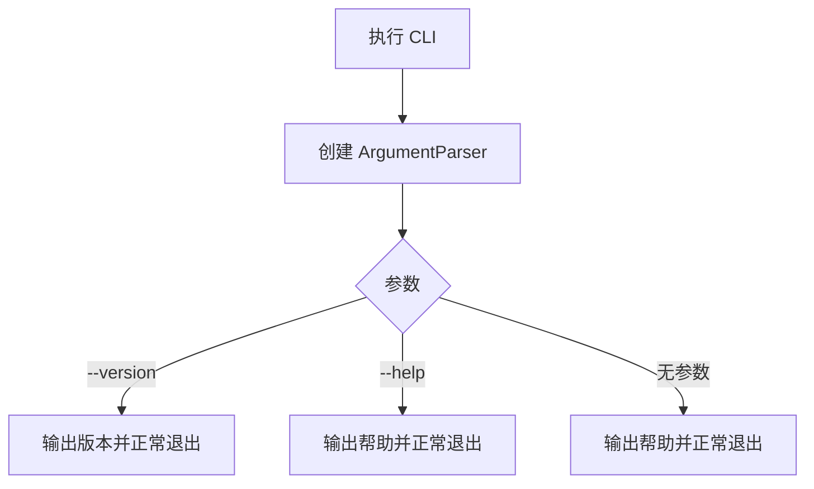
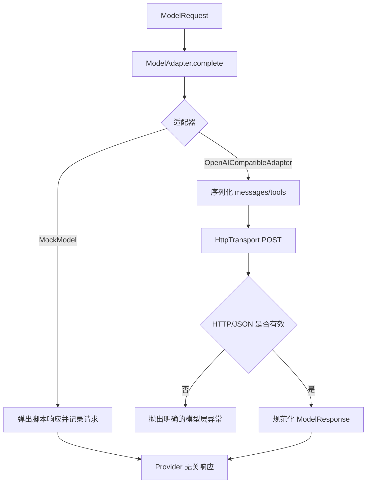

# MiniCode Rebuild 实现与学习记录

## 项目目标

从零实现一个可安装、可运行、可测试和可演示的本地终端 AI Coding Agent。项目按阶段建立模型适配、工具系统、安全边界、Agent Loop、上下文管理、会话恢复与扩展机制；每个阶段都保留真实的设计、测试和 Git 记录。

## 当前状态

| 项目 | 内容 |
|---|---|
| 当前阶段 | 阶段 2：工具基础设施（待开始） |
| 最近完成 | 阶段 1：核心类型与模型适配层 |
| 当前分支 | `rebuild/minicode-learning` |
| 最新阶段实现提交 | `274523e feat(phase-01): add model adapter and mock model` |
| 测试状态 | 阶段 1 测试 `28 passed`；全量回归 `32 passed` |
| 下一步 | 推送阶段 1，然后分析阶段 2 |

## 总体架构

项目采用 `src/` 布局。阶段 0 只建立可安装包和 CLI 外壳；后续阶段在包内逐步加入核心类型、模型适配、工具基础设施和 Agent Loop。入口层只负责参数解析与展示，不提前依赖模型或工具模块。


## 阶段路线图

| 阶段 | 名称 | 状态 | 核心产物 | 提交 |
|---|---|---|---|---|
| 0 | 仓库初始化与工程基线 | 已完成 | Python 包、CLI、pytest、README、学习日志 | `62ca406` |
| 1 | 核心类型与模型适配层 | 已完成 | 核心类型、`ModelAdapter`、`MockModel`、真实适配器 | `274523e` |
| 2 | 工具基础设施 | 待开始 | 工具定义、上下文、结果和注册表 | - |
| 3 | 只读工作区工具 | 待开始 | 读取、列举、搜索和路径保护 | - |
| 4 | 写入、编辑和命令执行工具 | 待开始 | 安全写入、编辑、命令与权限决策 | - |
| 5 | 最小 Agent Loop | 待开始 | 有界模型/工具执行循环 | - |
| 6 | 可用的 CLI 与运行配置 | 待开始 | 交互模式、Headless 模式和运行配置 | - |
| 7 | 上下文预算与压缩 | 待开始 | 预算、裁剪、摘要和降级策略 | - |
| 8 | 会话、Checkpoint 与 Rewind | 待开始 | 会话持久化、检查点和恢复 | - |
| 9 | Skills、Hooks 与扩展机制 | 待开始 | 按需技能和生命周期扩展点 | - |
| 10 | 可观测性、质量与发布准备 | 待开始 | 日志、质量门禁、安装与发布验证 | - |
| 11 | 可选高级能力 | 待开始 | 核心稳定后单独选择并实现 | - |

## 阶段 0：仓库初始化与工程基线

### 1. 阶段目标

- 建立 Python 3.11+ 的标准 `src/` 包结构。
- 使用 `pyproject.toml` 声明构建方式、项目元数据、CLI 和 pytest 配置。
- 提供能显示帮助和版本的最小 CLI。
- 建立 README、忽略规则、环境变量示例和阶段学习日志。
- 编写并运行不依赖网络或真实密钥的初始测试。

### 2. 本阶段非目标

- 不接入真实模型或 API。
- 不实现模型适配器、工具注册表或 Agent Loop。
- 不实现文件操作、命令执行、权限、会话、记忆、Skills、Hooks、MCP 或 TUI。
- 不引入运行时第三方依赖。

### 3. 参考资料与源码分析

| 参考项 | 路径或提交 | 学到的内容 | 本项目的取舍 |
|---|---|---|---|
| MiniCode Python 工程配置 | `D:\code\MiniCode-Python\pyproject.toml` | Python 版本、构建后端、控制台脚本和 pytest 可以集中声明 | 同样集中配置，但使用 `src/` 布局隔离源码，并只声明一个当前可工作的 CLI |
| MiniCode Python 入口 | `D:\code\MiniCode-Python\minicode\main.py` | 入口应负责参数解析和依赖组装 | 阶段 0 只解析 `--version` 和帮助，不加载任何尚未实现的运行时能力 |
| MiniCode Python 入口清理 | 提交 `47db045` | 已删除模块若仍留在脚本入口中，会让安装成功但命令运行失败 | 每个入口必须有测试；当前只注册一个最小入口 |
| MiniCode Python README | `D:\code\MiniCode-Python\README.zh-CN.md` | README 应给出可复制的安装、启动和验证命令 | 只描述当前阶段真实可用的命令，不提前宣称后续功能 |
| MiniClaudeCode README | `https://github.com/Monet1016/MiniClaudeCode`，提交 `4adcec6` | 入口层负责 CLI 和依赖组装，执行引擎不应反向依赖入口；项目应从可运行小闭环逐步扩展 | 阶段 0 保留独立 `cli.py` 边界，不复制其单文件实现，也不引入其中的高级能力 |

### 4. 设计方案

#### 4.1 模块职责

- `minicode_rebuild.__init__`：保存包版本这一项稳定元数据。
- `minicode_rebuild.cli`：构造参数解析器并提供控制台入口。
- `minicode_rebuild.__main__`：支持 `python -m minicode_rebuild`。
- `tests/`：验证版本、帮助、模块入口和控制台行为。

#### 4.2 核心数据结构

阶段 0 不定义 Agent 领域类型。唯一的稳定数据是包版本字符串，后续可由 CLI 和包元数据共同使用。

#### 4.3 执行流程



### 5. 实现内容

| 文件 | 新增或修改 | 作用 |
|---|---|---|
| `pyproject.toml` | 新增 | 声明构建后端、Python 版本、开发依赖、包发现、CLI 和 pytest 配置 |
| `src/minicode_rebuild/__init__.py` | 新增 | 暴露单一版本来源 |
| `src/minicode_rebuild/cli.py` | 新增 | 构造无副作用参数解析器并实现阶段 0 CLI |
| `src/minicode_rebuild/__main__.py` | 新增 | 支持 `python -m minicode_rebuild` |
| `tests/test_cli.py` | 新增 | 覆盖版本、帮助、模块入口和非法参数 |
| `README.md` | 新增 | 记录当前真实能力、安装、使用和测试方法 |
| `.gitignore` | 新增 | 排除密钥、本地环境、缓存和构建产物 |
| `.gitattributes` | 新增 | 统一文本文件换行规则，降低跨平台差异 |
| `.env.example` | 新增 | 为阶段 1 预留无敏感值的配置名称 |
| `docs/REBUILD_LOG.md` | 新增 | 保存路线图、参考分析、设计、验证和学习记录 |
| `AI_MINICODE_REBUILD_EXECUTION_PROMPT.md` | 纳入版本控制 | 保存项目的持续执行协议 |

### 6. 关键代码解析

#### 6.1 `build_parser`

`build_parser()` 只创建并返回 `ArgumentParser`，不读取配置、不访问网络，也不启动任何 Agent 能力。这使参数结构可以独立测试，并保证阶段 0 的 CLI 不依赖后续模块。`--version` 直接读取包级 `__version__`，避免 CLI 与包元数据在源码中出现两套运行时版本常量。

#### 6.2 `main`

`main(argv)` 接收可选参数序列：测试传入列表时不需要修改全局 `sys.argv`，控制台脚本不传参数时则自然使用真实命令行。正常的无参数路径打印帮助并返回 `0`；`argparse` 对帮助、版本和非法参数分别给出标准退出码。

#### 6.3 调用链

```text
minicode-rebuild / python -m minicode_rebuild
→ minicode_rebuild.cli.main
→ build_parser
→ parse_args
→ 版本、帮助或参数错误输出
```

### 7. 测试与验证

#### 7.1 测试范围

- 包版本可读取。
- CLI 无参数时输出帮助并成功退出。
- CLI 的 `--version` 输出与包版本一致。
- `python -m minicode_rebuild` 可作为模块入口运行。
- 安装后的 `minicode-rebuild` 控制台脚本可执行。

#### 7.2 执行命令

```bash
python -m venv .venv
.\.venv\Scripts\python.exe -m pip install -e ".[dev]"
.\.venv\Scripts\python.exe -m pytest tests\test_cli.py -q
.\.venv\Scripts\python.exe -m pytest -q
.\.venv\Scripts\python.exe -m minicode_rebuild --version
.\.venv\Scripts\minicode-rebuild.exe --help
.\.venv\Scripts\python.exe -m compileall -q src tests
```

#### 7.3 实际结果

- 验证解释器：Python `3.14.6`，满足项目声明的 Python `3.11+`。
- 可编辑安装：成功构建并安装 `minicode-rebuild==0.1.0`，同时安装 pytest 开发依赖。
- 阶段测试：`4 passed in 1.17s`。
- 全量回归：`4 passed in 0.98s`。
- 模块版本入口：输出 `minicode-rebuild 0.1.0`，退出码为 `0`。
- 控制台脚本：成功显示 `usage: minicode-rebuild [-h] [--version]`。
- 编译检查：`compileall` 无错误输出，退出码为 `0`。

### 8. 遇到的问题与解决过程

| 问题 | 根因 | 解决方案 | 如何避免 |
|---|---|---|---|
| 自动化账户触发 Git `dubious ownership` | 仓库由用户账户创建，执行环境使用不同 Windows SID | Git 命令仅在本次调用中传入 `safe.directory`，不修改用户全局配置 | 不通过全局白名单扩大信任范围 |
| 首次可编辑安装无法下载构建依赖 | 沙箱网络策略阻止访问配置的 PyPI 镜像 | 获得联网许可后原命令重试成功 | 将网络策略问题与项目构建问题分开记录，不通过降低依赖版本伪装修复 |

### 9. 与参考项目的差异

本项目从空仓库建立 `src/` 包布局和单一入口。参考项目当前已经包含完整运行时与大量高级能力，本阶段不会复制这些模块；MiniClaudeCode 的模块边界只作为后续依赖方向参考。

### 10. 本阶段知识点

- 构建配置、包结构、控制台入口和测试共同构成可验证的工程基线。
- “能够安装”和“入口能够运行”是两项不同的验收，需要分别测试。
- 路线图中的后续模块不应提前成为阶段 0 入口的依赖。

### 11. 自测问题

1. 为什么 `src/` 布局能更早暴露未安装包或导入路径配置错误？
2. 为什么控制台脚本需要独立于函数单元测试进行验证？
3. 为什么阶段 0 不应提前加入模型 SDK？

### 12. 阶段验收

- [x] 可执行开发模式安装。
- [x] CLI 能输出帮助。
- [x] CLI 能输出版本。
- [x] 阶段 0 测试通过。
- [x] 全量回归测试通过。
- [x] 文档记录与实际结果一致。

### 13. Git 记录

- 分支：`rebuild/minicode-learning`
- 提交：`62ca406`
- 提交信息：`chore(phase-00): bootstrap project and learning log`
- 远程状态：已推送至 `origin/rebuild/minicode-learning`

### 14. 下一阶段

阶段 1 将定义核心消息、模型响应与工具调用类型，建立 `ModelAdapter` 协议、可测试的 `MockModel`，并加入 OpenAI-compatible 真实适配器。

## 阶段 1：核心类型与模型适配层

### 1. 阶段目标

- 定义消息、模型请求、模型响应、工具调用、模型工具声明和 token 用量等核心类型。
- 定义与具体 Provider 解耦的 `ModelAdapter` 协议。
- 实现可按脚本返回响应或异常、并记录请求的 `MockModel`。
- 实现一个非流式 OpenAI-compatible Chat Completions 适配器。
- 通过环境变量加载默认模型、API 基址、API Key 和超时。
- 使用可注入假传输层完成真实适配器测试，不依赖网络和真实密钥。

### 2. 本阶段非目标

- 不实现工具注册、参数 schema 执行校验或任何本地工具。
- 不实现 Agent Loop、重试、流式输出、成本统计或模型路由。
- 不把真实模型调用接入 CLI。
- 不读取 `.env` 文件，不引入第三方模型 SDK。
- 不支持图像、音频、自定义工具或 Provider 私有高级参数。

### 3. 参考资料与源码分析

| 参考项 | 路径或提交 | 学到的内容 | 本项目的取舍 |
|---|---|---|---|
| MiniCode 核心类型 | `D:\code\MiniCode-Python\minicode\types.py` | Provider 应通过统一协议返回规范化响应，Agent 不应依赖原始响应体 | 使用不可变 dataclass 代替松散 `TypedDict`，并把一次调用封装为 `ModelRequest` |
| MiniCode Mock 模型 | `D:\code\MiniCode-Python\minicode\mock_model.py`、提交 `4e5253b` | Mock 让测试不依赖真实 Provider；参考实现会根据命令生成固定工具调用 | 本阶段采用响应队列而非内置命令语义，使任何测试都能显式编排文本、工具调用和异常 |
| MiniCode OpenAI 适配器 | `D:\code\MiniCode-Python\minicode\openai_adapter.py` | Provider 层负责消息/工具序列化、HTTP 错误和响应规范化 | 只保留非流式最小路径，并注入传输协议，不带重试、Store、成本或工具注册依赖 |
| MiniCode Provider 修复 | 提交 `d326bc6`、`ef6c775` | Provider 私有能力不能仅凭模型名盲目开启；思考块等扩展会增加兼容复杂度 | 阶段 1 只发送 Chat Completions 的公共最小字段，不发送 thinking 等私有扩展 |
| OpenAI Chat Completions API | `https://developers.openai.com/api/reference/resources/chat/subresources/completions/methods/create` | 工具使用函数名、描述和 JSON Schema 声明；响应给出 `tool_calls`，参数是需校验的 JSON 字符串 | 建立 `ModelTool` 与 `ToolCall` 规范化边界；无效 JSON 作为协议错误，不静默替换为空对象 |
| DeepSeek API 快速开始 | `https://api-docs.deepseek.com/` | OpenAI-compatible 基址为 `https://api.deepseek.com`，支持 `deepseek-v4-pro` 和 `/chat/completions` | 将它们设为默认值，同时允许环境变量覆盖；也支持以 `/chat/completions` 结尾的完整地址 |

### 4. 设计方案

#### 4.1 模块职责

- `core.py`：定义 Provider 无关、可验证的核心数据类型和 `ModelAdapter` 协议。
- `config.py`：只从显式环境映射或 `os.environ` 加载模型设置，且不在对象 repr 中暴露密钥。
- `models/mock.py`：提供确定性脚本响应并记录调用。
- `models/openai_compatible.py`：序列化标准请求、调用注入的 HTTP 传输并规范化响应。

#### 4.2 核心数据结构

- `Message`：角色、文本、可选工具调用或工具结果关联 ID。
- `ModelTool`：模型可见的函数名、描述和 JSON Schema；它不是阶段 2 的可执行工具定义。
- `ToolCall`：模型生成的调用 ID、名称和已解析参数。
- `ModelRequest`：一次模型调用的消息与工具声明快照。
- `ModelResponse`：文本、工具调用、停止原因与 token 用量。
- `ModelSettings`：模型、基址、密钥与超时。

#### 4.3 执行流程



### 5. 实现内容

| 文件 | 新增或修改 | 作用 |
|---|---|---|
| `src/minicode_rebuild/core.py` | 新增 | 定义消息、工具声明/调用、模型请求/响应、token 用量和适配器协议 |
| `src/minicode_rebuild/config.py` | 新增 | 加载并校验 OpenAI-compatible 环境配置，隐藏密钥 repr |
| `src/minicode_rebuild/models/errors.py` | 新增 | 区分传输错误与响应协议错误 |
| `src/minicode_rebuild/models/mock.py` | 新增 | 按顺序返回脚本响应/异常并记录请求 |
| `src/minicode_rebuild/models/openai_compatible.py` | 新增 | 非流式 Chat Completions 序列化、HTTP 传输和响应规范化 |
| `src/minicode_rebuild/models/__init__.py` | 新增 | 暴露 `MockModel` 公共入口 |
| `tests/test_core.py` | 新增 | 验证核心类型约束和非法边界 |
| `tests/test_config.py` | 新增 | 验证默认值、覆盖、错误配置和密钥脱敏 |
| `tests/test_mock_model.py` | 新增 | 验证脚本响应、异常、记录、协议兼容和耗尽行为 |
| `tests/test_openai_compatible.py` | 新增 | 验证文本/工具调用、多轮序列化、HTTP/网络/JSON 错误 |
| `.env.example` | 修改 | 写明默认 DeepSeek 基址、超时和两种密钥变量 |
| `README.md` | 修改 | 记录阶段 1 真实能力、配置和最小库用法 |
| `docs/REBUILD_LOG.md` | 修改 | 补充阶段 1 分析、设计、测试和结果 |

### 6. 关键代码解析

#### 6.1 核心类型与不变量

`Message` 把对话角色限制为 system、user、assistant 和 tool。工具结果必须带 `tool_call_id`，而只有 assistant 消息能携带 `tool_calls`。`ModelRequest` 至少需要一条消息，`ModelTool` 和 `ToolCall` 对函数名执行公共格式检查。这些约束在请求到达 Provider 前暴露结构错误。

核心类型使用 `frozen=True` 和 tuple 保存集合快照，避免 Mock 记录的历史请求被调用方事后改变。参数 Mapping 会在构造时复制，但阶段 1 不执行 JSON Schema 校验；那是阶段 2 的职责。

#### 6.2 `ModelAdapter` 与 `MockModel`

`ModelAdapter.complete(request)` 只有一个输入对象和一个标准响应。`MockModel` 实现同一结构协议：每次调用先记录请求，再弹出一个 `ModelResponse` 或异常。脚本耗尽会抛出 `ModelResponseError`，测试因此不会意外重复最后一次结果或静默返回空响应。

#### 6.3 OpenAI-compatible 适配器

适配器把 `Message` 转为 Chat Completions 消息，把 `ModelTool` 转为 function tool JSON Schema。它只发送 `model`、`messages` 和可选 `tools`，不根据模型名猜测私有参数。

HTTP 由 `HttpTransport` 注入。生产实现使用 `urllib`，测试使用 `FakeTransport` 捕获 URL、header 和 payload。HTTP 非 2xx、网络故障、非 JSON、空 choices、非法 token 用量和非法工具参数分别产生明确模型层异常。工具参数字符串只有在解码为 JSON object 后才进入 `ToolCall`。

#### 6.4 调用链

```text
ModelSettings.from_env
→ OpenAICompatibleAdapter.complete(ModelRequest)
→ serialize messages/tools
→ HttpTransport.post_json
→ validate HTTP and JSON
→ normalize ModelResponse
```

### 7. 测试与验证

#### 7.1 测试范围

- 核心类型正常路径与角色/关联 ID 边界。
- 配置默认值、覆盖、密钥缺失、非法 URL、非法超时和密钥脱敏。
- Mock 的文本、工具调用、异常、请求记录和脚本耗尽行为。
- OpenAI-compatible 文本响应、工具 schema、工具调用、多轮消息、token 用量和 URL 拼接。
- HTTP 错误、非 JSON、空 choices、无效工具参数等错误路径。
- 阶段 0 CLI 回归。

#### 7.2 执行命令

```bash
.\.venv\Scripts\python.exe -m pytest tests\test_core.py tests\test_config.py tests\test_mock_model.py tests\test_openai_compatible.py -q
.\.venv\Scripts\python.exe -m pytest -q
.\.venv\Scripts\python.exe -m compileall -q src tests
.\.venv\Scripts\minicode-rebuild.exe --version
```

#### 7.3 实际结果

- 测试先行检查：实现前出现 4 个 `ModuleNotFoundError` 收集错误，原因是计划中的模块尚未创建，符合预期。
- 阶段测试：`28 passed in 0.14s`。
- 全量回归：`32 passed in 1.07s`。
- 编译检查：`compileall` 无错误输出，退出码为 `0`。
- CLI 回归：输出 `minicode-rebuild 0.1.0`。
- 安装隔离验证：从项目目录外成功导入 `OpenAICompatibleAdapter`，证明新增子包可通过现有可编辑安装访问。
- 所有模型适配测试使用假传输或 monkeypatch 的网络错误，没有发送真实 API 请求。

### 8. 遇到的问题与解决过程

| 问题 | 根因 | 解决方案 | 如何避免 |
|---|---|---|---|
| OpenAI Developer Docs MCP 无法安装 | 当前环境拒绝执行 `codex.exe`，返回 `Access is denied` | 按文档技能的官方域名回退规则，读取 OpenAI 官方 API Reference | 只以官方 API 参考为协议依据，不用搜索摘要猜测字段 |
| 测试先行时 4 个模块导入失败 | 测试引用的阶段 1 模块尚未实现 | 保留失败输出作为红灯基线，随后只实现测试要求的最小模块 | 先确认测试确实失败，再进入实现，避免测试对既有行为给出假阳性 |

### 9. 与参考项目的差异

参考 MiniCode 的当前适配器同时承担流式处理、重试、成本、Store 和 Provider 扩展。本阶段把边界缩到“标准请求 → 单次 HTTP → 标准响应”，并通过注入传输层隔离网络，使模型层先具备可预测、可测试的失败语义。

### 10. 本阶段知识点

- 统一模型协议的价值是让 Agent Loop 面向稳定领域对象，而不是 Provider JSON。
- Mock 应允许测试声明响应脚本，而不是把某个演示命令写死在模型实现中。
- 模型生成的工具参数不可信，即便能够 JSON 解码，也仍需阶段 2 的 schema 校验。

### 11. 自测问题

1. 为什么 `ModelTool` 与可执行的 `ToolDefinition` 应是两个边界对象？
2. 为什么无效的工具参数 JSON 不应该静默替换成 `{}`？
3. 为什么真实适配器测试应注入传输层，而不是 monkeypatch 整个业务方法？

### 12. 阶段验收

- [x] 核心类型和 `ModelAdapter` 协议已定义。
- [x] `MockModel` 可确定性返回文本、工具调用和异常。
- [x] OpenAI-compatible 适配器可规范化文本与工具调用。
- [x] 环境配置不提交或泄漏真实密钥。
- [x] 阶段测试通过。
- [x] 全量回归测试通过。
- [x] 文档与真实实现一致。

### 13. Git 记录

- 分支：`rebuild/minicode-learning`
- 提交：`274523e`
- 提交信息：`feat(phase-01): add model adapter and mock model`
- 远程状态：待推送

### 14. 下一阶段

阶段 2 将实现可执行工具定义、上下文、结果和注册表，并加入参数校验、未知工具处理、异常隔离与结果长度限制。
