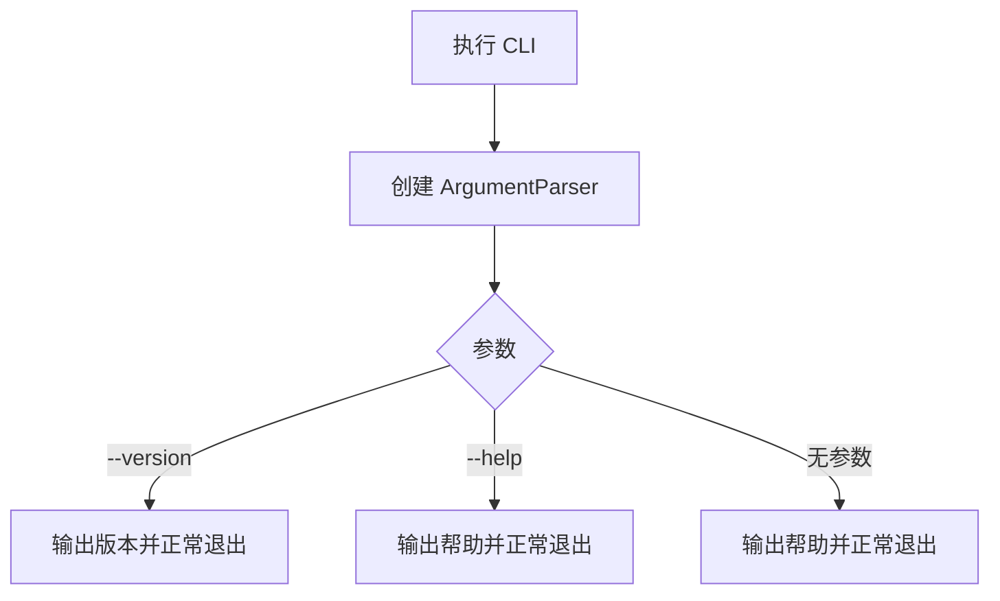
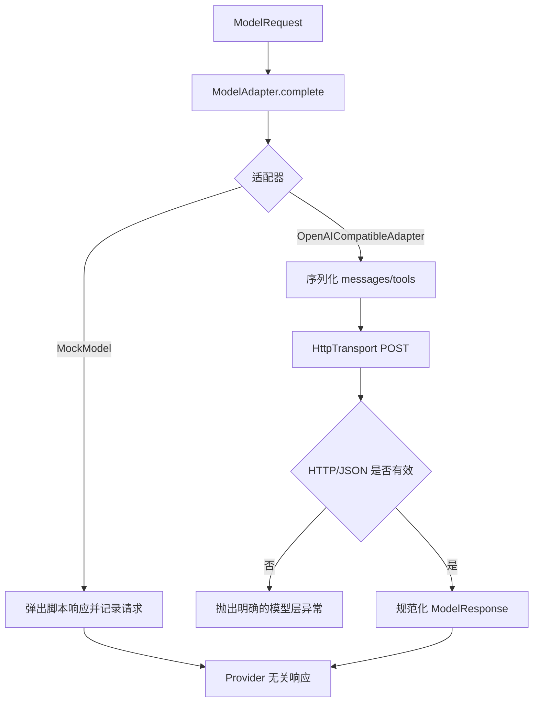
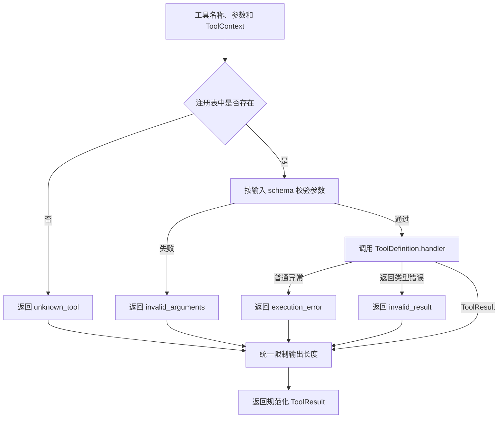
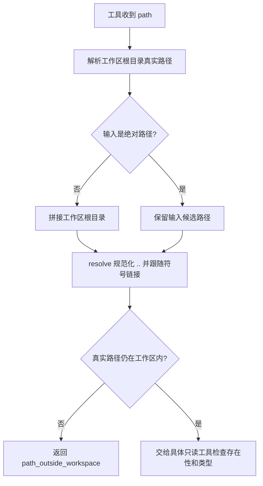

# MiniCode Rebuild 实现与学习记录

## 项目目标

从零实现一个可安装、可运行、可测试和可演示的本地终端 AI Coding Agent。项目按阶段建立模型适配、工具系统、安全边界、Agent Loop、上下文管理、会话恢复与扩展机制；每个阶段都保留真实的设计、测试和 Git 记录。

## 当前状态

| 项目 | 内容 |
|---|---|
| 当前阶段 | 阶段 4：写入、编辑和命令执行工具（待开始） |
| 最近完成 | 阶段 3：只读工作区工具 |
| 当前分支 | `rebuild/minicode-learning` |
| 最新阶段实现提交 | `8764e55 feat(phase-03): add read-only workspace tools` |
| 测试状态 | 阶段 3 测试 `43 passed, 2 skipped`；全量回归 `95 passed, 2 skipped` |
| 下一步 | 分析阶段 4 的写入原子性、命令风险和权限决策参考实现 |

## 总体架构

项目采用 `src/` 布局。阶段 0 只建立可安装包和 CLI 外壳；后续阶段在包内逐步加入核心类型、模型适配、工具基础设施和 Agent Loop。入口层只负责参数解析与展示，不提前依赖模型或工具模块。


## 阶段路线图

| 阶段 | 名称 | 状态 | 核心产物 | 提交 |
|---|---|---|---|---|
| 0 | 仓库初始化与工程基线 | 已完成 | Python 包、CLI、pytest、README、学习日志 | `62ca406` |
| 1 | 核心类型与模型适配层 | 已完成 | 核心类型、`ModelAdapter`、`MockModel`、真实适配器 | `274523e` |
| 2 | 工具基础设施 | 已完成 | 工具定义、上下文、结果和注册表 | `a56c195` |
| 3 | 只读工作区工具 | 已完成 | 读取、列举、搜索和路径保护 | `8764e55` |
| 4 | 写入、编辑和命令执行工具 | 待开始 | 安全写入、编辑、命令与权限决策 | - |
| 5 | 最小 Agent Loop | 待开始 | 有界模型/工具执行循环 | - |
| 6 | 可用的 CLI 与运行配置 | 待开始 | 交互模式、Headless 模式和运行配置 | - |
| 7 | 上下文预算与压缩 | 待开始 | 预算、裁剪、摘要和降级策略 | - |
| 8 | 会话、Checkpoint 与 Rewind | 待开始 | 会话持久化、检查点和恢复 | - |
| 9 | Skills、Hooks 与扩展机制 | 待开始 | 按需技能和生命周期扩展点 | - |
| 10 | 可观测性、质量与发布准备 | 待开始 | 日志、质量门禁、安装与发布验证 | - |
| 11 | 可选高级能力 | 待开始 | 核心稳定后单独选择并实现 | - |

## 阶段 0：仓库初始化与工程基线

### 1. 阶段目标

- 建立 Python 3.11+ 的标准 `src/` 包结构。
- 使用 `pyproject.toml` 声明构建方式、项目元数据、CLI 和 pytest 配置。
- 提供能显示帮助和版本的最小 CLI。
- 建立 README、忽略规则、环境变量示例和阶段学习日志。
- 编写并运行不依赖网络或真实密钥的初始测试。

### 2. 本阶段非目标

- 不接入真实模型或 API。
- 不实现模型适配器、工具注册表或 Agent Loop。
- 不实现文件操作、命令执行、权限、会话、记忆、Skills、Hooks、MCP 或 TUI。
- 不引入运行时第三方依赖。

### 3. 参考资料与源码分析

| 参考项 | 路径或提交 | 学到的内容 | 本项目的取舍 |
|---|---|---|---|
| MiniCode Python 工程配置 | `D:\code\MiniCode-Python\pyproject.toml` | Python 版本、构建后端、控制台脚本和 pytest 可以集中声明 | 同样集中配置，但使用 `src/` 布局隔离源码，并只声明一个当前可工作的 CLI |
| MiniCode Python 入口 | `D:\code\MiniCode-Python\minicode\main.py` | 入口应负责参数解析和依赖组装 | 阶段 0 只解析 `--version` 和帮助，不加载任何尚未实现的运行时能力 |
| MiniCode Python 入口清理 | 提交 `47db045` | 已删除模块若仍留在脚本入口中，会让安装成功但命令运行失败 | 每个入口必须有测试；当前只注册一个最小入口 |
| MiniCode Python README | `D:\code\MiniCode-Python\README.zh-CN.md` | README 应给出可复制的安装、启动和验证命令 | 只描述当前阶段真实可用的命令，不提前宣称后续功能 |
| MiniClaudeCode README | `https://github.com/Monet1016/MiniClaudeCode`，提交 `4adcec6` | 入口层负责 CLI 和依赖组装，执行引擎不应反向依赖入口；项目应从可运行小闭环逐步扩展 | 阶段 0 保留独立 `cli.py` 边界，不复制其单文件实现，也不引入其中的高级能力 |

### 4. 设计方案

#### 4.1 模块职责

- `minicode_rebuild.__init__`：保存包版本这一项稳定元数据。
- `minicode_rebuild.cli`：构造参数解析器并提供控制台入口。
- `minicode_rebuild.__main__`：支持 `python -m minicode_rebuild`。
- `tests/`：验证版本、帮助、模块入口和控制台行为。

#### 4.2 核心数据结构

阶段 0 不定义 Agent 领域类型。唯一的稳定数据是包版本字符串，后续可由 CLI 和包元数据共同使用。

#### 4.3 执行流程



### 5. 实现内容

| 文件 | 新增或修改 | 作用 |
|---|---|---|
| `pyproject.toml` | 新增 | 声明构建后端、Python 版本、开发依赖、包发现、CLI 和 pytest 配置 |
| `src/minicode_rebuild/__init__.py` | 新增 | 暴露单一版本来源 |
| `src/minicode_rebuild/cli.py` | 新增 | 构造无副作用参数解析器并实现阶段 0 CLI |
| `src/minicode_rebuild/__main__.py` | 新增 | 支持 `python -m minicode_rebuild` |
| `tests/test_cli.py` | 新增 | 覆盖版本、帮助、模块入口和非法参数 |
| `README.md` | 新增 | 记录当前真实能力、安装、使用和测试方法 |
| `.gitignore` | 新增 | 排除密钥、本地环境、缓存和构建产物 |
| `.gitattributes` | 新增 | 统一文本文件换行规则，降低跨平台差异 |
| `.env.example` | 新增 | 为阶段 1 预留无敏感值的配置名称 |
| `docs/REBUILD_LOG.md` | 新增 | 保存路线图、参考分析、设计、验证和学习记录 |
| `AI_MINICODE_REBUILD_EXECUTION_PROMPT.md` | 纳入版本控制 | 保存项目的持续执行协议 |

### 6. 关键代码解析

#### 6.1 `build_parser`

`build_parser()` 只创建并返回 `ArgumentParser`，不读取配置、不访问网络，也不启动任何 Agent 能力。这使参数结构可以独立测试，并保证阶段 0 的 CLI 不依赖后续模块。`--version` 直接读取包级 `__version__`，避免 CLI 与包元数据在源码中出现两套运行时版本常量。

#### 6.2 `main`

`main(argv)` 接收可选参数序列：测试传入列表时不需要修改全局 `sys.argv`，控制台脚本不传参数时则自然使用真实命令行。正常的无参数路径打印帮助并返回 `0`；`argparse` 对帮助、版本和非法参数分别给出标准退出码。

#### 6.3 调用链

```text
minicode-rebuild / python -m minicode_rebuild
→ minicode_rebuild.cli.main
→ build_parser
→ parse_args
→ 版本、帮助或参数错误输出
```

### 7. 测试与验证

#### 7.1 测试范围

- 包版本可读取。
- CLI 无参数时输出帮助并成功退出。
- CLI 的 `--version` 输出与包版本一致。
- `python -m minicode_rebuild` 可作为模块入口运行。
- 安装后的 `minicode-rebuild` 控制台脚本可执行。

#### 7.2 执行命令

```bash
python -m venv .venv
.\.venv\Scripts\python.exe -m pip install -e ".[dev]"
.\.venv\Scripts\python.exe -m pytest tests\test_cli.py -q
.\.venv\Scripts\python.exe -m pytest -q
.\.venv\Scripts\python.exe -m minicode_rebuild --version
.\.venv\Scripts\minicode-rebuild.exe --help
.\.venv\Scripts\python.exe -m compileall -q src tests
```

#### 7.3 实际结果

- 验证解释器：Python `3.14.6`，满足项目声明的 Python `3.11+`。
- 可编辑安装：成功构建并安装 `minicode-rebuild==0.1.0`，同时安装 pytest 开发依赖。
- 阶段测试：`4 passed in 1.17s`。
- 全量回归：`4 passed in 0.98s`。
- 模块版本入口：输出 `minicode-rebuild 0.1.0`，退出码为 `0`。
- 控制台脚本：成功显示 `usage: minicode-rebuild [-h] [--version]`。
- 编译检查：`compileall` 无错误输出，退出码为 `0`。

### 8. 遇到的问题与解决过程

| 问题 | 根因 | 解决方案 | 如何避免 |
|---|---|---|---|
| 自动化账户触发 Git `dubious ownership` | 仓库由用户账户创建，执行环境使用不同 Windows SID | Git 命令仅在本次调用中传入 `safe.directory`，不修改用户全局配置 | 不通过全局白名单扩大信任范围 |
| 首次可编辑安装无法下载构建依赖 | 沙箱网络策略阻止访问配置的 PyPI 镜像 | 获得联网许可后原命令重试成功 | 将网络策略问题与项目构建问题分开记录，不通过降低依赖版本伪装修复 |

### 9. 与参考项目的差异

本项目从空仓库建立 `src/` 包布局和单一入口。参考项目当前已经包含完整运行时与大量高级能力，本阶段不会复制这些模块；MiniClaudeCode 的模块边界只作为后续依赖方向参考。

### 10. 本阶段知识点

- 构建配置、包结构、控制台入口和测试共同构成可验证的工程基线。
- “能够安装”和“入口能够运行”是两项不同的验收，需要分别测试。
- 路线图中的后续模块不应提前成为阶段 0 入口的依赖。

### 11. 自测问题

1. 为什么 `src/` 布局能更早暴露未安装包或导入路径配置错误？
2. 为什么控制台脚本需要独立于函数单元测试进行验证？
3. 为什么阶段 0 不应提前加入模型 SDK？

### 12. 阶段验收

- [x] 可执行开发模式安装。
- [x] CLI 能输出帮助。
- [x] CLI 能输出版本。
- [x] 阶段 0 测试通过。
- [x] 全量回归测试通过。
- [x] 文档记录与实际结果一致。

### 13. Git 记录

- 分支：`rebuild/minicode-learning`
- 提交：`62ca406`
- 提交信息：`chore(phase-00): bootstrap project and learning log`
- 远程状态：已推送至 `origin/rebuild/minicode-learning`

### 14. 下一阶段

阶段 1 将定义核心消息、模型响应与工具调用类型，建立 `ModelAdapter` 协议、可测试的 `MockModel`，并加入 OpenAI-compatible 真实适配器。

## 阶段 1：核心类型与模型适配层

### 1. 阶段目标

- 定义消息、模型请求、模型响应、工具调用、模型工具声明和 token 用量等核心类型。
- 定义与具体 Provider 解耦的 `ModelAdapter` 协议。
- 实现可按脚本返回响应或异常、并记录请求的 `MockModel`。
- 实现一个非流式 OpenAI-compatible Chat Completions 适配器。
- 通过环境变量加载默认模型、API 基址、API Key 和超时。
- 使用可注入假传输层完成真实适配器测试，不依赖网络和真实密钥。

### 2. 本阶段非目标

- 不实现工具注册、参数 schema 执行校验或任何本地工具。
- 不实现 Agent Loop、重试、流式输出、成本统计或模型路由。
- 不把真实模型调用接入 CLI。
- 不读取 `.env` 文件，不引入第三方模型 SDK。
- 不支持图像、音频、自定义工具或 Provider 私有高级参数。

### 3. 参考资料与源码分析

| 参考项 | 路径或提交 | 学到的内容 | 本项目的取舍 |
|---|---|---|---|
| MiniCode 核心类型 | `D:\code\MiniCode-Python\minicode\types.py` | Provider 应通过统一协议返回规范化响应，Agent 不应依赖原始响应体 | 使用不可变 dataclass 代替松散 `TypedDict`，并把一次调用封装为 `ModelRequest` |
| MiniCode Mock 模型 | `D:\code\MiniCode-Python\minicode\mock_model.py`、提交 `4e5253b` | Mock 让测试不依赖真实 Provider；参考实现会根据命令生成固定工具调用 | 本阶段采用响应队列而非内置命令语义，使任何测试都能显式编排文本、工具调用和异常 |
| MiniCode OpenAI 适配器 | `D:\code\MiniCode-Python\minicode\openai_adapter.py` | Provider 层负责消息/工具序列化、HTTP 错误和响应规范化 | 只保留非流式最小路径，并注入传输协议，不带重试、Store、成本或工具注册依赖 |
| MiniCode Provider 修复 | 提交 `d326bc6`、`ef6c775` | Provider 私有能力不能仅凭模型名盲目开启；思考块等扩展会增加兼容复杂度 | 阶段 1 只发送 Chat Completions 的公共最小字段，不发送 thinking 等私有扩展 |
| OpenAI Chat Completions API | `https://developers.openai.com/api/reference/resources/chat/subresources/completions/methods/create` | 工具使用函数名、描述和 JSON Schema 声明；响应给出 `tool_calls`，参数是需校验的 JSON 字符串 | 建立 `ModelTool` 与 `ToolCall` 规范化边界；无效 JSON 作为协议错误，不静默替换为空对象 |
| DeepSeek API 快速开始 | `https://api-docs.deepseek.com/` | OpenAI-compatible 基址为 `https://api.deepseek.com`，支持 `deepseek-v4-pro` 和 `/chat/completions` | 将它们设为默认值，同时允许环境变量覆盖；也支持以 `/chat/completions` 结尾的完整地址 |

### 4. 设计方案

#### 4.1 模块职责

- `core.py`：定义 Provider 无关、可验证的核心数据类型和 `ModelAdapter` 协议。
- `config.py`：只从显式环境映射或 `os.environ` 加载模型设置，且不在对象 repr 中暴露密钥。
- `models/mock.py`：提供确定性脚本响应并记录调用。
- `models/openai_compatible.py`：序列化标准请求、调用注入的 HTTP 传输并规范化响应。

#### 4.2 核心数据结构

- `Message`：角色、文本、可选工具调用或工具结果关联 ID。
- `ModelTool`：模型可见的函数名、描述和 JSON Schema；它不是阶段 2 的可执行工具定义。
- `ToolCall`：模型生成的调用 ID、名称和已解析参数。
- `ModelRequest`：一次模型调用的消息与工具声明快照。
- `ModelResponse`：文本、工具调用、停止原因与 token 用量。
- `ModelSettings`：模型、基址、密钥与超时。

#### 4.3 执行流程



### 5. 实现内容

| 文件 | 新增或修改 | 作用 |
|---|---|---|
| `src/minicode_rebuild/core.py` | 新增 | 定义消息、工具声明/调用、模型请求/响应、token 用量和适配器协议 |
| `src/minicode_rebuild/config.py` | 新增 | 加载并校验 OpenAI-compatible 环境配置，隐藏密钥 repr |
| `src/minicode_rebuild/models/errors.py` | 新增 | 区分传输错误与响应协议错误 |
| `src/minicode_rebuild/models/mock.py` | 新增 | 按顺序返回脚本响应/异常并记录请求 |
| `src/minicode_rebuild/models/openai_compatible.py` | 新增 | 非流式 Chat Completions 序列化、HTTP 传输和响应规范化 |
| `src/minicode_rebuild/models/__init__.py` | 新增 | 暴露 `MockModel` 公共入口 |
| `tests/test_core.py` | 新增 | 验证核心类型约束和非法边界 |
| `tests/test_config.py` | 新增 | 验证默认值、覆盖、错误配置和密钥脱敏 |
| `tests/test_mock_model.py` | 新增 | 验证脚本响应、异常、记录、协议兼容和耗尽行为 |
| `tests/test_openai_compatible.py` | 新增 | 验证文本/工具调用、多轮序列化、HTTP/网络/JSON 错误 |
| `.env.example` | 修改 | 写明默认 DeepSeek 基址、超时和两种密钥变量 |
| `README.md` | 修改 | 记录阶段 1 真实能力、配置和最小库用法 |
| `docs/REBUILD_LOG.md` | 修改 | 补充阶段 1 分析、设计、测试和结果 |

### 6. 关键代码解析

#### 6.1 核心类型与不变量

`Message` 把对话角色限制为 system、user、assistant 和 tool。工具结果必须带 `tool_call_id`，而只有 assistant 消息能携带 `tool_calls`。`ModelRequest` 至少需要一条消息，`ModelTool` 和 `ToolCall` 对函数名执行公共格式检查。这些约束在请求到达 Provider 前暴露结构错误。

核心类型使用 `frozen=True` 和 tuple 保存集合快照，避免 Mock 记录的历史请求被调用方事后改变。参数 Mapping 会在构造时复制，但阶段 1 不执行 JSON Schema 校验；那是阶段 2 的职责。

#### 6.2 `ModelAdapter` 与 `MockModel`

`ModelAdapter.complete(request)` 只有一个输入对象和一个标准响应。`MockModel` 实现同一结构协议：每次调用先记录请求，再弹出一个 `ModelResponse` 或异常。脚本耗尽会抛出 `ModelResponseError`，测试因此不会意外重复最后一次结果或静默返回空响应。

#### 6.3 OpenAI-compatible 适配器

适配器把 `Message` 转为 Chat Completions 消息，把 `ModelTool` 转为 function tool JSON Schema。它只发送 `model`、`messages` 和可选 `tools`，不根据模型名猜测私有参数。

HTTP 由 `HttpTransport` 注入。生产实现使用 `urllib`，测试使用 `FakeTransport` 捕获 URL、header 和 payload。HTTP 非 2xx、网络故障、非 JSON、空 choices、非法 token 用量和非法工具参数分别产生明确模型层异常。工具参数字符串只有在解码为 JSON object 后才进入 `ToolCall`。

#### 6.4 调用链

```text
ModelSettings.from_env
→ OpenAICompatibleAdapter.complete(ModelRequest)
→ serialize messages/tools
→ HttpTransport.post_json
→ validate HTTP and JSON
→ normalize ModelResponse
```

### 7. 测试与验证

#### 7.1 测试范围

- 核心类型正常路径与角色/关联 ID 边界。
- 配置默认值、覆盖、密钥缺失、非法 URL、非法超时和密钥脱敏。
- Mock 的文本、工具调用、异常、请求记录和脚本耗尽行为。
- OpenAI-compatible 文本响应、工具 schema、工具调用、多轮消息、token 用量和 URL 拼接。
- HTTP 错误、非 JSON、空 choices、无效工具参数等错误路径。
- 阶段 0 CLI 回归。

#### 7.2 执行命令

```bash
.\.venv\Scripts\python.exe -m pytest tests\test_core.py tests\test_config.py tests\test_mock_model.py tests\test_openai_compatible.py -q
.\.venv\Scripts\python.exe -m pytest -q
.\.venv\Scripts\python.exe -m compileall -q src tests
.\.venv\Scripts\minicode-rebuild.exe --version
```

#### 7.3 实际结果

- 测试先行检查：实现前出现 4 个 `ModuleNotFoundError` 收集错误，原因是计划中的模块尚未创建，符合预期。
- 阶段测试：`28 passed in 0.14s`。
- 全量回归：`32 passed in 1.07s`。
- 编译检查：`compileall` 无错误输出，退出码为 `0`。
- CLI 回归：输出 `minicode-rebuild 0.1.0`。
- 安装隔离验证：从项目目录外成功导入 `OpenAICompatibleAdapter`，证明新增子包可通过现有可编辑安装访问。
- 所有模型适配测试使用假传输或 monkeypatch 的网络错误，没有发送真实 API 请求。

### 8. 遇到的问题与解决过程

| 问题 | 根因 | 解决方案 | 如何避免 |
|---|---|---|---|
| OpenAI Developer Docs MCP 无法安装 | 当前环境拒绝执行 `codex.exe`，返回 `Access is denied` | 按文档技能的官方域名回退规则，读取 OpenAI 官方 API Reference | 只以官方 API 参考为协议依据，不用搜索摘要猜测字段 |
| 测试先行时 4 个模块导入失败 | 测试引用的阶段 1 模块尚未实现 | 保留失败输出作为红灯基线，随后只实现测试要求的最小模块 | 先确认测试确实失败，再进入实现，避免测试对既有行为给出假阳性 |
| 首次 Git 推送发生 `SSL_ERROR_SYSCALL` | 沙箱内到 GitHub 的 TLS 连接失败 | 使用获准的外部网络环境原命令重试，推送成功 | 保留本地提交，不改写历史；把网络问题与提交内容问题分开处理 |

### 9. 与参考项目的差异

参考 MiniCode 的当前适配器同时承担流式处理、重试、成本、Store 和 Provider 扩展。本阶段把边界缩到“标准请求 → 单次 HTTP → 标准响应”，并通过注入传输层隔离网络，使模型层先具备可预测、可测试的失败语义。

### 10. 本阶段知识点

- 统一模型协议的价值是让 Agent Loop 面向稳定领域对象，而不是 Provider JSON。
- Mock 应允许测试声明响应脚本，而不是把某个演示命令写死在模型实现中。
- 模型生成的工具参数不可信，即便能够 JSON 解码，也仍需阶段 2 的 schema 校验。

### 11. 自测问题

1. 为什么 `ModelTool` 与可执行的 `ToolDefinition` 应是两个边界对象？
2. 为什么无效的工具参数 JSON 不应该静默替换成 `{}`？
3. 为什么真实适配器测试应注入传输层，而不是 monkeypatch 整个业务方法？

### 12. 阶段验收

- [x] 核心类型和 `ModelAdapter` 协议已定义。
- [x] `MockModel` 可确定性返回文本、工具调用和异常。
- [x] OpenAI-compatible 适配器可规范化文本与工具调用。
- [x] 环境配置不提交或泄漏真实密钥。
- [x] 阶段测试通过。
- [x] 全量回归测试通过。
- [x] 文档与真实实现一致。

### 13. Git 记录

- 分支：`rebuild/minicode-learning`
- 提交：`274523e`
- 提交信息：`feat(phase-01): add model adapter and mock model`
- 远程状态：已推送至 `origin/rebuild/minicode-learning`

### 14. 下一阶段

阶段 2 将实现可执行工具定义、上下文、结果和注册表，并加入参数校验、未知工具处理、异常隔离与结果长度限制。

## 阶段 2：工具基础设施

### 1. 阶段目标

- 定义模型工具声明与 Python 执行函数之间的 `ToolDefinition` 边界。
- 定义承载工作目录和一次执行共享状态的 `ToolContext`。
- 使用 `ToolResult` 统一表达成功、失败、错误代码和输出截断信息。
- 实现支持注册、查找、模型声明导出和执行的 `ToolRegistry`。
- 在执行处理器之前校验参数，在执行之后统一隔离普通异常并限制结果长度。

### 2. 本阶段非目标

- 不实现 `read_file`、搜索、写入、编辑或命令执行等具体工具。
- 不实现工作区路径解析、越界保护、危险操作审批或权限持久化；这些分别属于阶段 3 和阶段 4。
- 不实现后台任务、并发工具调用、重试、Hooks、MCP 或 Agent Loop。
- 不引入完整 JSON Schema 第三方实现；只支持当前工具参数需要且可明确测试的子集。

### 3. 参考资料与源码分析

| 参考项 | 路径或提交 | 学到的内容 | 本项目的取舍 |
|---|---|---|---|
| MiniCode 工具注册表 | `D:\code\MiniCode-Python\minicode\tooling.py`、提交 `4e5253b` | 工具定义需要把模型 schema、参数解析和执行函数绑定在一起，注册表负责统一查找和调用 | 保留稳定的定义与注册表边界，但让本项目的 `ToolDefinition` 直接复用阶段 1 的 `ModelTool` schema |
| MiniCode 注册表索引修复 | 提交 `050c45a` | 工具数量增长后，名称查找不应每次线性扫描；重复名称也必须在注册时暴露 | 使用名称到定义的字典进行 O(1) 查找，并拒绝重复注册 |
| MiniCode 校验与输出治理 | 提交 `3d1c2a8`、`dd6e934` | 模型参数和工具输出都不可信；校验错误、运行异常和超长结果需要在统一边界收敛 | 实现小型 JSON Schema 子集、稳定错误代码和统一头尾截断，不提前加入日志与工具专属截断策略 |
| MiniClaudeCode 工具基础设施 | `https://github.com/Monet1016/MiniClaudeCode`，提交 `4adcec6` 的 `tooling.py` 与 `tests/test_tooling.py` | 最小注册表仍应覆盖未知工具、校验异常、运行异常、非法返回值和超长错误文本 | 吸收最小闭环测试思路，但不复制其后台任务、权限对象或运行时字段；这些能力留给后续阶段 |

### 4. 设计方案

#### 4.1 模块职责

- `minicode_rebuild.tooling`：集中定义工具上下文、结果、可执行定义、参数校验错误和注册表。
- `minicode_rebuild.core.ModelTool`：继续作为模型可见的只读声明；由 `ToolDefinition.to_model_tool()` 生成，避免执行函数泄漏到模型边界。
- `ToolRegistry`：持有唯一名称索引，先校验参数，再调用处理器，最后检查并限制结果。

#### 4.2 核心数据结构

- `ToolContext`：包含 `cwd: Path` 和可变 `state`。注册表原样传递同一个上下文，不处理阶段 3 才定义的路径安全语义。
- `ToolResult`：包含 `ok`、`output`、稳定的可选 `error_code`，以及 `truncated`、`original_length` 截断元数据。
- `ToolDefinition`：包含名称、描述、对象型输入 schema、处理器和可选的单工具输出上限。
- `ToolRegistry`：用字典保存定义；默认输出上限为 20,000 字符，单工具可以选择更小的上限。

参数校验支持对象、数组、字符串、整数、数字、布尔值和 null，并处理 `required`、`properties`、`additionalProperties`、`items`、`enum` 与常用长度/数值边界。未支持的 schema 关键字不会被伪装成已经生效；定义注册时会检查 schema 自身结构。

#### 4.3 执行流程



`Exception` 会转换为失败结果，使单个工具错误不击穿未来的 Agent Loop；`KeyboardInterrupt` 和 `SystemExit` 不属于普通执行失败，保持可传播，以便用户中断和进程退出仍然有效。

### 5. 实现内容

| 文件 | 新增或修改 | 作用 |
|---|---|---|
| `src/minicode_rebuild/tooling.py` | 新增 | 定义工具上下文、结果、可执行定义、schema 校验器和注册表 |
| `tests/test_tooling.py` | 新增 | 覆盖注册、模型声明导出、参数边界、异常隔离、返回协议和输出截断 |
| `README.md` | 修改 | 说明阶段 2 的真实能力、边界和最小注册表示例 |
| `docs/REBUILD_LOG.md` | 修改 | 记录阶段 2 的参考分析、设计、实现、验证与学习结论 |

### 6. 关键代码解析

#### 6.1 `ToolDefinition` 与 `ModelTool`

`ToolDefinition` 是执行侧对象，包含处理器；`ModelTool` 是模型侧对象，只包含名称、描述和参数 schema。构造 `ToolDefinition` 时先检查根 schema 必须是对象，再借助 `ModelTool` 复用函数名称约束。`to_model_tool()` 返回 schema 的深拷贝，使 Provider 层永远看不到 Python 处理器。

```python
def to_model_tool(self) -> ModelTool:
    return ModelTool(
        name=self.name,
        description=self.description,
        parameters=deepcopy(dict(self.input_schema)),
    )
```

#### 6.2 参数校验

注册时，`_validate_schema_definition` 检查 schema 本身是否属于已支持子集，拒绝未知关键字、未定义的必填属性和矛盾边界。执行时，`_validate_value` 递归检查实际值，并用 `$.items[0].mode` 一类路径指出失败位置。整数校验显式排除 Python 中属于 `int` 子类的 `bool`，避免模型传入 `true` 后被当成数字 `1`。

校验失败会返回 `error_code="invalid_arguments"`，处理器不会运行。这样未来的 Agent Loop 可以根据稳定错误代码做决策，而用户仍能从文本输出理解失败原因。

#### 6.3 异常隔离与返回协议

`ToolRegistry.execute()` 只捕获 `Exception`，将处理器普通异常转换为 `execution_error`。处理器若没有返回 `ToolResult`，则转换为 `invalid_result`。未知名称直接返回 `unknown_tool`。`KeyboardInterrupt` 和 `SystemExit` 继承自 `BaseException`，因此不会被误吞。

```text
name + arguments + context
→ O(1) 查找定义
→ schema 校验
→ handler
→ ToolResult 类型检查
→ 统一输出限制
```

#### 6.4 结果长度限制

注册表默认限制输出为 20,000 字符，每个定义可设置不少于 32 字符的更小上限。超过限制时同时保留开头和结尾，中间插入明确标记，并设置 `truncated=True` 与 `original_length`。成功结果、领域失败、校验错误和运行异常都经过同一终结步骤，因此长错误文本也无法绕过限制。

### 7. 测试与验证

#### 7.1 测试范围

- 上下文工作目录规范化和共享状态传递。
- 注册、查找、重复名称拒绝和 `ModelTool` 声明导出。
- 根 schema、输出上限和处理器返回协议边界。
- 必填属性、类型、额外属性、数值范围、嵌套数组与枚举校验。
- 未知工具、普通执行异常、`KeyboardInterrupt` 和 `SystemExit`。
- 成功结果、领域失败和超长校验错误的统一头尾截断。
- 阶段 0 CLI 与阶段 1 模型适配层的完整回归。

#### 7.2 执行命令

```bash
.\.venv\Scripts\python.exe -m pytest tests\test_tooling.py -q
.\.venv\Scripts\python.exe -m pytest -q
.\.venv\Scripts\python.exe -m compileall -q src tests
git -c safe.directory=D:/code/MiNiCode-xxx diff --check
```

#### 7.3 实际结果

- 测试先行检查：实现前在收集阶段出现 `ModuleNotFoundError: No module named 'minicode_rebuild.tooling'`，证明新测试确实覆盖尚未存在的能力。
- 首轮实现：`19 passed, 1 failed`；唯一失败是必填属性错误文本使用 `requires property`，没有满足测试约定的 `required property` 表达。
- 阶段测试：`20 passed in 0.12s`。
- 全量回归：`52 passed in 1.29s`。
- 编译检查：`compileall` 无错误输出，退出码为 `0`。
- 差异检查：`git diff --check` 无错误输出，退出码为 `0`。

### 8. 遇到的问题与解决过程

| 问题 | 根因 | 解决方案 | 如何避免 |
|---|---|---|---|
| 首轮阶段测试有 1 项错误提示断言失败 | 实现使用“requires property”，测试约定检查“required property”；错误类型、错误代码和处理器短路均正确 | 统一为 `is missing required property`，保留 JSON 路径和属性名后重新运行全部测试 | 把错误代码作为机器边界，把少量稳定文本作为用户边界；修改提示后必须重跑失败用例与回归 |
| 临时参考仓库首次清理因权限审核超时 | 递归删除触发了执行环境的自动权限审核，审核未在时限内完成 | 先确认解析后的精确目录，再用同一路径获得授权后清理成功 | 临时资源使用独立、明确路径；删除前验证目标，审核超时不等同于命令或目录不安全 |

### 9. 与参考项目的差异

参考 MiniCode 的当前工具层已经包含后台任务、权限对象、运行时会话、日志持久化和针对具体工具的截断规则。参考 MiniClaudeCode 也把后台任务元数据纳入 `ToolResult`。本阶段只建立未来 Agent Loop 必需的稳定执行边界：共享上下文、schema、处理器、规范结果和注册表。权限在阶段 4 结合真实写入与命令风险设计，后台任务则只有出现明确需求时才加入，避免为尚不存在的调用场景固化字段。

与两个参考实现主要依赖每个工具自带 validator 的方式不同，本项目让 `ToolDefinition` 的模型可见 schema 同时成为执行前校验依据。这样声明和实际约束不会天然形成两套来源；代价是当前只支持经过测试的 JSON Schema 子集，并对不支持的关键字快速失败。

### 10. 本阶段知识点

- 模型可见声明和 Python 可执行定义职责不同，但应共享同一份参数 schema。
- 工具边界需要同时防御不可信参数、不受控异常、错误返回类型和超长输出。
- 错误文本服务于人，稳定错误代码服务于程序；两者一起让未来 Agent Loop 可以安全继续。
- 捕获 `Exception` 而不是 `BaseException`，才能在隔离工具故障的同时保留用户中断和进程退出语义。

### 11. 自测问题

1. 为什么 `ToolDefinition` 不直接作为 `ModelRequest.tools` 的元素发送给 Provider？
2. 为什么参数校验必须在处理器运行之前，而且处理器收到的是参数副本？
3. 为什么输出限制必须同样作用于校验错误和运行异常？

### 12. 阶段验收

- [x] `ToolDefinition`、`ToolContext`、`ToolResult` 和 `ToolRegistry` 已实现。
- [x] 工具可以转换为阶段 1 的 `ModelTool` 声明。
- [x] 未知工具和无效参数返回稳定失败结果。
- [x] 普通处理器异常不会击穿注册表边界。
- [x] 所有结果路径都受字符长度上限保护。
- [x] 阶段测试和全量回归测试通过。
- [x] README 与学习文档反映真实实现边界。

### 13. Git 记录

- 分支：`rebuild/minicode-learning`
- 提交：`a56c195`
- 提交信息：`feat(phase-02): implement tool registry`
- 远程状态：已推送至 `origin/rebuild/minicode-learning`

### 14. 下一阶段

阶段 3 将在本注册表之上实现 `read_file`、`list_files`、`glob_search` 和 `grep_files`，并集中设计工作区路径解析、绝对路径与 `..` 越界保护、搜索结果上限和大文件读取边界。

## 阶段 3：只读工作区工具

### 1. 阶段目标

- 实现 `read_file`、`list_files`、`glob_search` 和 `grep_files` 四个只读工具。
- 建立唯一的工作区路径解析入口，所有工具先经过同一条路径安全边界。
- 允许工作区内的相对路径和绝对路径，同时拒绝通过绝对路径、`..` 或符号链接逃逸工作区。
- 为单文件读取、目录列举、文件匹配、内容搜索和单行展示分别设置明确上限。
- 通过阶段 2 的 `ToolRegistry` 执行具体工具，验证 schema 校验、异常隔离和最终输出截断可以组合工作。

### 2. 本阶段非目标

- 不实现写入、编辑、补丁、删除或命令执行。
- 不实现权限询问、一次性授权或危险操作分类；只读工具无条件受工作区根目录约束。
- 不读取 `.gitignore` 或建立可配置忽略规则，不调用外部 `rg`、`grep` 或 shell 命令。
- 不支持二进制、图片、PDF 或自动编码探测；文本统一按 UTF-8 处理。
- 不做全文索引、缓存、并行搜索、模糊搜索或 AST 级代码导航。

### 3. 参考资料与源码分析

| 参考项 | 路径或提交 | 学到的内容 | 本项目的取舍 |
|---|---|---|---|
| MiniCode 工作区路径守卫 | `D:\code\MiniCode-Python\minicode\workspace.py`、提交 `4e5253b` | 相对路径和绝对路径应先解析为规范路径，再用工作区根目录做包含关系检查；这个边界应独立于具体工具 | 保留集中解析与 `Path.relative_to` 检查，并额外用解析后的真实路径防止工作区内符号链接指向外部；本阶段不接入权限管理器 |
| MiniCode 基础读取与列举工具 | `minicode/tools/read_file.py`、`list_files.py`，提交 `4e5253b`、`8d83e84`、`661c5c5` | 读取需要 offset/limit 和二进制/编码错误处理；目录结果需要稳定排序和数量限制；后续提交说明把 `OSError` 转为空字符串会掩盖真实失败 | 不加入缓存；按块跳过字符并只读取请求窗口，避免为了截断先把大文件全部载入内存；缺失、类型错误、编码错误和 I/O 错误返回不同错误代码 |
| MiniCode 内容搜索扩展 | `minicode/tools/grep_files.py`、提交 `3d1c2a8` | 搜索需要忽略常见大型目录、限制扫描文件数/结果数、跳过非文本文件，并输出 `path:line:content` | 只保留阶段 3 必需的正则、单个 include glob、大小与结果限制；逐文件逐行搜索，不对整个 `rglob` 结果排序，也不一次读完整文件 |
| MiniCode 路径守卫补齐 | 提交 `f5873de` 与 `tests/test_tools.py` | 后加入的工具若直接拼接 `cwd / path`，会绕开既有安全边界；该问题后来需要专门安全修复和越界回归测试 | 四个工具从第一版就只调用公共解析器；阶段测试同时覆盖 `..`、工作区外绝对路径和可用时的符号链接逃逸 |

### 4. 设计方案

#### 4.1 模块职责

- `minicode_rebuild.workspace`：定义 `WorkspacePathError` 和 `resolve_workspace_path()`，只负责把不可信输入解析为工作区内的规范路径。
- `minicode_rebuild.tools.read_only`：定义四个工具、只读扫描辅助函数、统一忽略目录和各级预算常量。
- `minicode_rebuild.tools`：暴露四个 `ToolDefinition` 及稳定的 `READ_ONLY_TOOLS` 集合，供未来 CLI 或 Agent Loop 注册。
- `tests/test_workspace.py`：只验证路径解析边界，不依赖工具注册表。
- `tests/test_read_only_tools.py`：全部通过 `ToolRegistry.execute()` 验证工具正常、边界、错误、安全和集成路径。

#### 4.2 工具契约与预算

| 工具 | 输入 | 正常输出 | 主动限制 |
|---|---|---|---|
| `read_file` | `path`，可选 `offset`、`limit` | 文件窗口、字符位置和是否仍有后续内容 | 默认读取 8,000 字符，单次最多 16,000；按块跳过 offset，不整文件载入 |
| `list_files` | 可选 `path`、`limit` | 直接子项的类型和工作区相对路径 | 默认 200 项，最多 1,000 项；稳定排序，达到上限给出截断摘要 |
| `glob_search` | `pattern`，可选 `path`、`limit` | 匹配文件/目录的工作区相对路径 | 拒绝绝对或含 `..` 的 glob；忽略常见大型目录；限制扫描项和返回项 |
| `grep_files` | `pattern`，可选 `path`、`include`、`case_sensitive`、`limit` | `path:line:content` | 最多扫描 5,000 个文件；跳过超过 1 MiB 或非 UTF-8 文件；单行预览最多 500 字符；限制匹配数 |

四个工具还会使用阶段 2 的单工具 `output_limit=20_000` 作为最终防线。工具自身的结果限制负责提供准确的“已截断”语义，注册表限制负责防止任何遗漏或异常文本突破统一边界。

#### 4.3 路径安全流程



工作区内绝对路径是同一资源的另一种表达，因此允许；绝对路径只有指向工作区外时才拒绝。`..` 也不按字符串一概拒绝：解析后仍在工作区内可以使用，解析后越过根目录则拒绝。这样安全规则取决于最终资源边界，而不是路径文本外观。

#### 4.4 错误边界

- 路径逃逸统一返回 `path_outside_workspace`，不把工作区外文件名或内容放入结果。
- 不存在、不是文件、不是目录、非法 glob、非法正则、非 UTF-8 和普通 I/O 错误使用稳定且可测试的错误代码。
- 搜索遇到单个不可读、过大或非文本文件时跳过并在摘要中计数，不让一个无关文件击穿整个搜索。
- 工作区根目录本身无效属于调用方配置错误，由工具转换为明确失败结果；`KeyboardInterrupt` 和 `SystemExit` 仍由阶段 2 注册表保持可传播。

### 5. 实现内容

| 文件 | 新增或修改 | 作用 |
|---|---|---|
| `src/minicode_rebuild/workspace.py` | 新增 | 集中解析工作区真实路径并拒绝越界 |
| `src/minicode_rebuild/tools/__init__.py` | 新增 | 暴露四个工具和 `READ_ONLY_TOOLS` 稳定集合 |
| `src/minicode_rebuild/tools/read_only.py` | 新增 | 实现读取、列举、glob、grep 及其扫描/输出预算 |
| `tests/test_workspace.py` | 新增 | 覆盖相对/绝对路径、`..`、工作区根和符号链接边界 |
| `tests/test_read_only_tools.py` | 新增 | 通过注册表覆盖四工具正常、错误、安全、限额和集成路径 |
| `README.md` | 修改 | 记录阶段 3 真实能力、调用示例和安全/输出边界 |
| `docs/REBUILD_LOG.md` | 修改 | 记录参考分析、设计、测试、实现和学习结论 |

### 6. 关键代码解析

#### 6.1 `resolve_workspace_path`

解析器先使用 `strict=True` 得到真实且必须存在的工作区根目录，再把输入路径按绝对/相对两种形式组成候选路径。候选路径使用 `resolve(strict=False)` 消除 `.`、`..` 并跟随已经存在的符号链接，最后通过 `relative_to(root)` 判断真实目标是否仍在工作区内。

`WorkspacePathError` 同时携带稳定错误代码。越界错误文本不会回显不可信的外部路径，避免搜索或读取失败时泄漏工作区外文件名。路径解析只判断边界，不把“不存在”“不是文件”等具体工具语义混在一起。

#### 6.2 `read_file` 与 `list_files`

`read_file` 以 UTF-8 文本流打开文件。跳过 offset 时使用 8,192 字符的小块循环，随后最多读取 `limit + 1` 个字符；多出的一个字符只用来判断是否还有后续内容。因此读取 16,000 字符窗口不会因为源文件很大而先加载整个文件。输出包含 `OFFSET`、`END`、`TRUNCATED` 和可选的 `NEXT_OFFSET`。

`list_files` 使用 `heapq.nsmallest(limit + 1, ...)`，只保留足以排序和判断截断的有限结果，而不是先把大型目录的全部条目放入列表。输出始终使用工作区相对 POSIX 路径，便于模型在不同平台生成后续调用。

#### 6.3 `glob_search` 与 `grep_files`

glob 模式必须是相对模式且不能包含 `..`。每个匹配项再次检查解析后的真实路径是否在工作区内，因此工作区内指向外部的符号链接不会进入结果。常见版本控制、虚拟环境、缓存和构建目录默认跳过。

`grep_files` 使用 `os.walk(..., followlinks=False)` 遍历，并在打开文件前检查路径边界和 1 MiB 大小上限。每个文件按 UTF-8 文本流逐行匹配；单行只展示 500 个字符，匹配结果到达上限后立即停止。非法正则是 `invalid_regex`，单个大文件、非 UTF-8 文件和不可读文件则跳过并在摘要中分别计数。

#### 6.4 调用链

```text
模型工具参数
→ ToolRegistry schema 校验
→ read_only 工具处理器
→ resolve_workspace_path 路径守卫
→ 文件系统只读操作
→ 工具主动结果/大小限制
→ ToolRegistry 20,000 字符最终限制
→ ToolResult
```

### 7. 测试与验证

#### 7.1 测试范围

- 路径解析：工作区内相对路径、工作区内绝对路径、规范化、`..` 越界、绝对路径越界、无效工作区和符号链接越界。
- `read_file`：窗口读取、继续 offset、大文件边界、缺失、目录、非 UTF-8 和四工具越界集成。
- `list_files`：稳定排序、相对路径、数量限制、错误目录类型和绝对路径。
- `glob_search`：递归匹配、忽略目录、非法/绝对/父级 glob、结果限制、外部符号链接和路径错误。
- `grep_files`：正则、include glob、大小写、结果限制、非法正则、过大/非文本文件、长行和注册表总输出限制。
- 阶段 0 CLI、阶段 1 模型适配和阶段 2 工具注册表全量回归。

#### 7.2 执行命令

```bash
python -m pytest tests/test_workspace.py tests/test_read_only_tools.py -q
python -m pytest -q
python -m compileall -q src tests
python -m pip wheel . --no-deps --wheel-dir <临时目录>
git diff --check
```

#### 7.3 实际结果

- 测试先行红灯：收集阶段出现 2 个 `ModuleNotFoundError`，分别缺少 `minicode_rebuild.workspace` 和 `minicode_rebuild.tools`。
- 首轮最小实现阶段测试：`31 passed, 2 skipped in 0.29s`。
- 补充绝对路径、搜索根和 schema 上限测试后首轮：`41 passed, 2 failed, 2 skipped`；失败来自测试把 glob 的 `*` 当成正则，`grep_files` 正确返回 `invalid_regex`。改用两种语法都合法的 `.*` 后通过。
- 最终阶段测试：`43 passed, 2 skipped in 0.39s`。
- 最终全量回归：`95 passed, 2 skipped in 1.43s`。
- 两项跳过均为 Windows 当前账户无法创建符号链接；同一安全边界的 `..` 和工作区外绝对路径测试已实际执行通过。
- 编译检查：`compileall` 无错误输出，退出码为 `0`；pycache 输出重定向到临时目录。
- 打包检查：首次关闭构建隔离时因现有 `.venv` 未安装 `setuptools`/`wheel` 失败；允许 pip 在隔离环境下载 `pyproject.toml` 声明的构建依赖后，成功生成 `minicode_rebuild-0.1.0-py3-none-any.whl`（20,926 字节），并确认其中包含三个阶段 3 模块。

### 8. 遇到的问题与解决过程

| 问题 | 根因 | 解决方案 | 如何避免 |
|---|---|---|---|
| 原工作区已有 4 个跟踪文件删除和缓存目录 | 开发前状态不是干净基线，直接恢复或编辑 README 会覆盖用户现有修改 | 从当前 `HEAD` 创建临时干净克隆，在隔离目录实现并准备快进推送；原工作区不恢复、不暂存、不覆盖 | 开发前始终审核 `git status`；能隔离时不要求用户牺牲现有修改 |
| 历史提交邮箱不是要求的精确地址 | 历史作者邮箱使用全角句号 `qq。com`，当前配置才是 ASCII `qq.com` | 隔离仓库显式设置本地 `user.email=32326077178@qq.com`，提交前再次核对 | 同时检查配置来源和真实提交作者，不能只看 `git config` |
| 补充测试时 `grep_files` 两项失败 | 同一个参数化测试把 glob 通配符 `*` 传给正则工具，正则语法本身无效 | 改用 glob 和正则都合法的 `.*`，重新运行阶段与全量测试 | 参数化多协议接口时先确认测试数据在每种协议下语义有效 |
| 两个符号链接测试跳过 | 当前 Windows 账户没有创建符号链接所需权限 | 保留跨平台测试并明确记录跳过；实际执行 `..`、绝对路径和解析器逻辑的替代安全测试 | 不把环境不支持写成“通过”；在支持符号链接的平台让同一测试自动执行 |
| 首次 wheel 验证无法导入构建后端 | 现有虚拟环境没有安装 `setuptools`/`wheel`，且命令关闭了构建隔离 | 使用标准隔离构建，临时下载声明的构建依赖后成功生成并检查 wheel | 区分运行依赖、开发依赖和 PEP 517 构建依赖；打包验证默认使用隔离环境 |

### 9. 与参考项目的差异

参考 MiniCode 的 `read_file` 会缓存完整文件内容，当前 `grep_files` 也会先对完整 `rglob` 结果排序并逐文件读入全部文本。本项目阶段 3 不加入缓存，并把内存边界放在第一版：读取采用窗口流，grep 文件先受 1 MiB 上限约束再逐行处理，glob 只保留有限候选。

参考实现允许工具在路径解析后依赖可选权限管理器；本阶段尚无权限系统，所以只读工具始终以 `ToolContext.cwd` 为硬边界。参考项目后续用 `f5873de` 才把部分实用工具补入路径守卫，本项目从一开始让四个工具共享唯一解析器。

### 10. 本阶段知识点

- 路径安全应检查规范化后的真实目标，不应只搜索字符串中是否出现 `..`。
- 工具自身的语义截断和注册表的最终截断职责不同：前者告诉调用方如何继续，后者防止遗漏突破全局边界。
- 搜索除了限制返回匹配数，还必须限制扫描文件数、单文件大小和单行展示长度。
- 错误代码让未来 Agent Loop 能区分“参数可修正”“路径越界”“文件不存在”和“普通 I/O 失败”。

### 11. 自测问题

1. 为什么工作区内绝对路径可以允许，而工作区外绝对路径必须拒绝？
2. 为什么 `read_file` 要读取 `limit + 1` 个字符，而不是读取完整文件后切片？
3. 为什么 grep 的结果数限制不能替代单文件大小和单行长度限制？

### 12. 阶段验收

- [x] `read_file` 可以分窗口读取工作区内 UTF-8 文件。
- [x] `list_files` 可以稳定、有限地列举直接子项。
- [x] `glob_search` 和 `grep_files` 的扫描与结果均受控。
- [x] 绝对路径和 `..` 无法逃逸工作区。
- [x] 符号链接逃逸逻辑已实现并提供可执行环境相关测试。
- [x] 大文件、长行和最终工具输出均有限制。
- [x] 阶段测试、全量回归、编译和 wheel 打包验证通过。
- [x] README 与学习文档反映真实能力和限制。

### 13. Git 记录

- 分支：`rebuild/minicode-learning`
- 提交：`8764e55`
- 提交信息：`feat(phase-03): add read-only workspace tools`
- 远程状态：已推送至 `origin/rebuild/minicode-learning`

### 14. 下一阶段

阶段 4 将实现 `write_file`、`edit_file`、`patch_file` 和 `run_command`，在任何写入或命令执行前建立权限风险分类、危险命令检测以及允许/拒绝/一次性授权机制。
